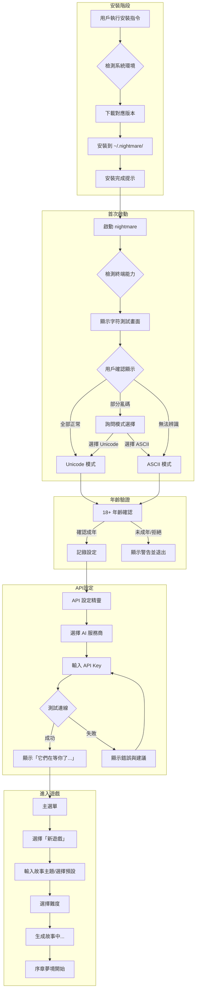
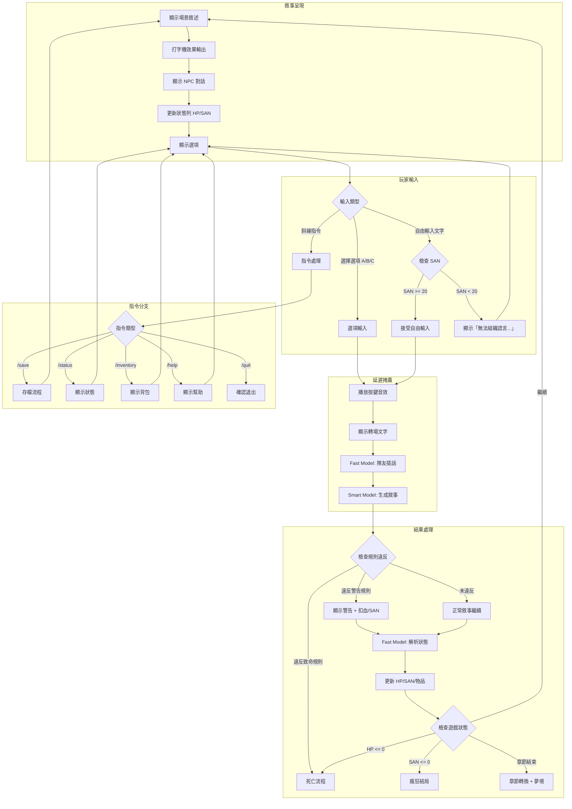
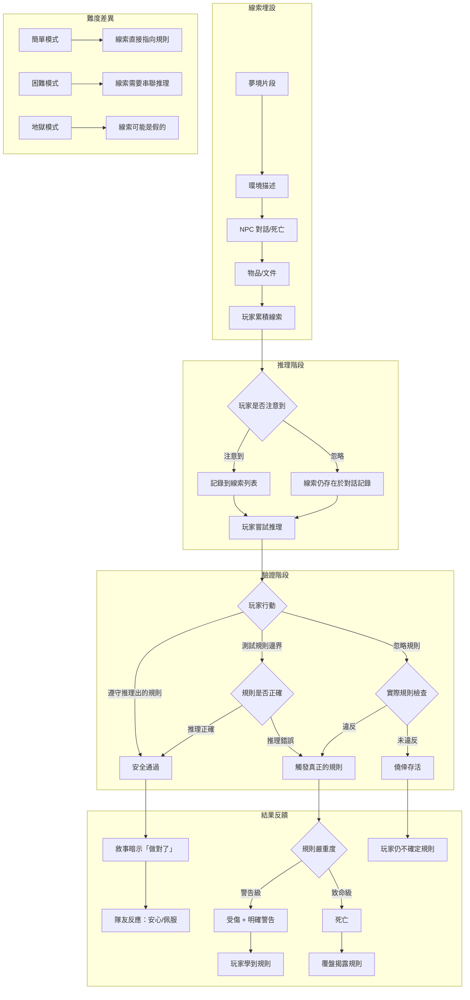
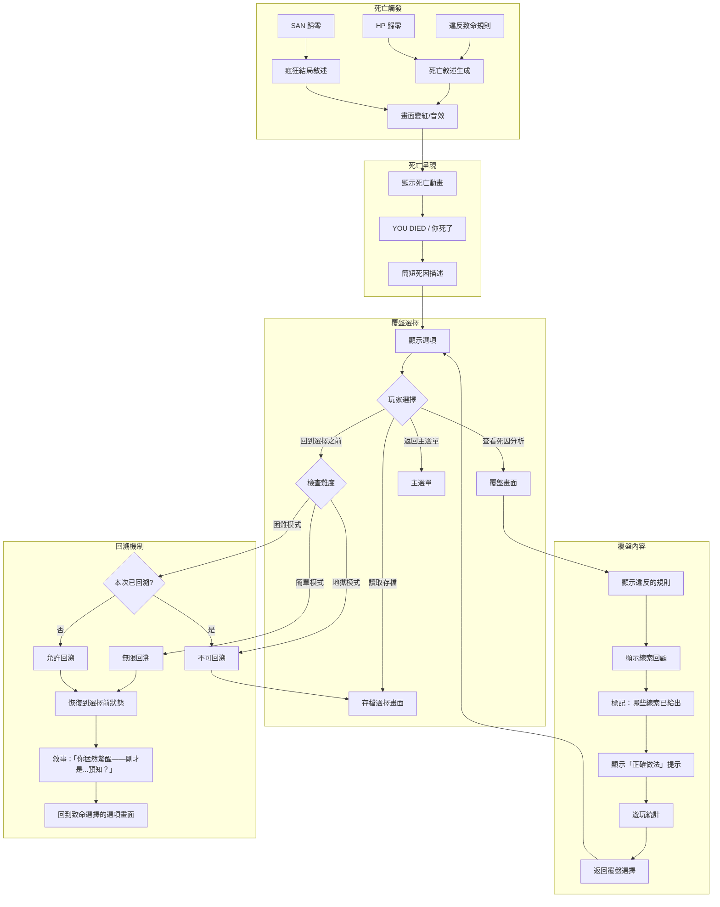
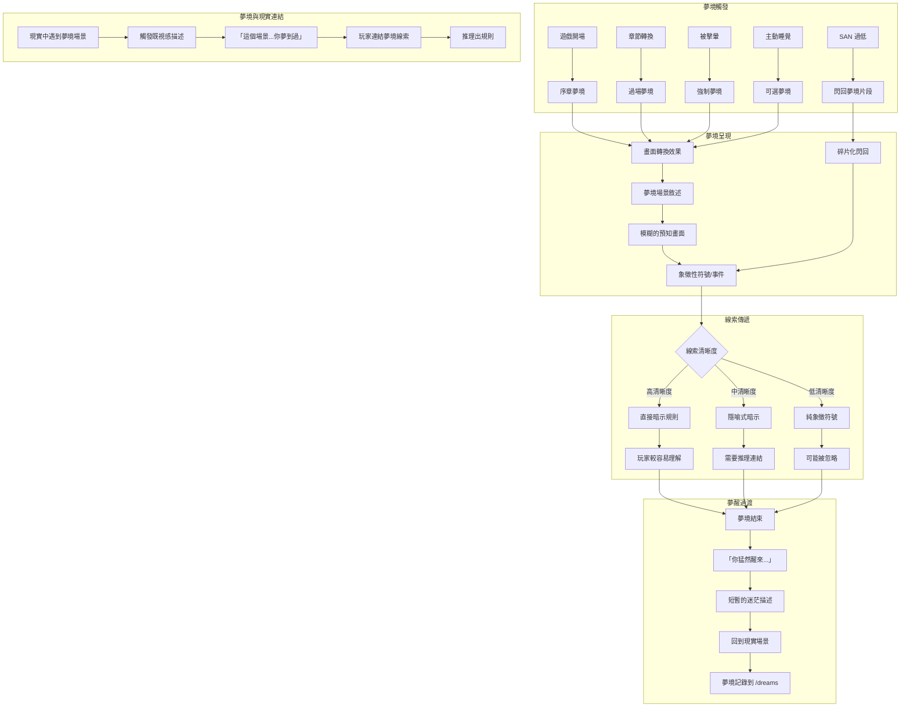
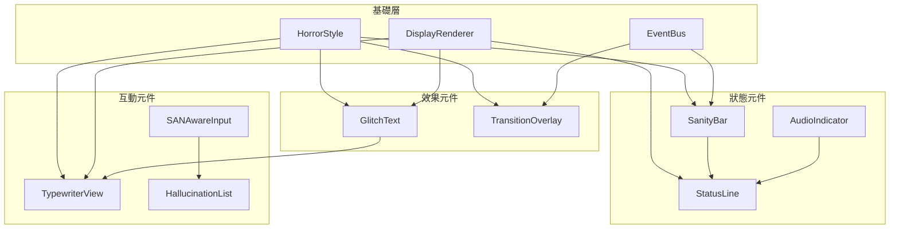

# 惡夢驚襲 (Nightmare Assault) - 技術架構文檔

> **版本**: 1.0.0  
> **最後更新**: 2024-12  
> **語言**: Go 1.21+  
> **授權**: Apache 2.0

---

## 目錄

1. [系統概述](#1-系統概述)
2. [技術選型](#2-技術選型)
3. [專案結構](#3-專案結構)
4. [核心模組設計](#4-核心模組設計)
5. [雙模型架構](#5-雙模型架構)
6. [遊戲引擎](#6-遊戲引擎)
   - [6.5 用戶旅程流程](#65-用戶旅程流程)
7. [Prompt 系統](#7-prompt-系統)
8. [TUI 介面](#8-tui-介面)
   - [8.8 EventBus 事件系統](#88-eventbus-事件系統)
   - [8.9 元件目錄結構](#89-元件目錄結構)
   - [8.10 響應式版面配置](#810-響應式版面配置)
9. [音效系統](#9-音效系統)
10. [存檔系統](#10-存檔系統)
11. [配置管理](#11-配置管理)
12. [安裝與發布](#12-安裝與發布)
13. [效能優化](#13-效能優化)
14. [錯誤處理](#14-錯誤處理)
    - [14.3 敘事化錯誤處理](#143-敘事化錯誤處理)
15. [測試策略](#15-測試策略)
16. [開發指南](#16-開發指南)
17. [UX 一致性模式](#17-ux-一致性模式)

---

## 1. 系統概述

### 1.1 架構圖

```
┌─────────────────────────────────────────────────────────────────────────────┐
│                              Nightmare Assault                               │
├─────────────────────────────────────────────────────────────────────────────┤
│                                                                              │
│  ┌─────────────────────────────────────────────────────────────────────┐   │
│  │                           表現層 (Presentation)                      │   │
│  │  ┌─────────────┐  ┌─────────────┐  ┌─────────────┐  ┌────────────┐  │   │
│  │  │  TUI View   │  │   Themes    │  │  Typewriter │  │   Audio    │  │   │
│  │  │  (BubbleTea)│  │  (LipGloss) │  │   Effect    │  │   (oto)    │  │   │
│  │  └─────────────┘  └─────────────┘  └─────────────┘  └────────────┘  │   │
│  └───────────────────────────────────┬─────────────────────────────────┘   │
│                                      │                                      │
│  ┌───────────────────────────────────┴─────────────────────────────────┐   │
│  │                           業務層 (Business)                          │   │
│  │  ┌─────────────┐  ┌─────────────┐  ┌─────────────┐  ┌────────────┐  │   │
│  │  │ Game Engine │  │ Rule Engine │  │  Story Ctrl │  │  NPC Mgr   │  │   │
│  │  └─────────────┘  └─────────────┘  └─────────────┘  └────────────┘  │   │
│  │  ┌─────────────┐  ┌─────────────┐  ┌─────────────┐  ┌────────────┐  │   │
│  │  │ State Mgr   │  │ Clue System │  │ Dream System│  │ Derail Hdl │  │   │
│  │  └─────────────┘  └─────────────┘  └─────────────┘  └────────────┘  │   │
│  └───────────────────────────────────┬─────────────────────────────────┘   │
│                                      │                                      │
│  ┌───────────────────────────────────┴─────────────────────────────────┐   │
│  │                           LLM 層 (AI Integration)                    │   │
│  │  ┌─────────────────────────────────────────────────────────────┐    │   │
│  │  │                      Model Router                            │    │   │
│  │  │  ┌──────────────────────┐  ┌──────────────────────┐         │    │   │
│  │  │  │    Smart Model       │  │     Fast Model       │         │    │   │
│  │  │  │  (DM / Storyteller)  │  │  (Parser / Actor)    │         │    │   │
│  │  │  └──────────────────────┘  └──────────────────────┘         │    │   │
│  │  └─────────────────────────────────────────────────────────────┘    │   │
│  │  ┌─────────────┐  ┌─────────────┐  ┌─────────────┐  ┌────────────┐  │   │
│  │  │   OpenAI    │  │  Anthropic  │  │   Gemini    │  │    Grok    │  │   │
│  │  └─────────────┘  └─────────────┘  └─────────────┘  └────────────┘  │   │
│  │  ┌─────────────┐  ┌─────────────┐  ┌─────────────┐                  │   │
│  │  │    Groq     │  │ OpenRouter  │  │   Custom    │                  │   │
│  │  └─────────────┘  └─────────────┘  └─────────────┘                  │   │
│  └───────────────────────────────────┬─────────────────────────────────┘   │
│                                      │                                      │
│  ┌───────────────────────────────────┴─────────────────────────────────┐   │
│  │                           基礎層 (Infrastructure)                    │   │
│  │  ┌─────────────┐  ┌─────────────┐  ┌─────────────┐  ┌────────────┐  │   │
│  │  │   Config    │  │    Save     │  │    Skill    │  │   Logger   │  │   │
│  │  │   Manager   │  │   Manager   │  │   Loader    │  │            │  │   │
│  │  └─────────────┘  └─────────────┘  └─────────────┘  └────────────┘  │   │
│  └─────────────────────────────────────────────────────────────────────┘   │
│                                                                              │
└─────────────────────────────────────────────────────────────────────────────┘
```

### 1.2 資料流

```
┌─────────┐     ┌─────────┐     ┌─────────────┐     ┌─────────────┐
│  User   │────▶│   TUI   │────▶│ Game Engine │────▶│ Model Router│
│  Input  │     │  Layer  │     │             │     │             │
└─────────┘     └─────────┘     └──────┬──────┘     └──────┬──────┘
                                       │                   │
                                       ▼                   ▼
                                ┌─────────────┐     ┌─────────────┐
                                │ Local Logic │     │  LLM APIs   │
                                │  (Fast)     │     │  (Network)  │
                                └──────┬──────┘     └──────┬──────┘
                                       │                   │
                                       └─────────┬─────────┘
                                                 │
                                                 ▼
                                       ┌─────────────────┐
                                       │  State Manager  │
                                       │  (Update Game)  │
                                       └────────┬────────┘
                                                │
                                                ▼
                                       ┌─────────────────┐
                                       │   TUI Render    │
                                       │  (Display)      │
                                       └─────────────────┘
```

---

## 2. 技術選型

### 2.1 核心技術棧

| 類別 | 技術 | 版本 | 用途 |
|------|------|------|------|
| 語言 | Go | 1.21+ | 主程式開發 |
| TUI 框架 | Bubble Tea | latest | 終端介面 |
| 樣式庫 | Lip Gloss | latest | 終端樣式 |
| 元件庫 | Bubbles | latest | TUI 元件 |
| 音訊庫 | oto | v3 | 音效播放 |
| HTTP | net/http | stdlib | API 請求 |
| JSON | encoding/json | stdlib | 資料序列化 |
| YAML | gopkg.in/yaml.v3 | v3 | 配置檔案 |

### 2.2 為什麼選擇 Go

| 優勢 | 說明 |
|------|------|
| 單一執行檔 | 編譯後無需任何運行時依賴 |
| 跨平台編譯 | `GOOS` + `GOARCH` 輕鬆交叉編譯 |
| 高性能 | 編譯語言，執行效率高 |
| 並發模型 | goroutine 適合處理多 API 請求 |
| 生態成熟 | Charm 系列 TUI 庫品質極高 |
| 部署簡單 | 用戶下載即用 |

### 2.3 依賴清單

```go
// go.mod
module github.com/yourusername/nightmare-assault

go 1.21

require (
    github.com/charmbracelet/bubbletea v0.25.0
    github.com/charmbracelet/bubbles v0.18.0
    github.com/charmbracelet/lipgloss v0.9.1
    github.com/hajimehoshi/oto/v3 v3.1.0
    github.com/hajimehoshi/go-mp3 v0.3.4
    gopkg.in/yaml.v3 v3.0.1
    github.com/spf13/cobra v1.8.0
    github.com/google/uuid v1.6.0
)
```

---

## 3. 專案結構

```
nightmare-assault/
│
├── cmd/
│   └── nightmare/
│       └── main.go                      # 程式入口
│
├── internal/
│   ├── app/
│   │   ├── app.go                       # 應用程式主邏輯
│   │   └── lifecycle.go                 # 生命週期管理
│   │
│   ├── config/
│   │   ├── config.go                    # 配置結構定義
│   │   ├── loader.go                    # 配置載入器
│   │   ├── validator.go                 # 配置驗證
│   │   └── defaults.go                  # 預設值
│   │
│   ├── engine/
│   │   ├── game.go                      # 遊戲主循環
│   │   ├── state.go                     # 遊戲狀態管理
│   │   ├── player.go                    # 玩家狀態
│   │   ├── rules/
│   │   │   ├── engine.go                # 規則引擎
│   │   │   ├── validator.go             # 規則驗證
│   │   │   ├── trigger.go               # 觸發檢測
│   │   │   └── types.go                 # 規則類型定義
│   │   ├── story/
│   │   │   ├── controller.go            # 劇情控制器
│   │   │   ├── chapter.go               # 章節管理
│   │   │   ├── compression.go           # 章節壓縮
│   │   │   └── generator.go             # 故事生成
│   │   ├── npc/
│   │   │   ├── manager.go               # NPC 管理器
│   │   │   ├── teammate.go              # 隊友系統
│   │   │   ├── dialogue.go              # 對話系統
│   │   │   └── archetypes.go            # NPC 原型
│   │   ├── clues/
│   │   │   ├── system.go                # 線索系統
│   │   │   ├── tracker.go               # 線索追蹤
│   │   │   └── matcher.go               # 線索匹配
│   │   ├── dreams/
│   │   │   ├── system.go                # 夢境系統
│   │   │   ├── fragments.go             # 夢境片段
│   │   │   └── matcher.go               # 夢境-現實匹配
│   │   ├── sanity/
│   │   │   ├── system.go                # 理智值系統
│   │   │   ├── effects.go               # 理智效果
│   │   │   └── hallucination.go         # 幻覺生成
│   │   └── derail/
│   │       ├── handler.go               # 脫軌處理器
│   │       ├── detector.go              # 脫軌檢測
│   │       └── strategies.go            # 處理策略
│   │
│   ├── llm/
│   │   ├── router/
│   │   │   ├── router.go                # 模型路由器
│   │   │   ├── task.go                  # 任務類型定義
│   │   │   └── balancer.go              # 負載平衡
│   │   ├── provider/
│   │   │   ├── interface.go             # Provider 介面
│   │   │   ├── openai.go                # OpenAI 實作
│   │   │   ├── anthropic.go             # Anthropic 實作
│   │   │   ├── gemini.go                # Gemini 實作
│   │   │   ├── grok.go                  # Grok 實作
│   │   │   ├── groq.go                  # Groq 實作
│   │   │   └── custom.go                # 自訂 Gateway
│   │   ├── prompt/
│   │   │   ├── builder.go               # Prompt 建構器
│   │   │   ├── templates.go             # Prompt 模板
│   │   │   ├── system.go                # System Prompt
│   │   │   └── context.go               # 上下文管理
│   │   ├── parser/
│   │   │   ├── parser.go                # 回應解析器
│   │   │   ├── xml.go                   # XML 標籤解析
│   │   │   └── json.go                  # JSON 解析
│   │   └── stream/
│   │       ├── handler.go               # 串流處理
│   │       └── buffer.go                # 緩衝區管理
│   │
│   ├── tui/
│   │   ├── app.go                       # TUI 應用程式
│   │   ├── model.go                     # Bubble Tea Model
│   │   ├── update.go                    # Update 邏輯
│   │   ├── views/
│   │   │   ├── menu.go                  # 主選單
│   │   │   ├── setup.go                 # 遊戲設定
│   │   │   ├── game.go                  # 遊戲主畫面
│   │   │   ├── dialogue.go              # 對話畫面
│   │   │   ├── status.go                # 狀態畫面
│   │   │   ├── inventory.go             # 背包畫面
│   │   │   ├── clues.go                 # 線索畫面
│   │   │   ├── dreams.go                # 夢境畫面
│   │   │   ├── team.go                  # 隊友畫面
│   │   │   ├── save.go                  # 存檔畫面
│   │   │   ├── death.go                 # 死亡畫面
│   │   │   ├── debrief.go               # 覆盤畫面
│   │   │   ├── ending.go                # 結局畫面
│   │   │   └── settings.go              # 設定畫面
│   │   ├── components/
│   │   │   ├── textbox.go               # 文字輸入框
│   │   │   ├── typewriter.go            # 打字機效果
│   │   │   ├── progressbar.go           # 進度條
│   │   │   ├── healthbar.go             # 血量/理智條
│   │   │   ├── options.go               # 選項元件
│   │   │   ├── transition.go            # 轉場效果
│   │   │   └── spinner.go               # 載入動畫
│   │   ├── styles/
│   │   │   ├── themes.go                # 主題定義
│   │   │   ├── colors.go                # 顏色定義
│   │   │   └── layouts.go               # 版面配置
│   │   └── commands/
│   │       ├── slash.go                 # 斜線指令處理
│   │       ├── parser.go                # 指令解析
│   │       └── handlers.go              # 指令處理器
│   │
│   ├── audio/
│   │   ├── manager.go                   # 音訊管理器
│   │   ├── bgm.go                       # BGM 播放
│   │   ├── sfx.go                       # 音效播放
│   │   └── loader.go                    # 音檔載入
│   │
│   ├── storage/
│   │   ├── save/
│   │   │   ├── manager.go               # 存檔管理器
│   │   │   ├── serializer.go            # 序列化
│   │   │   └── migration.go             # 版本遷移
│   │   └── cache/
│   │       └── context_cache.go         # Context 快取
│   │
│   ├── skills/
│   │   ├── loader.go                    # Skill 載入器
│   │   ├── parser.go                    # Markdown 解析
│   │   └── registry.go                  # Skill 註冊表
│   │
│   ├── transitions/
│   │   ├── loader.go                    # 轉場文字載入
│   │   └── selector.go                  # 隨機選擇器
│   │
│   ├── i18n/
│   │   ├── i18n.go                      # 國際化主程式
│   │   ├── zh_tw.go                     # 繁體中文
│   │   └── en_us.go                     # 英文
│   │
│   ├── update/
│   │   ├── checker.go                   # 更新檢查
│   │   ├── downloader.go                # 下載器
│   │   └── installer.go                 # 安裝器
│   │
│   └── utils/
│       ├── crypto.go                    # 加密工具
│       ├── file.go                      # 檔案操作
│       ├── random.go                    # 隨機數工具
│       └── terminal.go                  # 終端工具
│
├── pkg/
│   └── models/
│       ├── game.go                      # 遊戲資料模型
│       ├── player.go                    # 玩家模型
│       ├── npc.go                       # NPC 模型
│       ├── rule.go                      # 規則模型
│       ├── clue.go                      # 線索模型
│       ├── dream.go                     # 夢境模型
│       ├── story.go                     # 故事模型
│       └── save.go                      # 存檔模型
│
├── skills/                              # Skill Markdown 檔案
│   ├── story_generation.md
│   ├── rule_generation.md
│   ├── dream_generation.md
│   ├── npc_generation.md
│   ├── derail_handling.md
│   ├── state_update.md
│   ├── chapter_compression.md
│   └── debrief_generation.md
│
├── assets/
│   ├── bgm/                             # 背景音樂
│   │   ├── ambient_explore.mp3
│   │   ├── tension_building.mp3
│   │   ├── chase_horror.mp3
│   │   ├── melancholy.mp3
│   │   ├── safe_room.mp3
│   │   └── ending_theme.mp3
│   ├── sfx/                             # 音效
│   │   ├── key_press.wav
│   │   ├── option_select.wav
│   │   ├── warning.wav
│   │   ├── death.wav
│   │   ├── clue_found.wav
│   │   ├── heartbeat.wav
│   │   ├── scream.wav
│   │   ├── footsteps.wav
│   │   ├── door_creak.wav
│   │   └── whisper.wav
│   └── transitions/
│       └── transitions.json             # 轉場文字庫
│
├── configs/
│   ├── default.yaml                     # 預設配置
│   └── themes/                          # 主題配置
│       ├── midnight.yaml
│       ├── blood.yaml
│       ├── asylum.yaml
│       ├── forest.yaml
│       └── terminal.yaml
│
├── scripts/
│   ├── install.ps1                      # Windows 安裝腳本
│   ├── install.sh                       # Unix 安裝腳本
│   ├── uninstall.ps1                    # Windows 解除安裝
│   ├── uninstall.sh                     # Unix 解除安裝
│   └── build.sh                         # 編譯腳本
│
├── .github/
│   └── workflows/
│       ├── release.yaml                 # 自動發布
│       ├── test.yaml                    # 自動測試
│       └── lint.yaml                    # 程式碼檢查
│
├── docs/
│   ├── README.md                        # 專案說明
│   ├── CONTRIBUTING.md                  # 貢獻指南
│   ├── CHANGELOG.md                     # 更新日誌
│   └── api/                             # API 文檔
│
├── test/
│   ├── integration/                     # 整合測試
│   ├── e2e/                             # 端到端測試
│   └── fixtures/                        # 測試資料
│
├── go.mod
├── go.sum
├── Makefile
├── LICENSE
└── README.md
```

---

## 4. 核心模組設計

### 4.1 遊戲狀態 (GameState)

```go
// pkg/models/game.go

package models

import "time"

// GameState 遊戲完整狀態
type GameState struct {
    Meta         GameMeta         `json:"meta"`
    Settings     GameSettings     `json:"settings"`
    Story        StoryState       `json:"story"`
    Rules        RuleState        `json:"rules"`
    Player       PlayerState      `json:"player"`
    Teammates    []TeammateState  `json:"teammates"`
    Dreams       DreamState       `json:"dreams"`
    HiddenStates HiddenStates     `json:"hidden_states"`
    Conversation ConversationState `json:"conversation"`
    APIUsage     APIUsageStats    `json:"api_usage"`
}

// GameMeta 遊戲元資料
type GameMeta struct {
    GameID          string    `json:"game_id"`
    SaveID          int       `json:"save_id"`
    SaveName        string    `json:"save_name"`
    CreatedAt       time.Time `json:"created_at"`
    UpdatedAt       time.Time `json:"updated_at"`
    PlaytimeSeconds int64     `json:"playtime_seconds"`
    GameVersion     string    `json:"game_version"`
}

// GameSettings 遊戲設定
type GameSettings struct {
    Difficulty    Difficulty `json:"difficulty"`
    TargetLength  Length     `json:"target_length"`
    IsAdult       bool       `json:"is_adult"`
    Language      string     `json:"language"`
    TypewriterOn  bool       `json:"typewriter_on"`
    BGMOn         bool       `json:"bgm_on"`
    BGMVolume     int        `json:"bgm_volume"`
    SFXOn         bool       `json:"sfx_on"`
    SFXVolume     int        `json:"sfx_volume"`
    Theme         string     `json:"theme"`
}

// Difficulty 難度等級
type Difficulty string

const (
    DifficultyEasy   Difficulty = "easy"
    DifficultyHard   Difficulty = "hard"
    DifficultyHell   Difficulty = "hell"
)

// Length 故事長度
type Length string

const (
    LengthShort  Length = "short"   // 10,000 - 39,999
    LengthMedium Length = "medium"  // 40,000 - 79,999
    LengthLong   Length = "long"    // 80,000+
)
```

### 4.2 規則系統 (Rule)

```go
// pkg/models/rule.go

package models

// Rule 潛規則定義
type Rule struct {
    ID               int           `json:"id"`
    Text             string        `json:"text"`
    TriggerLocation  string        `json:"trigger_location"`  // 觸發位置（空字串=全域）
    TriggerCondition string        `json:"trigger_condition"` // 觸發條件表達式
    TriggerTime      string        `json:"trigger_time"`      // 觸發時間（可選）
    IsFake           bool          `json:"is_fake"`           // 是否為假規則
    Severity         RuleSeverity  `json:"severity"`          // 嚴重程度
    HintsPlanned     []RuleHint    `json:"hints_planned"`     // 計劃中的提示
    HintsGiven       []int         `json:"hints_given"`       // 已給出的提示 ID
    ClueToDebunk     string        `json:"clue_to_debunk"`    // 破解假規則的線索
    DeathMessage     string        `json:"death_message"`     // 死亡訊息
    WarningMessage   string        `json:"warning_message"`   // 警告訊息
    ViolationCount   int           `json:"violation_count"`   // 違反次數
    IsDiscovered     bool          `json:"is_discovered"`     // 玩家是否已知
}

// RuleSeverity 規則嚴重程度
type RuleSeverity string

const (
    SeverityWarning RuleSeverity = "warning" // 警告（扣血/扣理智）
    SeverityLethal  RuleSeverity = "lethal"  // 即死
)

// RuleHint 規則提示
type RuleHint struct {
    ID       int      `json:"id"`
    Chapter  int      `json:"chapter"`
    Type     HintType `json:"type"`
    Content  string   `json:"content"`
    IsGiven  bool     `json:"is_given"`
}

// HintType 提示類型
type HintType string

const (
    HintTypeDream     HintType = "dream"
    HintTypeNPCDeath  HintType = "npc_death"
    HintTypeNPCDialog HintType = "npc_dialog"
    HintTypeItem      HintType = "item"
    HintTypeEnviron   HintType = "environment"
    HintTypeEvent     HintType = "event"
)

// RuleState 規則狀態
type RuleState struct {
    AllRules         []Rule `json:"all_rules"`
    KnownRules       []int  `json:"known_rules"`
    TriggeredRules   []int  `json:"triggered_rules"`
    WarningsReceived []RuleWarning `json:"warnings_received"`
}

// RuleWarning 規則警告記錄
type RuleWarning struct {
    RuleID    int    `json:"rule_id"`
    Chapter   int    `json:"chapter"`
    TurnCount int    `json:"turn_count"`
    Message   string `json:"message"`
}
```

### 4.3 玩家狀態 (Player)

```go
// pkg/models/player.go

package models

// PlayerState 玩家狀態
type PlayerState struct {
    HP              int             `json:"hp"`
    MaxHP           int             `json:"max_hp"`
    SAN             int             `json:"san"`
    MaxSAN          int             `json:"max_san"`
    Location        string          `json:"location"`
    Inventory       []Item          `json:"inventory"`
    KnownClues      []Clue          `json:"known_clues"`
    PlayerSettings  PlayerSettings  `json:"player_settings"`
}

// PlayerSettings 玩家自訂設定（脫軌處理用）
type PlayerSettings struct {
    ClaimedProfession string   `json:"claimed_profession"` // 自稱的職業
    SpecialAbilities  []string `json:"special_abilities"`  // 自稱的能力
    AbilityLimits     []string `json:"ability_limits"`     // 能力的限制
}

// Item 物品
type Item struct {
    ID          string   `json:"id"`
    Name        string   `json:"name"`
    Description string   `json:"description"`
    Type        ItemType `json:"type"`
    Effect      string   `json:"effect"`      // 使用效果
    UsesLeft    int      `json:"uses_left"`   // 剩餘使用次數（-1=無限）
    IsKey       bool     `json:"is_key"`      // 是否為關鍵道具
}

// ItemType 物品類型
type ItemType string

const (
    ItemTypeHealing   ItemType = "healing"   // 治療
    ItemTypeSanity    ItemType = "sanity"    // 理智恢復
    ItemTypeClue      ItemType = "clue"      // 線索
    ItemTypeTool      ItemType = "tool"      // 工具
    ItemTypeKey       ItemType = "key"       // 關鍵道具
)

// Clue 線索
type Clue struct {
    ID          int        `json:"id"`
    Content     string     `json:"content"`
    Source      ClueSource `json:"source"`
    Chapter     int        `json:"chapter"`
    RelatedRule int        `json:"related_rule"` // 關聯的規則 ID（0=無）
    IsFake      bool       `json:"is_fake"`      // 是否為煙霧彈
}

// ClueSource 線索來源
type ClueSource string

const (
    ClueSourceDream       ClueSource = "dream"
    ClueSourceItem        ClueSource = "item"
    ClueSourceNPC         ClueSource = "npc"
    ClueSourceEnvironment ClueSource = "environment"
    ClueSourceEvent       ClueSource = "event"
)
```

### 4.4 NPC/隊友 (Teammate)

```go
// pkg/models/npc.go

package models

// TeammateState 隊友狀態
type TeammateState struct {
    ID           int           `json:"id"`
    Name         string        `json:"name"`
    Archetype    NPCArchetype  `json:"archetype"`
    Personality  string        `json:"personality"`
    RoleInStory  string        `json:"role_in_story"`
    IsAlive      bool          `json:"is_alive"`
    HP           int           `json:"hp"`
    SAN          int           `json:"san"`
    Location     string        `json:"location"`
    Items        []Item        `json:"items"`
    TrustLevel   int           `json:"trust_level"`    // 0-100
    KnownInfo    []string      `json:"known_info"`     // NPC 知道的資訊
    Secret       string        `json:"secret"`         // NPC 的秘密
    IsReliable   bool          `json:"is_reliable"`    // 是否可信
    DeathChapter int           `json:"death_chapter"`  // 死亡章節（0=未死）
    DeathCause   string        `json:"death_cause"`    // 死因
}

// NPCArchetype NPC 原型
type NPCArchetype string

const (
    ArchetypeVictim       NPCArchetype = "victim"          // 犧牲者
    ArchetypeUnreliable   NPCArchetype = "unreliable"      // 不可靠敘述者
    ArchetypeLogic        NPCArchetype = "logic"           // 理性分析者
    ArchetypeIntuition    NPCArchetype = "intuition"       // 直覺敏銳者
    ArchetypeInformer     NPCArchetype = "informer"        // 隱藏知情者
    ArchetypePossessed    NPCArchetype = "possessed"       // 被附身者
)
```

### 4.5 夢境系統 (Dream)

```go
// pkg/models/dream.go

package models

// DreamState 夢境狀態
type DreamState struct {
    Fragments    []DreamFragment `json:"fragments"`
    DreamHistory []int           `json:"dream_history"` // 已播放的夢境 ID
}

// DreamFragment 夢境片段
type DreamFragment struct {
    ID           int     `json:"id"`
    Trigger      string  `json:"trigger"`       // 觸發時機
    Content      string  `json:"content"`       // 夢境內容
    RelatedRule  int     `json:"related_rule"`  // 關聯的規則
    Clarity      float64 `json:"clarity"`       // 清晰度 0-1
    IsMatched    bool    `json:"is_matched"`    // 是否已在現實對應
    MatchedAt    string  `json:"matched_at"`    // 對應的章節
}

// DreamTrigger 夢境觸發時機
const (
    DreamTriggerPrologue   = "prologue"    // 開場
    DreamTriggerChapter    = "chapter"     // 章節轉換
    DreamTriggerSleep      = "sleep"       // 玩家選擇睡覺
    DreamTriggerKnockout   = "knockout"    // 被擊暈
    DreamTriggerLowSanity  = "low_sanity"  // 低理智
)
```

### 4.6 故事狀態 (Story)

```go
// pkg/models/story.go

package models

// StoryState 故事狀態
type StoryState struct {
    Seed             string           `json:"seed"`
    Title            string           `json:"title"`
    Premise          string           `json:"premise"`
    CurrentChapter   int              `json:"current_chapter"`
    TotalChapters    int              `json:"total_chapters"`
    ChapterSummaries []string         `json:"chapter_summaries"`
    Truth            StoryTruth       `json:"truth"`
    Setting          StorySetting     `json:"setting"`
    EndingFlags      map[string]bool  `json:"ending_flags"`
}

// StoryTruth 故事真相（隱藏）
type StoryTruth struct {
    CoreMystery           string `json:"core_mystery"`
    TrueEndingCondition   string `json:"true_ending_condition"`
    HiddenEndingCondition string `json:"hidden_ending_condition"`
}

// StorySetting 場景設定
type StorySetting struct {
    TimePeriod   string   `json:"time_period"`
    MainLocation string   `json:"main_location"`
    Atmosphere   []string `json:"atmosphere"`
    Locations    []Location `json:"locations"`
}

// Location 地點
type Location struct {
    ID          string   `json:"id"`
    Name        string   `json:"name"`
    Description string   `json:"description"`
    IsAccessible bool    `json:"is_accessible"`
    IsSafe       bool    `json:"is_safe"`
    Items        []string `json:"items"`
    Connections  []string `json:"connections"`
}
```

### 4.7 區塊結構 (Block)

區塊是故事的基本單位，由玩法、場景、恐懼源三種模板組合而成。

```go
// internal/game/block.go

package game

// Block 故事區塊
type Block struct {
    ID        string          `json:"block_id"`
    Name      string          `json:"block_name"`
    Templates BlockTemplates  `json:"templates"`
    Params    BlockParameters `json:"parameters"`
    Rules     []BlockRule     `json:"rules"`
    Entry     EntryConditions `json:"entry_conditions"`
    Exits     []ExitCondition `json:"exit_conditions"`
}

// BlockTemplates 區塊使用的模板
type BlockTemplates struct {
    Gameplay   string `json:"gameplay"`    // 玩法模板 ID (P01-P10)
    Setting    string `json:"setting"`     // 場景模板 ID (S01-S10)
    FearSource string `json:"fear_source"` // 恐懼源模板 ID (F01-F10)
}

// BlockParameters 區塊參數
type BlockParameters struct {
    Duration           string  `json:"duration"`            // short/medium/long
    DifficultyModifier float64 `json:"difficulty_modifier"` // 難度係數
    SANPressure        string  `json:"san_pressure"`        // none/gradual/constant/high
    NPCCount           int     `json:"npc_count"`           // 可用 NPC 數量
}

// BlockRule 區塊內規則
type BlockRule struct {
    ID       string   `json:"id"`
    Text     string   `json:"text"`
    Hints    []string `json:"hints"`    // 線索類型
    Severity string   `json:"severity"` // warning/damage/lethal
}

// EntryConditions 進入條件
type EntryConditions struct {
    FromBlocks    []string `json:"from_blocks"`
    RequiredItems []string `json:"required_items"`
    RequiredFlags []string `json:"required_flags"`
}

// ExitCondition 離開條件
type ExitCondition struct {
    Type      string `json:"type"`      // success/branch/failure
    Condition string `json:"condition"` // 觸發條件
    NextBlock string `json:"next_block"`
}
```

#### 區塊結構 JSON Schema

```json
{
  "$schema": "http://json-schema.org/draft-07/schema#",
  "title": "Block",
  "type": "object",
  "required": ["block_id", "block_name", "templates", "parameters", "exit_conditions"],
  "properties": {
    "block_id": {
      "type": "string",
      "pattern": "^B[0-9]{3}(_[a-z]+)?$"
    },
    "block_name": {
      "type": "string",
      "minLength": 1
    },
    "templates": {
      "type": "object",
      "required": ["gameplay", "setting", "fear_source"],
      "properties": {
        "gameplay": {
          "type": "string",
          "pattern": "^P[0-9]{2}_[a-z_]+$"
        },
        "setting": {
          "type": "string",
          "pattern": "^S[0-9]{2}_[a-z_]+$"
        },
        "fear_source": {
          "type": "string",
          "pattern": "^F[0-9]{2}_[a-z_]+$"
        }
      }
    },
    "parameters": {
      "type": "object",
      "properties": {
        "duration": {
          "type": "string",
          "enum": ["short", "medium", "long"]
        },
        "difficulty_modifier": {
          "type": "number",
          "minimum": 0.5,
          "maximum": 2.0
        },
        "san_pressure": {
          "type": "string",
          "enum": ["none", "gradual", "constant", "high"]
        },
        "npc_count": {
          "type": "integer",
          "minimum": 0
        }
      }
    },
    "rules": {
      "type": "array",
      "items": {
        "type": "object",
        "required": ["id", "text", "severity"],
        "properties": {
          "id": { "type": "string" },
          "text": { "type": "string" },
          "hints": {
            "type": "array",
            "items": { "type": "string" }
          },
          "severity": {
            "type": "string",
            "enum": ["warning", "damage", "lethal"]
          }
        }
      }
    },
    "exit_conditions": {
      "type": "array",
      "minItems": 1,
      "items": {
        "type": "object",
        "required": ["type", "condition", "next_block"],
        "properties": {
          "type": {
            "type": "string",
            "enum": ["success", "branch", "failure"]
          },
          "condition": { "type": "string" },
          "next_block": { "type": "string" }
        }
      }
    }
  }
}
```

---

## 5. 雙模型架構

### 5.1 模型路由器 (Model Router)

```go
// internal/llm/router/router.go

package router

import (
    "context"
    "sync"
)

// ModelRouter 模型路由器
type ModelRouter struct {
    smartProvider Provider
    fastProvider  Provider
    config        *RouterConfig
    mu            sync.RWMutex
}

// RouterConfig 路由配置
type RouterConfig struct {
    SmartModel ModelConfig `json:"smart_model"`
    FastModel  ModelConfig `json:"fast_model"`
    UseSameKey bool        `json:"use_same_key"` // 兩模型是否共用 Key
}

// ModelConfig 單一模型配置
type ModelConfig struct {
    Provider    string  `json:"provider"`
    BaseURL     string  `json:"base_url"`
    APIKey      string  `json:"api_key"`
    Model       string  `json:"model"`
    MaxTokens   int     `json:"max_tokens"`
    Temperature float64 `json:"temperature"`
}

// TaskType 任務類型
type TaskType string

const (
    TaskNarrative     TaskType = "narrative"      // 故事敘述 → Smart
    TaskRuleCheck     TaskType = "rule_check"     // 規則判定 → Smart
    TaskStateUpdate   TaskType = "state_update"   // 狀態更新 → Fast
    TaskNPCBanter     TaskType = "npc_banter"     // 隊友插話 → Fast
    TaskIntentDetect  TaskType = "intent_detect"  // 意圖識別 → Fast
    TaskCompression   TaskType = "compression"    // 章節壓縮 → Fast
    TaskSpamFilter    TaskType = "spam_filter"    // 垃圾過濾 → Fast
)

// Route 根據任務類型路由到對應模型
func (r *ModelRouter) Route(taskType TaskType) Provider {
    switch taskType {
    case TaskNarrative, TaskRuleCheck:
        return r.smartProvider
    case TaskStateUpdate, TaskNPCBanter, TaskIntentDetect, TaskCompression, TaskSpamFilter:
        return r.fastProvider
    default:
        return r.smartProvider
    }
}

// ExecuteParallel 並行執行多個任務
func (r *ModelRouter) ExecuteParallel(ctx context.Context, tasks []Task) ([]Response, error) {
    results := make([]Response, len(tasks))
    var wg sync.WaitGroup
    errChan := make(chan error, len(tasks))

    for i, task := range tasks {
        wg.Add(1)
        go func(idx int, t Task) {
            defer wg.Done()
            provider := r.Route(t.Type)
            resp, err := provider.Complete(ctx, t.Messages, t.Options)
            if err != nil {
                errChan <- err
                return
            }
            results[idx] = resp
        }(i, task)
    }

    wg.Wait()
    close(errChan)

    if len(errChan) > 0 {
        return nil, <-errChan
    }

    return results, nil
}
```

### 5.2 延遲掩蓋機制

```go
// internal/llm/router/masking.go

package router

import (
    "context"
    "time"
)

// MaskingConfig 延遲掩蓋配置
type MaskingConfig struct {
    EnableBanter        bool          `json:"enable_banter"`
    EnableTransition    bool          `json:"enable_transition"`
    BanterTimeout       time.Duration `json:"banter_timeout"`
    TransitionMinDelay  time.Duration `json:"transition_min_delay"`
}

// MaskedExecution 帶有延遲掩蓋的執行
type MaskedExecution struct {
    router      *ModelRouter
    config      MaskingConfig
    transitions *TransitionSelector
}

// Execute 執行帶掩蓋的請求
func (m *MaskedExecution) Execute(ctx context.Context, input PlayerInput, state *GameState) (*ExecutionResult, error) {
    result := &ExecutionResult{}
    
    // 1. 立即返回轉場文字（本地，0ms）
    if m.config.EnableTransition {
        result.Transition = m.transitions.Select(state.Player.SAN)
    }
    
    // 2. 並行請求
    errChan := make(chan error, 2)
    
    // 2a. Fast Model: 隊友插話（掩蓋延遲）
    if m.config.EnableBanter && len(state.Teammates) > 0 {
        go func() {
            banterCtx, cancel := context.WithTimeout(ctx, m.config.BanterTimeout)
            defer cancel()
            
            banter, err := m.requestBanter(banterCtx, input, state)
            if err == nil {
                result.Banter = banter
            }
            errChan <- nil // 插話失敗不影響主流程
        }()
    }
    
    // 2b. Smart Model: 主要故事內容
    go func() {
        narrative, err := m.requestNarrative(ctx, input, state)
        if err != nil {
            errChan <- err
            return
        }
        result.Narrative = narrative
        errChan <- nil
    }()
    
    // 3. 等待結果
    for i := 0; i < 2; i++ {
        if err := <-errChan; err != nil {
            return nil, err
        }
    }
    
    // 4. Fast Model: 解析狀態更新
    stateUpdate, err := m.requestStateUpdate(ctx, result.Narrative, state)
    if err != nil {
        return nil, err
    }
    result.StateUpdate = stateUpdate
    
    return result, nil
}

// ExecutionResult 執行結果
type ExecutionResult struct {
    Transition  string        // 轉場文字（本地）
    Banter      string        // 隊友插話（Fast Model）
    Narrative   string        // 故事內容（Smart Model，串流）
    StateUpdate *StateUpdate  // 狀態更新（Fast Model）
    Options     []string      // 選項
}
```

### 5.3 三層延遲防護機制

```
┌─────────────────────────────────────────────────────────────────┐
│                      三層延遲防護流程                            │
├─────────────────────────────────────────────────────────────────┤
│                                                                  │
│  ┌─────────────────┐                                            │
│  │ 玩家輸入        │                                            │
│  └────────┬────────┘                                            │
│           ▼                                                      │
│  ┌─────────────────┐  0ms                                       │
│  │ Layer 1: 本地   │ ─────────────────────────────────────────  │
│  │ 轉場文字        │  「黑暗吞噬了你的視線...」                 │
│  └────────┬────────┘                                            │
│           ▼                                                      │
│  ┌─────────────────┐  ~300ms                                    │
│  │ Layer 2: Fast   │ ─────────────────────────────────────────  │
│  │ 隊友插話        │  「小美：『你聽到了嗎...那個聲音...』」   │
│  └────────┬────────┘                                            │
│           ▼                                                      │
│  ┌─────────────────┐  ~2000ms                                   │
│  │ Layer 3: Smart  │ ─────────────────────────────────────────  │
│  │ 主要敘事        │  完整故事內容（串流顯示）                  │
│  └─────────────────┘                                            │
│                                                                  │
│  如果 Smart Model 超時 (>5s):                                   │
│  Layer 4: 保底文字 → 從 transitions.json 載入場景感應文字       │
│                                                                  │
└─────────────────────────────────────────────────────────────────┘
```

### 5.4 transitions.json 結構

```json
// assets/transitions.json - 場景感應轉場文字

{
  "by_san_range": {
    "80-100": [
      "你深吸一口氣，繼續前進。",
      "周圍的空氣似乎變得凝重。",
      "你的腳步在寂靜中迴盪。"
    ],
    "50-79": [
      "你感覺到一陣莫名的不安。",
      "你的心跳開始加速。",
      "有什麼東西在注視著你..."
    ],
    "20-49": [
      "你的視線開始模糊...",
      "耳邊傳來難以辨識的低語...",
      "你分不清這是現實還是幻覺..."
    ],
    "1-19": [
      "一̷切̷都̷在̷崩̷解̷...",
      "你̸已̸經̸不̸知̸道̸自̸己̸是̸誰̸了̸...",
      "黑̵暗̵中̵有̵什̵麼̵在̵呼̵喚̵你̵的̵名̵字̵..."
    ]
  },

  "by_location_type": {
    "corridor": [
      "走廊似乎沒有盡頭...",
      "牆壁上的影子在移動..."
    ],
    "room": [
      "房間裡的空氣沉悶而壓抑...",
      "你感覺有人剛剛離開..."
    ],
    "outdoor": [
      "迷霧籠罩了一切...",
      "你聽到了遠處的腳步聲..."
    ]
  },

  "by_event": {
    "teammate_death": [
      "一切發生得太快了...",
      "你的腦海一片空白..."
    ],
    "rule_violation": [
      "你感到一陣刺痛...",
      "有什麼規則被打破了..."
    ],
    "discovery": [
      "你發現了什麼...",
      "這改變了一切..."
    ]
  },

  "fallback": [
    "請稍候...",
    "夢境正在重組...",
    "正在連結夢境..."
  ]
}
```

### 5.5 TransitionSelector 實作

```go
// internal/llm/router/transitions.go

package router

import (
    "encoding/json"
    "math/rand"
    "os"
)

// TransitionData 轉場文字資料
type TransitionData struct {
    BySanRange     map[string][]string `json:"by_san_range"`
    ByLocationType map[string][]string `json:"by_location_type"`
    ByEvent        map[string][]string `json:"by_event"`
    Fallback       []string            `json:"fallback"`
}

// TransitionSelector 轉場文字選擇器
type TransitionSelector struct {
    data *TransitionData
}

// Select 根據遊戲狀態選擇轉場文字
func (ts *TransitionSelector) Select(san int, locationType string, event string) string {
    var candidates []string

    // 優先級 1: 事件特定
    if event != "" {
        if texts, ok := ts.data.ByEvent[event]; ok {
            candidates = append(candidates, texts...)
        }
    }

    // 優先級 2: SAN 範圍
    sanRange := ts.getSanRange(san)
    if texts, ok := ts.data.BySanRange[sanRange]; ok {
        candidates = append(candidates, texts...)
    }

    // 優先級 3: 場景類型
    if locationType != "" {
        if texts, ok := ts.data.ByLocationType[locationType]; ok {
            candidates = append(candidates, texts...)
        }
    }

    // 如果沒有找到，使用 fallback
    if len(candidates) == 0 {
        candidates = ts.data.Fallback
    }

    // 隨機選擇
    return candidates[rand.Intn(len(candidates))]
}

func (ts *TransitionSelector) getSanRange(san int) string {
    switch {
    case san >= 80:
        return "80-100"
    case san >= 50:
        return "50-79"
    case san >= 20:
        return "20-49"
    default:
        return "1-19"
    }
}
```

### 5.6 任務分配示例

```go
// internal/engine/game.go

package engine

// ProcessPlayerInput 處理玩家輸入
func (g *GameEngine) ProcessPlayerInput(ctx context.Context, input string) error {
    // Step 1: 本地即時反饋
    g.tui.PlaySound("key_press")
    g.tui.ShowTransition(g.state.Player.SAN)
    
    // Step 2: Fast Model - 意圖識別（攔截垃圾輸入）
    intent, err := g.router.Route(TaskIntentDetect).DetectIntent(ctx, input)
    if err != nil {
        return err
    }
    
    if intent.Type == IntentSpam {
        g.tui.ShowMessage("你的聲音在虛空中消散...")
        return nil
    }
    
    // Step 3: 本地邏輯 - 物品/規則檢查
    if intent.Type == IntentUseItem {
        if !g.state.Player.HasItem(intent.Target) {
            g.tui.ShowMessage("你身上沒有這個東西。")
            return nil
        }
    }
    
    // Step 4: 本地邏輯 - 規則觸發檢測
    violation := g.ruleEngine.CheckViolation(input, g.state)
    if violation != nil {
        return g.handleRuleViolation(ctx, violation)
    }
    
    // Step 5: 雙模型並行處理
    result, err := g.maskedExecution.Execute(ctx, input, g.state)
    if err != nil {
        return err
    }
    
    // Step 6: 顯示結果
    if result.Banter != "" {
        g.tui.ShowNPCDialog(result.Banter)
    }
    g.tui.StreamText(result.Narrative)
    g.tui.UpdateStatus(result.StateUpdate)
    g.tui.ShowOptions(result.Options)
    
    // Step 7: 更新狀態
    g.state.Apply(result.StateUpdate)
    
    return nil
}
```

---

## 6. 遊戲引擎

### 6.1 主遊戲循環

```go
// internal/engine/game.go

package engine

import (
    "context"
)

// GameEngine 遊戲引擎
type GameEngine struct {
    state           *GameState
    ruleEngine      *RuleEngine
    storyController *StoryController
    npcManager      *NPCManager
    dreamSystem     *DreamSystem
    sanitySystem    *SanitySystem
    clueTracker     *ClueTracker
    derailHandler   *DerailHandler
    router          *ModelRouter
    maskedExecution *MaskedExecution
    tui             *TUI
    audio           *AudioManager
    saveManager     *SaveManager
}

// GameLoop 主遊戲循環
func (g *GameEngine) GameLoop(ctx context.Context) error {
    for {
        select {
        case <-ctx.Done():
            return ctx.Err()
        default:
            // 檢查遊戲結束條件
            if g.state.Player.HP <= 0 {
                return g.handleDeath(ctx, "hp_zero")
            }
            if g.state.Player.SAN <= 0 {
                return g.handleDeath(ctx, "san_zero")
            }
            
            // 等待玩家輸入
            input, err := g.tui.WaitForInput()
            if err != nil {
                return err
            }
            
            // 處理斜線指令
            if isSlashCommand(input) {
                if err := g.handleSlashCommand(ctx, input); err != nil {
                    if err == ErrQuit {
                        return nil
                    }
                    g.tui.ShowError(err)
                }
                continue
            }
            
            // 檢查理智值限制
            if g.state.Player.SAN < 20 && !isOptionSelection(input) {
                g.tui.ShowMessage("你的手抖得無法打字...")
                continue
            }
            
            // 處理玩家輸入
            if err := g.ProcessPlayerInput(ctx, input); err != nil {
                return err
            }
            
            // 更新遊戲時間
            g.state.HiddenStates.TurnCount++
            
            // 檢查章節轉換
            if g.storyController.ShouldAdvanceChapter(g.state) {
                if err := g.advanceChapter(ctx); err != nil {
                    return err
                }
            }
        }
    }
}
```

### 6.2 規則引擎

```go
// internal/engine/rules/engine.go

package rules

import (
    "regexp"
    "strings"
)

// RuleEngine 規則引擎
type RuleEngine struct {
    rules    []Rule
    triggers map[int]*TriggerState
}

// CheckViolation 檢查是否違反規則
func (re *RuleEngine) CheckViolation(input string, state *GameState) *Violation {
    for _, rule := range re.rules {
        if rule.IsFake {
            continue // 假規則不觸發
        }
        
        // 檢查位置條件
        if rule.TriggerLocation != "" && rule.TriggerLocation != state.Player.Location {
            continue
        }
        
        // 檢查時間條件
        if rule.TriggerTime != "" && !re.matchTime(rule.TriggerTime, state.HiddenStates.InGameTime) {
            continue
        }
        
        // 檢查行為條件
        if re.matchCondition(rule.TriggerCondition, input, state) {
            return &Violation{
                Rule:     rule,
                Input:    input,
                Location: state.Player.Location,
                Time:     state.HiddenStates.InGameTime,
            }
        }
    }
    
    return nil
}

// matchCondition 匹配觸發條件
func (re *RuleEngine) matchCondition(condition string, input string, state *GameState) bool {
    // 條件格式範例：
    // "action:run AND sound:bell"
    // "action:look_back"
    // "speak:name AND location:mirror"
    
    parts := strings.Split(condition, " AND ")
    for _, part := range parts {
        kv := strings.Split(part, ":")
        if len(kv) != 2 {
            continue
        }
        
        key, value := kv[0], kv[1]
        
        switch key {
        case "action":
            if !re.matchAction(value, input) {
                return false
            }
        case "sound":
            if !state.HiddenStates.ActiveSounds[value] {
                return false
            }
        case "location":
            if state.Player.Location != value {
                return false
            }
        case "speak":
            if !strings.Contains(strings.ToLower(input), value) {
                return false
            }
        case "san_below":
            threshold := parseInt(value)
            if state.Player.SAN >= threshold {
                return false
            }
        }
    }
    
    return true
}

// matchAction 匹配動作
func (re *RuleEngine) matchAction(action string, input string) bool {
    actionPatterns := map[string]*regexp.Regexp{
        "run":        regexp.MustCompile(`(?i)(跑|奔跑|快跑|run|sprint)`),
        "look_back":  regexp.MustCompile(`(?i)(回頭|轉身|往後看|look back|turn around)`),
        "speak":      regexp.MustCompile(`(?i)(說|喊|叫|speak|shout|say)`),
        "open_door":  regexp.MustCompile(`(?i)(開門|打開.*門|open.*door)`),
        "touch":      regexp.MustCompile(`(?i)(碰|摸|觸碰|touch|grab)`),
    }
    
    if pattern, ok := actionPatterns[action]; ok {
        return pattern.MatchString(input)
    }
    
    return false
}

// Violation 規則違反
type Violation struct {
    Rule     Rule
    Input    string
    Location string
    Time     string
}
```

### 6.3 理智系統

```go
// internal/engine/sanity/system.go

package sanity

import (
    "math/rand"
    "strings"
)

// SanitySystem 理智值系統
type SanitySystem struct {
    effects      *EffectGenerator
    hallucinator *Hallucinator
}

// ApplyEffects 根據理智值應用效果
func (ss *SanitySystem) ApplyEffects(text string, san int) string {
    switch {
    case san >= 80:
        return text // 清醒：無效果
    case san >= 50:
        return ss.effects.ApplyAnxiety(text) // 焦慮
    case san >= 20:
        return ss.effects.ApplyPanic(text) // 恐慌
    default:
        return ss.effects.ApplyCollapse(text) // 崩潰
    }
}

// GenerateOptions 生成選項（可能包含幻覺）
func (ss *SanitySystem) GenerateOptions(normalOptions []string, san int) []string {
    if san >= 20 {
        return normalOptions
    }
    
    // SAN < 20：加入幻覺選項
    return ss.hallucinator.InjectHallucinations(normalOptions)
}

// CanFreeType 是否可以自由輸入
func (ss *SanitySystem) CanFreeType(san int) bool {
    return san >= 20
}

// EffectGenerator 效果生成器
type EffectGenerator struct{}

// ApplyPanic 應用恐慌效果
func (eg *EffectGenerator) ApplyPanic(text string) string {
    // 隨機插入亂碼
    words := strings.Fields(text)
    result := make([]string, 0, len(words))
    
    for _, word := range words {
        result = append(result, word)
        if rand.Float32() < 0.1 { // 10% 機率插入亂碼
            glitches := []string{"...", "死...", "來了...", "?̷?̸?̵"}
            result = append(result, glitches[rand.Intn(len(glitches))])
        }
    }
    
    return strings.Join(result, " ")
}

// Hallucinator 幻覺生成器
type Hallucinator struct{}

// InjectHallucinations 注入幻覺選項
// 重要設計原則：幻覺選項在顯示時不標記，只在結果和覆盤時揭露
func (h *Hallucinator) InjectHallucinations(options []string) ([]string, []int) {
    hallucinations := []string{
        "眼前出現一扇發光的門，那一定是出口！", // 陷阱
        "把它們的皮剝下來",                      // 瘋狂行為
        "跳下去，一切就結束了",                  // 自殺選項
        "這裡很安全，可以休息了",                // 假安全
    }

    // 隨機插入 1-2 個幻覺選項
    numHallucinations := rand.Intn(2) + 1
    result := make([]string, len(options))
    copy(result, options)
    hallucinationIndices := []int{} // 記錄哪些是幻覺，但不顯示給玩家

    for i := 0; i < numHallucinations; i++ {
        hallText := hallucinations[rand.Intn(len(hallucinations))]
        pos := rand.Intn(len(result) + 1)
        // 重要：不加 [幻覺] 標記！只記錄索引
        result = append(result[:pos], append([]string{hallText}, result[pos:]...)...)
        hallucinationIndices = append(hallucinationIndices, pos)
    }

    return result, hallucinationIndices
}

// 設計原則：
// 1. 選項顯示時：無任何標記，玩家無法區分
// 2. 選擇後：敘事中揭露「那裡什麼都沒有」
// 3. 覆盤時：「選項 A 是幻覺，因為你的 SAN 只有 15」
// 哲學：「被欺騙感」→「對自己感官的不信任」= 真正的恐怖
```

#### 6.3.1 SAN 狀態機（六階段緩衝區）

```go
// internal/engine/sanity/state_machine.go

package sanity

// SANState 理智狀態
type SANState string

const (
    StateNormal     SANState = "normal"      // 80-100：完全正常
    StateUneasy     SANState = "uneasy"      // 60-79：些微不安
    StateAnxious    SANState = "anxious"     // 40-59：明顯焦慮
    StateUnstable   SANState = "unstable"    // 20-39：精神不穩
    StateCritical   SANState = "critical"    // 1-19：瀕臨崩潰
    StateCollapsed  SANState = "collapsed"   // 0：完全崩潰
)

// SANStateConfig 各狀態的配置
type SANStateConfig struct {
    Range           [2]int    // SAN 值範圍
    InputMode       InputMode // 輸入模式
    VisualEffects   []string  // 視覺效果列表
    PsychEffects    []string  // 心理效果列表
    HallucinationP  float64   // 幻覺選項出現機率
}

// InputMode 輸入模式
type InputMode string

const (
    InputFreeText   InputMode = "free_text"   // 自由輸入
    InputChoiceText InputMode = "choice_text" // 選項 + 自由輸入
    InputChoiceOnly InputMode = "choice_only" // 僅限選項
)

// SANStateMachine 六階段狀態配置
var SANStateMachine = map[SANState]SANStateConfig{
    StateNormal: {
        Range:          [2]int{80, 100},
        InputMode:      InputFreeText,
        VisualEffects:  []string{}, // 無效果
        PsychEffects:   []string{}, // 無效果
        HallucinationP: 0.0,
    },
    StateUneasy: {
        Range:          [2]int{60, 79},
        InputMode:      InputFreeText,
        VisualEffects:  []string{"subtle_flicker"},           // 偶爾文字閃爍
        PsychEffects:   []string{"occasional_wrong_choice"},  // 偶爾出現一個「感覺怪怪的」選項
        HallucinationP: 0.05,                                 // 5% 機率出現幻覺選項
    },
    StateAnxious: {
        Range:          [2]int{40, 59},
        InputMode:      InputChoiceText,
        VisualEffects:  []string{"text_corruption", "border_glitch"}, // 文字偶爾出現亂碼
        PsychEffects:   []string{"input_hesitation", "choice_doubt"}, // 輸入時有延遲感
        HallucinationP: 0.15,                                         // 15% 機率幻覺選項
    },
    StateUnstable: {
        Range:          [2]int{20, 39},
        InputMode:      InputChoiceText,
        VisualEffects:  []string{"severe_glitch", "color_shift"},    // 畫面明顯扭曲
        PsychEffects:   []string{"phantom_sounds", "false_warnings"},// 聽到不存在的聲音提示
        HallucinationP: 0.30,                                        // 30% 機率幻覺選項
    },
    StateCritical: {
        Range:          [2]int{1, 19},
        InputMode:      InputChoiceOnly,
        VisualEffects:  []string{"heavy_zalgo", "screen_tear"},      // 嚴重 Zalgo 文字
        PsychEffects:   []string{"unreliable_narrator", "time_skip"},// 敘述者開始說謊
        HallucinationP: 0.50,                                        // 50% 機率幻覺選項
    },
    StateCollapsed: {
        Range:          [2]int{0, 0},
        InputMode:      InputChoiceOnly, // 只能選，且選項可能全是幻覺
        VisualEffects:  []string{"total_corruption"},
        PsychEffects:   []string{"complete_unreliability"},
        HallucinationP: 0.80, // 80% 機率，幾乎無法信任任何選項
    },
}

// GetState 根據 SAN 值取得狀態
func GetState(san int) SANState {
    switch {
    case san >= 80:
        return StateNormal
    case san >= 60:
        return StateUneasy
    case san >= 40:
        return StateAnxious
    case san >= 20:
        return StateUnstable
    case san >= 1:
        return StateCritical
    default:
        return StateCollapsed
    }
}

// GetConfig 取得狀態配置
func GetConfig(san int) SANStateConfig {
    return SANStateMachine[GetState(san)]
}
```

設計原則（控制權即理智）：
- SAN 值代表玩家對遊戲的「控制權」而非單純的精神狀態
- 高 SAN = 完整遊戲體驗（自由輸入、清晰介面）
- 低 SAN = 受限體驗（強制選項、扭曲介面、幻覺干擾）
- 這讓「維持理智」成為有意義的遊戲目標，而非純數字管理

---

### 6.4 本地邏輯判定

```go
// internal/engine/local_logic.go

package engine

import (
    "math/rand"
)

// LocalLogic 本地邏輯處理（不需要 LLM）
type LocalLogic struct{}

// CalculateHP 計算生命值變化
func (ll *LocalLogic) CalculateHP(current int, change int, max int) int {
    result := current + change
    if result > max {
        return max
    }
    if result < 0 {
        return 0
    }
    return result
}

// CalculateSAN 計算理智值變化
func (ll *LocalLogic) CalculateSAN(current int, change int, max int) int {
    return ll.CalculateHP(current, change, max)
}

// CheckInventory 檢查背包
func (ll *LocalLogic) CheckInventory(inventory []Item, itemID string) bool {
    for _, item := range inventory {
        if item.ID == itemID {
            return true
        }
    }
    return false
}

// UseItem 使用物品（本地處理）
func (ll *LocalLogic) UseItem(state *GameState, itemID string) (*ItemUseResult, error) {
    for i, item := range state.Player.Inventory {
        if item.ID == itemID {
            result := &ItemUseResult{
                ItemUsed: item,
            }
            
            switch item.Type {
            case ItemTypeHealing:
                heal := 30 + rand.Intn(21) // 30-50
                result.HPChange = heal
                result.Message = "你使用了" + item.Name + "，恢復了一些體力。"
            case ItemTypeSanity:
                restore := 15 + rand.Intn(11) // 15-25
                result.SANChange = restore
                result.Message = "你使用了" + item.Name + "，感覺稍微冷靜了一些。"
            default:
                return nil, ErrItemNotUsable
            }
            
            // 減少使用次數或移除
            if item.UsesLeft > 0 {
                state.Player.Inventory[i].UsesLeft--
                if state.Player.Inventory[i].UsesLeft == 0 {
                    state.Player.Inventory = append(
                        state.Player.Inventory[:i],
                        state.Player.Inventory[i+1:]...,
                    )
                }
            }
            
            return result, nil
        }
    }
    
    return nil, ErrItemNotFound
}

// RollDice 擲骰子
func (ll *LocalLogic) RollDice(sides int) int {
    return rand.Intn(sides) + 1
}

// CheckSuccess 檢查成功率
func (ll *LocalLogic) CheckSuccess(chance float64) bool {
    return rand.Float64() < chance
}

// AdvanceTurn 推進回合
func (ll *LocalLogic) AdvanceTurn(state *GameState) {
    state.HiddenStates.TurnCount++
    
    // 時間流逝邏輯
    // 每 10 回合推進 30 分鐘
    if state.HiddenStates.TurnCount%10 == 0 {
        ll.advanceTime(state, 30)
    }
}

// ItemUseResult 物品使用結果
type ItemUseResult struct {
    ItemUsed  Item
    HPChange  int
    SANChange int
    Message   string
}
```

### 6.5 用戶旅程流程

以下流程圖定義核心遊戲流程的技術實現路徑。

#### 6.5.1 旅程優先級

| 優先級 | 旅程 | 技術重點 |
|--------|------|----------|
| P0 | 首次啟動、核心遊戲循環 | 初始化、主迴圈 |
| P1 | 規則發現、死亡與覆盤 | RuleEngine、DeathHandler |
| P2 | 夢境體驗、SAN 崩潰 | DreamSystem、SanitySystem |
| P3 | 隊友互動、存檔管理 | NPCManager、SaveManager |

#### 6.5.2 首次啟動流程



**技術對應：**
- `internal/config/wizard.go` - API 設定精靈
- `internal/tui/display.go` - 字符測試、DisplayMode 檢測
- `internal/engine/game.go` - NewGame() 初始化

#### 6.5.3 核心遊戲循環



**技術對應：**
- `internal/engine/game.go` - GameLoop(), ProcessPlayerInput()
- `internal/engine/rules/engine.go` - CheckViolation()
- `internal/llm/router.go` - Smart/Fast Model 路由
- `internal/tui/typewriter.go` - 打字機效果
- `internal/engine/masked.go` - MaskedExecution 延遲掩蓋

#### 6.5.4 規則發現流程



**技術對應：**
- `internal/engine/clue.go` - ClueTracker
- `internal/engine/rules/engine.go` - RuleEngine, Violation
- `internal/engine/dream.go` - DreamSystem 夢境線索

#### 6.5.5 死亡與覆盤流程



**技術對應：**
- `internal/engine/death.go` - DeathHandler, handleDeath()
- `internal/engine/debrief.go` - DebriefSystem 覆盤
- `internal/engine/rewind.go` - RewindManager 回溯機制
- `internal/save/manager.go` - 難度相關回溯權限

#### 6.5.6 SAN 崩潰流程

```mermaid
flowchart TD
    subgraph SAN下降觸發
        A[恐怖事件] --> B[SAN -10~20]
        C[隊友死亡] --> B
        D[發現真相] --> B
        E[使用/hint] --> F[SAN -10]
        B --> G[更新 SAN 值]
        F --> G
    end

    subgraph 漸進式效果
        G --> H{當前 SAN 範圍}
        H -->|80-100| I[清醒：無效果]
        H -->|60-79| J[不安：輕微顏色變化]
        H -->|40-59| K[焦慮：文字偶爾閃爍]
        H -->|20-39| L[恐慌：Glitch + 紅色關鍵字]
        H -->|1-19| M[崩潰：嚴重 Glitch + 幻覺選項]
        H -->|0| N[瘋狂結局]
    end

    subgraph 緩衝區警告 SAN 25-20
        O[進入緩衝區] --> P[顯示「思緒開始混亂...」]
        P --> Q[輸入框顏色變化]
        Q --> R[字數限制提示]
        R --> S[「你感覺即將失去控制...」]
    end

    subgraph 崩潰狀態 SAN < 20
        M --> T[封鎖自由輸入]
        T --> U[顯示「恐懼吞噬了你的聲音...」]
        U --> V[只能選擇選項]
        V --> W[注入幻覺選項]
        W --> X{玩家選擇}
        X -->|選擇正常選項| Y[正常結果]
        X -->|選擇幻覺選項| Z[陷阱結果]
    end

    subgraph 恢復機制
        AA[使用鎮靜劑] --> AB[SAN +15~25]
        AC[到達安全區] --> AD[SAN 緩慢恢復]
        AE[隊友安慰] --> AF[SAN +5~10]
        AB --> G
        AD --> G
        AF --> G
    end
```

**技術對應：**
- `internal/engine/sanity.go` - SanitySystem, SANState
- `internal/tui/horror.go` - HorrorStyle, GlitchText()
- `internal/engine/hallucination.go` - HallucinationInjector

#### 6.5.7 夢境體驗流程



**技術對應：**
- `internal/engine/dream.go` - DreamSystem, DreamTrigger
- `internal/engine/clue.go` - ClueTracker, /dreams 指令
- `internal/tui/transition.go` - 夢境轉換效果

#### 6.5.8 跨旅程共用模式

| 模式 | 描述 | 實現模組 |
|------|------|----------|
| 漸進式揭露 | 資訊逐步展開 | `internal/tui/typewriter.go` |
| 敘事包裝 | 系統機制用故事包裝 | `internal/prompt/narrator.go` |
| 緩衝區警告 | 閾值前預警 | `internal/engine/sanity.go` |
| 選擇有後果 | 選擇影響後續 | `internal/engine/rules/engine.go` |
| 難度分層 | 同機制不同難度 | `internal/config/difficulty.go` |

---

## 7. Prompt 系統

### 7.1 Prompt 建構器

```go
// internal/llm/prompt/builder.go

package prompt

import (
    "bytes"
    "text/template"
)

// PromptBuilder Prompt 建構器
type PromptBuilder struct {
    templates map[string]*template.Template
    skills    map[string]string
}

// Build 建構完整 Prompt
func (pb *PromptBuilder) Build(taskType string, data PromptData) (string, error) {
    var buf bytes.Buffer
    
    // 1. System Prompt
    if err := pb.templates["system"].Execute(&buf, data); err != nil {
        return "", err
    }
    
    // 2. Game Bible (if applicable)
    if data.IncludeGameBible {
        if err := pb.templates["game_bible"].Execute(&buf, data.GameBible); err != nil {
            return "", err
        }
    }
    
    // 3. Dynamic Context
    if err := pb.templates["context"].Execute(&buf, data.Context); err != nil {
        return "", err
    }
    
    // 4. Task-specific Skill
    if skill, ok := pb.skills[taskType]; ok {
        buf.WriteString("\n\n")
        buf.WriteString(skill)
    }
    
    // 5. User Input
    buf.WriteString("\n\n")
    buf.WriteString("玩家輸入：")
    buf.WriteString(data.UserInput)
    
    return buf.String(), nil
}

// PromptData Prompt 資料
type PromptData struct {
    Settings         GameSettings
    IncludeGameBible bool
    GameBible        *GameBible
    Context          *DynamicContext
    UserInput        string
}

// DynamicContext 動態上下文
type DynamicContext struct {
    CurrentHP         int
    CurrentSAN        int
    Location          string
    Inventory         []string
    KnownClues        []string
    KnownRules        []string
    TeammatesAlive    []string
    CurrentObjective  string
    ChapterSummary    string
    RecentHistory     []Message
    HiddenStates      map[string]interface{}
    PlayerSettings    PlayerSettings
}
```

### 7.2 System Prompt 模板

```go
// internal/llm/prompt/system.go

package prompt

const SystemPromptTemplate = `
你是「惡夢驚襲」遊戲的地下城主 (DM)，負責創造恐怖且引人入勝的故事體驗。

## 核心原則

1. **恐怖氛圍優先**：保持持續的緊張感和不安感
2. **規則一致性**：嚴格遵守 Game Bible 中定義的潛規則
3. **公平性**：每次死亡都必須有可追溯的線索
4. **無力感**：玩家無法用超能力或武力解決問題

## 輸出格式

你必須使用以下 XML 標籤格式輸出：

<story>
[故事敘述內容，包含環境描寫、NPC 對話、事件發展]
</story>

<options>
A. [選項 A]
B. [選項 B]
C. [選項 C]
D. [自由輸入]
</options>

<data>
{
  "hp_change": 0,
  "san_change": -5,
  "location": "current_location_id",
  "items_found": ["item_id"],
  "clues_found": ["線索內容"],
  "rules_triggered": [],
  "npc_status": {"name": "status"},
  "bgm": "bgm_type",
  "sfx": ["sfx_type"]
}
</data>

## 難度設定

{{if eq .Settings.Difficulty "easy"}}
- 線索直接指向規則
- 給予明確的警告
- 單重映射
{{else if eq .Settings.Difficulty "hard"}}
- 線索使用隱喻和破碎描述
- 雙重映射
- 包含 30% 煙霧彈
{{else}}
- 線索存在矛盾
- 三重以上映射
- 包含 50% 煙霧彈
- 部分 NPC 會說謊
{{end}}

## 18+ 內容

{{if .Settings.IsAdult}}
- 可以使用詳細的暴力描寫
- 可以描寫心理恐怖和人性黑暗面
- NPC 可以使用髒話
- 怪物設計可以更加令人不適
{{else}}
- 保持描寫的隱晦
- 避免過於血腥的細節
- 使用暗示而非直接描寫
{{end}}

## 語言

使用 {{.Settings.Language}} 進行所有輸出。
`
```

### 7.3 Skill 載入器

```go
// internal/skills/loader.go

package skills

import (
    "os"
    "path/filepath"
    "strings"
)

// SkillLoader Skill 載入器
type SkillLoader struct {
    skillDir string
    skills   map[string]Skill
}

// Skill 技能定義
type Skill struct {
    Name        string
    Description string
    Content     string
    Parameters  map[string]string
}

// Load 載入所有 Skill
func (sl *SkillLoader) Load() error {
    files, err := os.ReadDir(sl.skillDir)
    if err != nil {
        return err
    }
    
    for _, file := range files {
        if !file.IsDir() && strings.HasSuffix(file.Name(), ".md") {
            skill, err := sl.parseSkillFile(filepath.Join(sl.skillDir, file.Name()))
            if err != nil {
                return err
            }
            sl.skills[skill.Name] = skill
        }
    }
    
    return nil
}

// Get 取得指定 Skill
func (sl *SkillLoader) Get(name string) (Skill, bool) {
    skill, ok := sl.skills[name]
    return skill, ok
}

// parseSkillFile 解析 Skill 檔案
func (sl *SkillLoader) parseSkillFile(path string) (Skill, error) {
    content, err := os.ReadFile(path)
    if err != nil {
        return Skill{}, err
    }
    
    // 解析 Markdown 前言和內容
    // ...
    
    return Skill{
        Name:    extractName(content),
        Content: string(content),
    }, nil
}
```

---

## 8. TUI 介面

### 8.1 Bubble Tea Model

```go
// internal/tui/model.go

package tui

import (
    "github.com/charmbracelet/bubbletea"
    "github.com/charmbracelet/bubbles/textinput"
    "github.com/charmbracelet/bubbles/viewport"
)

// Model TUI 主模型
type Model struct {
    // 狀態
    state       AppState
    gameState   *GameState
    
    // 視圖
    currentView View
    
    // 元件
    textInput   textinput.Model
    viewport    viewport.Model
    
    // 樣式
    theme       Theme
    
    // 通道
    msgChan     chan tea.Msg
    
    // 控制
    typewriter  *TypewriterController
    
    // 尺寸
    width       int
    height      int
}

// AppState 應用程式狀態
type AppState int

const (
    StateMenu AppState = iota
    StateSetup
    StateLoading
    StatePlaying
    StatePaused
    StateDeath
    StateDebrief
    StateEnding
)

// View 視圖介面
type View interface {
    Init() tea.Cmd
    Update(msg tea.Msg) (View, tea.Cmd)
    View() string
}

// Init 初始化
func (m Model) Init() tea.Cmd {
    return tea.Batch(
        textinput.Blink,
        m.currentView.Init(),
    )
}

// Update 更新
func (m Model) Update(msg tea.Msg) (tea.Model, tea.Cmd) {
    var cmds []tea.Cmd
    
    switch msg := msg.(type) {
    case tea.KeyMsg:
        switch msg.String() {
        case "ctrl+c":
            return m, tea.Quit
        }
    
    case tea.WindowSizeMsg:
        m.width = msg.Width
        m.height = msg.Height
    
    case ViewChangeMsg:
        m.currentView = msg.NewView
        cmds = append(cmds, m.currentView.Init())
    }
    
    // 委派給當前視圖
    var cmd tea.Cmd
    m.currentView, cmd = m.currentView.Update(msg)
    cmds = append(cmds, cmd)
    
    return m, tea.Batch(cmds...)
}

// View 渲染
func (m Model) View() string {
    return m.currentView.View()
}
```

### 8.2 遊戲主畫面視圖

```go
// internal/tui/views/game.go

package views

import (
    "fmt"
    "strings"
    
    "github.com/charmbracelet/bubbletea"
    "github.com/charmbracelet/lipgloss"
)

// GameView 遊戲主畫面
type GameView struct {
    model       *Model
    gameState   *GameState
    
    // 顯示內容
    storyText   string
    options     []string
    
    // 元件
    healthBar   *HealthBar
    sanityBar   *SanityBar
    inputBox    *TextInput
    
    // 狀態
    isStreaming bool
    canFreeType bool
}

// View 渲染遊戲畫面
func (gv *GameView) View() string {
    var b strings.Builder
    
    // 頂部狀態列
    b.WriteString(gv.renderStatusBar())
    b.WriteString("\n")
    
    // 分隔線
    b.WriteString(gv.model.theme.Separator())
    b.WriteString("\n")
    
    // 章節標題
    if gv.gameState.Story.CurrentChapter > 0 {
        title := fmt.Sprintf("--- 第 %d 章：%s ---",
            gv.gameState.Story.CurrentChapter,
            gv.getChapterTitle())
        b.WriteString(gv.model.theme.ChapterTitle(title))
        b.WriteString("\n\n")
    }
    
    // 故事內容
    storyStyle := gv.getStoryStyle()
    b.WriteString(storyStyle.Render(gv.storyText))
    b.WriteString("\n\n")
    
    // 分隔線
    b.WriteString(gv.model.theme.Separator())
    b.WriteString("\n")
    
    // 選項
    b.WriteString(gv.renderOptions())
    b.WriteString("\n")
    
    // 輸入框
    if gv.canFreeType {
        b.WriteString(gv.inputBox.View())
    } else {
        b.WriteString(gv.model.theme.DisabledInput("░░░░░░ 你的手抖得無法打字... ░░░░░░"))
    }
    b.WriteString("\n")
    
    // 底部提示
    b.WriteString(gv.model.theme.Separator())
    b.WriteString("\n")
    b.WriteString(gv.model.theme.HelpText("/help 幫助 | /status 狀態 | /inventory 背包 | /save 存檔"))
    
    return b.String()
}

// renderStatusBar 渲染狀態列
func (gv *GameView) renderStatusBar() string {
    hp := gv.gameState.Player.HP
    san := gv.gameState.Player.SAN
    loc := gv.gameState.Player.Location
    
    hpBar := gv.healthBar.Render(hp, 100)
    sanBar := gv.sanityBar.Render(san, 100)
    
    return fmt.Sprintf("HP %s %d    SAN %s %d    📍 %s",
        hpBar, hp, sanBar, san, loc)
}

// renderOptions 渲染選項
func (gv *GameView) renderOptions() string {
    var b strings.Builder
    
    for i, opt := range gv.options {
        letter := string(rune('A' + i))
        
        // 檢查是否為幻覺選項
        if strings.Contains(opt, "[幻覺]") {
            opt = strings.Replace(opt, " [幻覺]", "", 1)
            b.WriteString(gv.model.theme.HallucinationOption(letter, opt))
        } else {
            b.WriteString(gv.model.theme.Option(letter, opt))
        }
        b.WriteString("\n")
    }
    
    return b.String()
}

// getStoryStyle 根據理智值獲取文字樣式
func (gv *GameView) getStoryStyle() lipgloss.Style {
    san := gv.gameState.Player.SAN
    
    switch {
    case san < 20:
        return gv.model.theme.CollapseText()
    case san < 40:
        return gv.model.theme.PanicText()
    default:
        return gv.model.theme.NormalText()
    }
}
```

### 8.3 打字機效果

```go
// internal/tui/components/typewriter.go

package components

import (
    "time"
    
    "github.com/charmbracelet/bubbletea"
)

// TypewriterController 打字機控制器
type TypewriterController struct {
    text       string
    displayed  int
    isActive   bool
    speed      time.Duration
}

// TypewriterTickMsg 打字機計時訊息
type TypewriterTickMsg struct{}

// Start 開始打字機效果
func (tw *TypewriterController) Start(text string) tea.Cmd {
    tw.text = text
    tw.displayed = 0
    tw.isActive = true
    
    return tw.tick()
}

// tick 計時
func (tw *TypewriterController) tick() tea.Cmd {
    return tea.Tick(tw.speed, func(time.Time) tea.Msg {
        return TypewriterTickMsg{}
    })
}

// Update 更新
func (tw *TypewriterController) Update(msg tea.Msg) tea.Cmd {
    switch msg.(type) {
    case TypewriterTickMsg:
        if tw.isActive && tw.displayed < len(tw.text) {
            tw.displayed++
            return tw.tick()
        }
        tw.isActive = false
    }
    return nil
}

// View 獲取當前顯示文字
func (tw *TypewriterController) View() string {
    if tw.displayed >= len(tw.text) {
        return tw.text
    }
    return tw.text[:tw.displayed]
}

// Skip 跳過打字機效果
func (tw *TypewriterController) Skip() {
    tw.displayed = len(tw.text)
    tw.isActive = false
}

// IsActive 是否正在打字
func (tw *TypewriterController) IsActive() bool {
    return tw.isActive
}
```

### 8.4 斜線指令處理

```go
// internal/tui/commands/slash.go

package commands

import (
    "strings"
)

// SlashCommandHandler 斜線指令處理器
type SlashCommandHandler struct {
    handlers map[string]CommandHandler
}

// CommandHandler 指令處理函數
type CommandHandler func(args []string, state *GameState) (*CommandResult, error)

// CommandResult 指令結果
type CommandResult struct {
    Message    string
    ViewChange View
    StateChange *StateUpdate
}

// NewSlashCommandHandler 建立處理器
func NewSlashCommandHandler() *SlashCommandHandler {
    sch := &SlashCommandHandler{
        handlers: make(map[string]CommandHandler),
    }
    
    // 註冊指令
    sch.Register("status", sch.handleStatus)
    sch.Register("inventory", sch.handleInventory)
    sch.Register("clues", sch.handleClues)
    sch.Register("dreams", sch.handleDreams)
    sch.Register("team", sch.handleTeam)
    sch.Register("rules", sch.handleRules)
    sch.Register("save", sch.handleSave)
    sch.Register("load", sch.handleLoad)
    sch.Register("log", sch.handleLog)
    sch.Register("hint", sch.handleHint)
    sch.Register("theme", sch.handleTheme)
    sch.Register("api", sch.handleAPI)
    sch.Register("bgm", sch.handleBGM)
    sch.Register("speed", sch.handleSpeed)
    sch.Register("lang", sch.handleLang)
    sch.Register("help", sch.handleHelp)
    sch.Register("quit", sch.handleQuit)
    
    return sch
}

// Handle 處理指令
func (sch *SlashCommandHandler) Handle(input string, state *GameState) (*CommandResult, error) {
    parts := strings.Fields(input)
    if len(parts) == 0 || !strings.HasPrefix(parts[0], "/") {
        return nil, ErrNotCommand
    }
    
    cmd := strings.TrimPrefix(parts[0], "/")
    args := parts[1:]
    
    handler, ok := sch.handlers[cmd]
    if !ok {
        return nil, ErrUnknownCommand
    }
    
    return handler(args, state)
}

// handleStatus 處理 /status
func (sch *SlashCommandHandler) handleStatus(args []string, state *GameState) (*CommandResult, error) {
    return &CommandResult{
        ViewChange: NewStatusView(state),
    }, nil
}

// handleHint 處理 /hint（消耗理智值）
func (sch *SlashCommandHandler) handleHint(args []string, state *GameState) (*CommandResult, error) {
    if state.Player.SAN < 10 {
        return &CommandResult{
            Message: "你的理智值不足以進行思考...",
        }, nil
    }
    
    return &CommandResult{
        Message: "你努力整理思緒...",
        StateChange: &StateUpdate{
            SANChange: -10,
        },
        // 觸發 LLM 生成提示
    }, nil
}
```

### 8.5 DisplayRenderer 介面

三種顯示模式：Unicode（預設）、ASCII（復古風格）、Accessible（無障礙）

```go
// internal/tui/display/renderer.go

package display

// DisplayMode 顯示模式
type DisplayMode string

const (
    ModeUnicode    DisplayMode = "unicode"    // 預設：完整 Unicode 支援
    ModeASCII      DisplayMode = "ascii"      // 復古：純 ASCII 字元
    ModeAccessible DisplayMode = "accessible" // 無障礙：ASCII + 無打字機 + 無閃爍
)

// Renderer 顯示渲染器介面
type Renderer interface {
    // 基礎元素
    RenderBorder(content string) string
    RenderHealthBar(hp int) string
    RenderSanityBar(san int) string
    RenderSeparator() string

    // 文字效果
    RenderGlitched(text string, intensity float64) string // 低 SAN 扭曲效果
    RenderFading(text string, fade float64) string        // 淡入淡出

    // 選項顯示
    RenderOptions(options []string, isHallucination []bool) string

    // 狀態圖示
    GetAudioIcon(enabled bool) string
    GetSaveIcon() string
}

// UnicodeRenderer Unicode 模式渲染器
type UnicodeRenderer struct {
    theme *Theme
}

func (r *UnicodeRenderer) RenderBorder(content string) string {
    // 使用 box-drawing 字元：┌ ┐ └ ┘ │ ─
    return fmt.Sprintf("┌%s┐\n│%s│\n└%s┘",
        strings.Repeat("─", len(content)), content, strings.Repeat("─", len(content)))
}

func (r *UnicodeRenderer) RenderGlitched(text string, intensity float64) string {
    // 低 SAN 效果：Zalgo text
    if intensity > 0.7 {
        return addZalgo(text, int(intensity*10))
    }
    return addGlitchChars(text, intensity)
}

// ASCIIRenderer ASCII 模式渲染器（80 年代 B 級恐怖片風格）
type ASCIIRenderer struct {
    theme *Theme
}

func (r *ASCIIRenderer) RenderBorder(content string) string {
    // 使用純 ASCII：+ - |
    return fmt.Sprintf("+%s+\n|%s|\n+%s+",
        strings.Repeat("-", len(content)), content, strings.Repeat("-", len(content)))
}

func (r *ASCIIRenderer) RenderGlitched(text string, intensity float64) string {
    // 低 SAN 效果：stuttered text 或 L33t speak
    if intensity > 0.7 {
        return toLeetSpeak(text) // "Hello" -> "H3LL0"
    }
    return toStuttered(text) // "Hello" -> "H-E-L-L-O"
}

// AccessibleRenderer 無障礙模式渲染器
type AccessibleRenderer struct {
    theme *Theme
}

func (r *AccessibleRenderer) RenderOptions(options []string, _ []bool) string {
    // 明確編號，無視覺干擾
    var b strings.Builder
    for i, opt := range options {
        b.WriteString(fmt.Sprintf("[%d] %s\n", i+1, opt))
    }
    return b.String()
}

// 安全字元集（跨平台相容）
var SafeASCIIChars = map[string]string{
    "heart":    "<3",      // Unicode: ❤️
    "skull":    "(x_x)",   // Unicode: 💀
    "warning":  "(!)",     // Unicode: ⚠️
    "check":    "[v]",     // Unicode: ✓
    "cross":    "[x]",     // Unicode: ✗
    "arrow_r":  "->",      // Unicode: →
    "arrow_l":  "<-",      // Unicode: ←
    "sound_on": "[♪]",     // Unicode: 🔊
    "sound_off":"[x]",     // Unicode: 🔇
}
```

### 8.6 顯示模式比較

| 特性 | Unicode | ASCII | Accessible |
|------|---------|-------|------------|
| 風格 | 現代心理驚悚 | 80 年代 B 級片 | 清晰無干擾 |
| 邊框 | `┌──────┐` | `+------+` | `+------+` |
| 低 SAN | Zalgo 文字 | L33t/Stuttered | 純文字描述 |
| 打字機效果 | 有 | 有 | 無 |
| 閃爍效果 | 有 | 有 | 無 |
| 選項顯示 | `▶ [A]` | `> [A]` | `[1] A` |

### 8.7 首次啟動顯示檢測

```go
// internal/tui/display/detector.go

package display

import (
    "os"
    "runtime"
)

// DetectDisplayMode 偵測建議的顯示模式
func DetectDisplayMode() DisplayMode {
    // Windows 特殊處理
    if runtime.GOOS == "windows" {
        // 嘗試設定 UTF-8
        if !trySetUTF8() {
            return ModeASCII
        }
    }

    // 檢查終端能力
    if !terminalSupportsUnicode() {
        return ModeASCII
    }

    return ModeUnicode
}

// trySetUTF8 嘗試設定 Windows 為 UTF-8
func trySetUTF8() bool {
    if runtime.GOOS != "windows" {
        return true
    }
    // 執行 chcp 65001
    // ...
    return true
}

// FirstLaunchCheck 首次啟動檢查
func FirstLaunchCheck() {
    mode := DetectDisplayMode()

    if mode == ModeASCII {
        fmt.Println(`
+------------------------------------------+
|  DISPLAY MODE: ASCII                     |
|                                          |
|  Your terminal doesn't support Unicode   |
|  Switching to retro 80s horror style!    |
|                                          |
|  Change anytime: /display unicode        |
+------------------------------------------+
`)
    }
}
```

### 8.8 EventBus 事件系統

恐怖事件系統使用同步+異步混合架構，支援優先級處理：

```go
// internal/tui/events/bus.go

package events

type Priority int

const (
    P0Critical Priority = iota // 死亡、遊戲結束 - 立即中斷
    P1High                      // SAN 崩潰、進入危險 - 快速處理
    P2Normal                    // SAN/HP 變化 - 正常佇列
    P3Low                       // 音效、UI 微調 - 可延遲
)

type Event struct {
    Type     EventType
    Priority Priority
    Data     interface{}
}

type EventBus struct {
    // 同步回調：P0/P1 事件，UI 必須立即反應
    syncHandlers map[EventType][]func(Event)

    // 異步 channel：P2/P3 事件，非即時處理
    asyncChan chan Event // size=64

    // 優先級佇列：P0 事件可 preempt 其他處理
    priorityQueue *PriorityQueue

    // 節流器：SAN 變化事件 100ms 合併
    throttler *Throttler
}

func NewEventBus() *EventBus {
    eb := &EventBus{
        syncHandlers:  make(map[EventType][]func(Event)),
        asyncChan:     make(chan Event, 64), // 64 緩衝，溢出丟棄
        priorityQueue: NewPriorityQueue(),
        throttler:     NewThrottler(100 * time.Millisecond),
    }
    go eb.processAsync()
    return eb
}

func (eb *EventBus) Emit(e Event) {
    switch e.Priority {
    case P0Critical, P1High:
        // 同步處理：立即執行所有回調
        for _, h := range eb.syncHandlers[e.Type] {
            h(e)
        }
    default:
        // 異步處理：加入 channel，滿則丟棄
        select {
        case eb.asyncChan <- e:
            // 成功入隊
        default:
            // 滿了就丟，P3 事件可接受丟失
            log.Debug("event dropped: %v", e.Type)
        }
    }
}

func (eb *EventBus) EmitSANChange(oldSAN, newSAN int) {
    // 100ms 節流：多次 SAN 變化合併為一次
    eb.throttler.Throttle(func() {
        style := horror.StyleFromSAN(newSAN)
        eb.Emit(Event{
            Type:     SANChanged,
            Priority: P2Normal,
            Data:     SANChangeData{Old: oldSAN, New: newSAN, Style: style},
        })
    })
}
```

**事件優先級定義：**

| 優先級 | 事件類型 | 處理方式 |
|--------|----------|----------|
| P0 Critical | `PlayerDeath`, `GameOver` | 立即中斷，preempt 所有動畫 |
| P1 High | `SANCollapse`, `EnterDanger` | 快速處理，可中斷打字機 |
| P2 Normal | `SANChanged`, `HPChanged` | 100ms 節流，批次更新 |
| P3 Low | `PlaySound`, `UITweak` | 可延遲、可丟棄 |

### 8.9 元件目錄結構

```
internal/tui/components/
├── base/               # HorrorComponent 介面定義
│   └── component.go    # 統一元件介面
│
├── shared/             # 共用工具
│   ├── throttle.go     # 節流器
│   ├── animation.go    # 動畫時間控制
│   └── accessibility.go # 無障礙輔助函數
│
├── status/             # 狀態顯示元件
│   ├── status_line.go  # 頂部狀態列
│   ├── sanity_bar.go   # SAN 值顯示（含數字欺騙）
│   └── audio_indicator.go # BGM 狀態
│
├── input/              # 輸入元件
│   ├── san_aware_input.go  # SAN 感知輸入框
│   └── hallucination_list.go # 幻覺選項選單
│
├── effects/            # 恐怖效果元件
│   ├── glitch_text.go      # Zalgo/L33t/描述文字
│   ├── transition_overlay.go # 場景轉換
│   └── typewriter_view.go  # 打字機效果
│
├── panels/             # 面板元件
│   ├── debrief_panel.go    # 死亡覆盤
│   ├── dream_renderer.go   # 夢境渲染
│   └── help_overlay.go     # 幫助覆蓋層
│
└── testdata/           # 測試資料
    └── golden/         # Golden file 快照
```

**元件依賴關係：**



### 8.10 響應式版面配置

四級寬度適應，根據終端寬度自動調整：

```go
// internal/tui/layout/responsive.go

type LayoutMode int

const (
    LayoutCompact  LayoutMode = iota // <80 字元
    LayoutStandard                    // 80-99 字元
    LayoutFull                        // 100-119 字元
    LayoutWide                        // ≥120 字元
)

func DetectLayoutMode(width int) LayoutMode {
    switch {
    case width < 80:
        return LayoutCompact
    case width < 100:
        return LayoutStandard
    case width < 120:
        return LayoutFull
    default:
        return LayoutWide
    }
}

// 各模式狀態列內容
var StatusLineContent = map[LayoutMode][]string{
    LayoutCompact:  {"HP", "SAN"},
    LayoutStandard: {"HP", "SAN", "Location"},
    LayoutFull:     {"HP", "SAN", "Location", "Time", "Teammate", "Audio"},
    LayoutWide:     {"HP", "SAN", "Location", "Time", "Teammate", "Audio", "Items"},
}
```

**高度分配公式：**
```
狀態列:     2 行 (固定)
敘事區:     height - 9 行 (動態，最小 8 行)
選項區:     5 行 (固定，超過可滾動)
快捷鍵提示: 2 行 (固定)
```

---

## 9. 音效系統

### 9.1 音訊管理器

```go
// internal/audio/manager.go

package audio

import (
    "os"
    "path/filepath"
    "sync"

    "github.com/hajimehoshi/oto/v3"
)

// AudioManager 音訊管理器
type AudioManager struct {
    context    *oto.Context
    bgmPlayer  *BGMPlayer
    sfxPlayer  *SFXPlayer
    
    bgmVolume  float64
    sfxVolume  float64
    
    mu         sync.Mutex
}

// NewAudioManager 建立音訊管理器
func NewAudioManager(assetsDir string) (*AudioManager, error) {
    ctx, ready, err := oto.NewContext(&oto.NewContextOptions{
        SampleRate:   44100,
        ChannelCount: 2,
        Format:       oto.FormatSignedInt16LE,
    })
    if err != nil {
        return nil, err
    }
    <-ready
    
    am := &AudioManager{
        context:   ctx,
        bgmVolume: 0.7,
        sfxVolume: 0.8,
    }
    
    // 初始化 BGM 播放器
    am.bgmPlayer = NewBGMPlayer(ctx, filepath.Join(assetsDir, "bgm"))
    
    // 初始化 SFX 播放器
    am.sfxPlayer = NewSFXPlayer(ctx, filepath.Join(assetsDir, "sfx"))
    
    return am, nil
}

// PlayBGM 播放背景音樂
func (am *AudioManager) PlayBGM(name string) error {
    am.mu.Lock()
    defer am.mu.Unlock()
    
    return am.bgmPlayer.Play(name, am.bgmVolume, true)
}

// StopBGM 停止背景音樂
func (am *AudioManager) StopBGM() {
    am.mu.Lock()
    defer am.mu.Unlock()
    
    am.bgmPlayer.Stop()
}

// PlaySFX 播放音效
func (am *AudioManager) PlaySFX(name string) error {
    return am.sfxPlayer.Play(name, am.sfxVolume)
}

// SetBGMVolume 設定 BGM 音量
func (am *AudioManager) SetBGMVolume(volume float64) {
    am.mu.Lock()
    defer am.mu.Unlock()
    
    am.bgmVolume = volume
    am.bgmPlayer.SetVolume(volume)
}

// SetSFXVolume 設定 SFX 音量
func (am *AudioManager) SetSFXVolume(volume float64) {
    am.mu.Lock()
    defer am.mu.Unlock()
    
    am.sfxVolume = volume
}

// Close 關閉音訊管理器
func (am *AudioManager) Close() {
    am.bgmPlayer.Stop()
    am.context.Close()
}
```

### 9.2 音訊系統介面模式 (Graceful Degradation)

```go
// internal/audio/interface.go

package audio

// AudioInterface 音訊介面（抽象層）
type AudioInterface interface {
    PlayBGM(name string) error
    StopBGM()
    PlaySFX(name string) error
    SetBGMVolume(volume float64)
    SetSFXVolume(volume float64)
    IsAvailable() bool
    GetStatusIcon() string
    Close()
}

// RealAudioManager 實際音訊管理器
type RealAudioManager struct {
    *AudioManager
}

func (r *RealAudioManager) IsAvailable() bool {
    return true
}

func (r *RealAudioManager) GetStatusIcon() string {
    return "🔊" // 或 ASCII: "[♪]"
}

// SilentAudioManager 靜音模式管理器
type SilentAudioManager struct{}

func (s *SilentAudioManager) PlayBGM(name string) error { return nil }
func (s *SilentAudioManager) StopBGM()                  {}
func (s *SilentAudioManager) PlaySFX(name string) error { return nil }
func (s *SilentAudioManager) SetBGMVolume(volume float64) {}
func (s *SilentAudioManager) SetSFXVolume(volume float64) {}
func (s *SilentAudioManager) IsAvailable() bool         { return false }
func (s *SilentAudioManager) GetStatusIcon() string     { return "🔇" }
func (s *SilentAudioManager) Close()                    {}

// NewAudioInterface 建立音訊介面（自動檢測）
func NewAudioInterface(assetsDir string) AudioInterface {
    am, err := NewAudioManager(assetsDir)
    if err != nil {
        // 音訊初始化失敗，使用靜音模式
        return &SilentAudioManager{}
    }
    return &RealAudioManager{AudioManager: am}
}
```

### 9.3 平台檢測與安裝指引

```go
// internal/audio/platform.go

package audio

import (
    "fmt"
    "os/exec"
    "runtime"
)

// PlatformAudioStatus 平台音訊狀態
type PlatformAudioStatus struct {
    OS            string
    AudioBackend  string
    IsAvailable   bool
    ErrorMessage  string
    InstallHint   string
}

// DetectAudioSupport 偵測音訊支援
func DetectAudioSupport() PlatformAudioStatus {
    status := PlatformAudioStatus{
        OS: runtime.GOOS,
    }

    switch runtime.GOOS {
    case "linux":
        return detectLinuxAudio()
    case "darwin":
        return detectMacAudio()
    case "windows":
        return detectWindowsAudio()
    default:
        status.IsAvailable = false
        status.ErrorMessage = "Unsupported platform"
        return status
    }
}

func detectLinuxAudio() PlatformAudioStatus {
    status := PlatformAudioStatus{OS: "linux"}

    // 檢查 ALSA
    if _, err := exec.LookPath("aplay"); err == nil {
        status.AudioBackend = "ALSA"
        status.IsAvailable = true
        return status
    }

    // 檢查 PulseAudio
    if _, err := exec.LookPath("paplay"); err == nil {
        status.AudioBackend = "PulseAudio"
        status.IsAvailable = true
        return status
    }

    status.IsAvailable = false
    status.ErrorMessage = "No audio backend found"
    status.InstallHint = getLinuxInstallHint()
    return status
}

func getLinuxInstallHint() string {
    // 偵測發行版並提供對應指令
    if isDebian() {
        return "sudo apt install libasound2-dev"
    }
    if isFedora() {
        return "sudo dnf install alsa-lib-devel"
    }
    if isArch() {
        return "sudo pacman -S alsa-lib"
    }
    return "Please install ALSA development libraries"
}

// CheckAudioCommand 音訊診斷指令 (nightmare --check-audio)
func CheckAudioCommand() {
    status := DetectAudioSupport()

    fmt.Println("┌─────────────────────────────────────┐")
    fmt.Println("│       Audio System Diagnostic       │")
    fmt.Println("├─────────────────────────────────────┤")
    fmt.Printf("│ OS:            %-20s │\n", status.OS)
    fmt.Printf("│ Audio Backend: %-20s │\n", status.AudioBackend)
    fmt.Printf("│ Status:        %-20s │\n", boolToStatus(status.IsAvailable))

    if !status.IsAvailable {
        fmt.Println("├─────────────────────────────────────┤")
        fmt.Printf("│ Error: %s\n", status.ErrorMessage)
        if status.InstallHint != "" {
            fmt.Println("│")
            fmt.Println("│ To fix, run:")
            fmt.Printf("│   %s\n", status.InstallHint)
        }
    }
    fmt.Println("└─────────────────────────────────────┘")
}

func boolToStatus(b bool) string {
    if b {
        return "✓ Available"
    }
    return "✗ Not Available"
}
```

### 9.4 四層音效分層設計

```
┌─────────────────────────────────────────────────────────┐
│                      音效分層架構                        │
├─────────────────────────────────────────────────────────┤
│                                                         │
│  Layer 4: UI 音效                                       │
│  ├── 選項選擇音                                         │
│  ├── 確認/取消音                                        │
│  └── 系統提示音                                         │
│                                                         │
│  Layer 3: 事件音效                                      │
│  ├── 死亡音效                                          │
│  ├── 發現線索音                                        │
│  └── 規則觸發音                                        │
│                                                         │
│  Layer 2: 氛圍音效                                      │
│  ├── 腳步聲                                            │
│  ├── 風聲/雨聲                                         │
│  └── 環境音效                                          │
│                                                         │
│  Layer 1: 背景音樂                                      │
│  ├── 探索 BGM                                          │
│  ├── 緊張 BGM                                          │
│  └── 安全區 BGM                                        │
│                                                         │
└─────────────────────────────────────────────────────────┘

優先級（P2）：低 SAN 時音效崩壞
- SAN < 40: BGM 輕微失真
- SAN < 20: 隨機幻聽音效
- SAN < 10: BGM 嚴重扭曲、音量不穩定
```

### 9.5 音訊下載系統

```bash
# 音訊包下載指令
nightmare --download-audio [pack]

# 可用包：
# - minimal (5MB): 基礎 BGM + 核心 SFX
# - standard (20MB): 完整 BGM + 全部 SFX
# - full (50MB): 高品質音檔 + 額外內容
```

### 9.6 BGM 播放器

```go
// internal/audio/bgm.go

package audio

import (
    "io"
    "os"
    "path/filepath"
    "sync"
    
    "github.com/hajimehoshi/go-mp3"
    "github.com/hajimehoshi/oto/v3"
)

// BGMPlayer BGM 播放器
type BGMPlayer struct {
    context     *oto.Context
    player      *oto.Player
    currentBGM  string
    bgmDir      string
    customDir   string
    isPlaying   bool
    shouldLoop  bool
    volume      float64
    
    mu          sync.Mutex
    stopChan    chan struct{}
}

// Play 播放 BGM
func (bp *BGMPlayer) Play(name string, volume float64, loop bool) error {
    bp.mu.Lock()
    defer bp.mu.Unlock()
    
    // 停止當前播放
    if bp.isPlaying {
        bp.stop()
    }
    
    // 尋找 BGM 檔案（優先自訂）
    path := bp.findBGMPath(name)
    if path == "" {
        return ErrBGMNotFound
    }
    
    // 開啟檔案
    f, err := os.Open(path)
    if err != nil {
        return err
    }
    
    // 解碼 MP3
    d, err := mp3.NewDecoder(f)
    if err != nil {
        f.Close()
        return err
    }
    
    bp.currentBGM = name
    bp.shouldLoop = loop
    bp.volume = volume
    bp.isPlaying = true
    bp.stopChan = make(chan struct{})
    
    // 播放
    go bp.playLoop(d, f)
    
    return nil
}

// playLoop 播放循環
func (bp *BGMPlayer) playLoop(decoder *mp3.Decoder, file *os.File) {
    defer file.Close()
    
    for {
        select {
        case <-bp.stopChan:
            return
        default:
            bp.player = bp.context.NewPlayer(decoder)
            bp.player.Play()
            
            // 等待播放完成
            for bp.player.IsPlaying() {
                select {
                case <-bp.stopChan:
                    bp.player.Close()
                    return
                default:
                }
            }
            
            bp.player.Close()
            
            // 如果不循環，結束
            if !bp.shouldLoop {
                bp.isPlaying = false
                return
            }
            
            // 重置到開頭
            file.Seek(0, io.SeekStart)
            decoder, _ = mp3.NewDecoder(file)
        }
    }
}

// findBGMPath 尋找 BGM 路徑
func (bp *BGMPlayer) findBGMPath(name string) string {
    // 優先檢查自訂目錄
    customPath := filepath.Join(bp.customDir, "custom_"+name+".mp3")
    if _, err := os.Stat(customPath); err == nil {
        return customPath
    }
    
    // 使用內建 BGM
    defaultPath := filepath.Join(bp.bgmDir, name+".mp3")
    if _, err := os.Stat(defaultPath); err == nil {
        return defaultPath
    }
    
    return ""
}
```

---

## 10. 存檔系統

### 10.1 存檔管理器

```go
// internal/storage/save/manager.go

package save

import (
    "encoding/json"
    "os"
    "path/filepath"
    "time"
)

// SaveManager 存檔管理器
type SaveManager struct {
    saveDir    string
    maxSlots   int
}

// NewSaveManager 建立存檔管理器
func NewSaveManager(saveDir string) *SaveManager {
    return &SaveManager{
        saveDir:  saveDir,
        maxSlots: 3,
    }
}

// Save 儲存遊戲
func (sm *SaveManager) Save(slot int, state *GameState) error {
    if slot < 1 || slot > sm.maxSlots {
        return ErrInvalidSlot
    }
    
    // 更新元資料
    state.Meta.SaveID = slot
    state.Meta.UpdatedAt = time.Now()
    
    // 序列化
    data, err := json.MarshalIndent(state, "", "  ")
    if err != nil {
        return err
    }
    
    // 寫入檔案
    path := sm.getSlotPath(slot)
    return os.WriteFile(path, data, 0644)
}

// Load 載入遊戲
func (sm *SaveManager) Load(slot int) (*GameState, error) {
    if slot < 1 || slot > sm.maxSlots {
        return nil, ErrInvalidSlot
    }
    
    path := sm.getSlotPath(slot)
    data, err := os.ReadFile(path)
    if err != nil {
        if os.IsNotExist(err) {
            return nil, ErrSaveNotFound
        }
        return nil, err
    }
    
    var state GameState
    if err := json.Unmarshal(data, &state); err != nil {
        return nil, err
    }
    
    // 版本遷移
    if err := sm.migrate(&state); err != nil {
        return nil, err
    }
    
    return &state, nil
}

// List 列出所有存檔
func (sm *SaveManager) List() ([]SaveInfo, error) {
    var saves []SaveInfo
    
    for i := 1; i <= sm.maxSlots; i++ {
        path := sm.getSlotPath(i)
        data, err := os.ReadFile(path)
        if err != nil {
            if os.IsNotExist(err) {
                saves = append(saves, SaveInfo{
                    Slot:   i,
                    Empty:  true,
                })
                continue
            }
            return nil, err
        }
        
        var state GameState
        if err := json.Unmarshal(data, &state); err != nil {
            return nil, err
        }
        
        saves = append(saves, SaveInfo{
            Slot:       i,
            Empty:      false,
            Name:       state.Meta.SaveName,
            Title:      state.Story.Title,
            Chapter:    state.Story.CurrentChapter,
            Playtime:   state.Meta.PlaytimeSeconds,
            UpdatedAt:  state.Meta.UpdatedAt,
            Difficulty: state.Settings.Difficulty,
        })
    }
    
    return saves, nil
}

// Delete 刪除存檔
func (sm *SaveManager) Delete(slot int) error {
    if slot < 1 || slot > sm.maxSlots {
        return ErrInvalidSlot
    }
    
    path := sm.getSlotPath(slot)
    return os.Remove(path)
}

// getSlotPath 獲取存檔路徑
func (sm *SaveManager) getSlotPath(slot int) string {
    return filepath.Join(sm.saveDir, fmt.Sprintf("save_%d.json", slot))
}

// SaveInfo 存檔資訊
type SaveInfo struct {
    Slot       int
    Empty      bool
    Name       string
    Title      string
    Chapter    int
    Playtime   int64
    UpdatedAt  time.Time
    Difficulty Difficulty
}
```

---

## 11. 配置管理

### 11.1 配置結構

```go
// internal/config/config.go

package config

// Config 完整配置
type Config struct {
    Version   string         `yaml:"version"`
    API       APIConfig      `yaml:"api"`
    Game      GameConfig     `yaml:"game"`
    Audio     AudioConfig    `yaml:"audio"`
    Display   DisplayConfig  `yaml:"display"`
    Paths     PathsConfig    `yaml:"paths"`
}

// APIConfig API 配置
type APIConfig struct {
    SmartModel ModelConfig `yaml:"smart_model"`
    FastModel  ModelConfig `yaml:"fast_model"`
    UseSameKey bool        `yaml:"use_same_key"`
    Timeout    int         `yaml:"timeout"`      // 秒
    MaxRetries int         `yaml:"max_retries"`
}

// ModelConfig 模型配置
type ModelConfig struct {
    Provider    string  `yaml:"provider"`
    BaseURL     string  `yaml:"base_url"`
    APIKey      string  `yaml:"api_key"`
    Model       string  `yaml:"model"`
    MaxTokens   int     `yaml:"max_tokens"`
    Temperature float64 `yaml:"temperature"`
}

// GameConfig 遊戲配置
type GameConfig struct {
    DefaultDifficulty string `yaml:"default_difficulty"`
    DefaultLength     string `yaml:"default_length"`
    Language          string `yaml:"language"`
    IsAdult           bool   `yaml:"is_adult"`
    AutoSave          bool   `yaml:"auto_save"`
}

// AudioConfig 音訊配置
type AudioConfig struct {
    BGMEnabled  bool    `yaml:"bgm_enabled"`
    BGMVolume   float64 `yaml:"bgm_volume"`
    SFXEnabled  bool    `yaml:"sfx_enabled"`
    SFXVolume   float64 `yaml:"sfx_volume"`
}

// DisplayConfig 顯示配置
type DisplayConfig struct {
    Theme           string `yaml:"theme"`
    TypewriterSpeed int    `yaml:"typewriter_speed"` // 毫秒
    TypewriterOn    bool   `yaml:"typewriter_on"`
}

// PathsConfig 路徑配置
type PathsConfig struct {
    SaveDir    string `yaml:"save_dir"`
    SkillsDir  string `yaml:"skills_dir"`
    AssetsDir  string `yaml:"assets_dir"`
    LogDir     string `yaml:"log_dir"`
}
```

### 11.2 預設配置

```yaml
# configs/default.yaml

version: "1.0.0"

api:
  smart_model:
    provider: "openai"
    base_url: "https://api.openai.com/v1"
    api_key: ""
    model: "gpt-4o"
    max_tokens: 4096
    temperature: 0.8
  fast_model:
    provider: "openai"
    base_url: "https://api.openai.com/v1"
    api_key: ""
    model: "gpt-4o-mini"
    max_tokens: 2048
    temperature: 0.5
  use_same_key: true
  timeout: 30
  max_retries: 5

game:
  default_difficulty: "hard"
  default_length: "medium"
  language: "zh-TW"
  is_adult: false
  auto_save: false

audio:
  bgm_enabled: true
  bgm_volume: 0.7
  sfx_enabled: true
  sfx_volume: 0.8

display:
  theme: "midnight"
  typewriter_speed: 30
  typewriter_on: true

paths:
  save_dir: "~/.nightmare/saves"
  skills_dir: "~/.nightmare/skills"
  assets_dir: "~/.nightmare"
  log_dir: "~/.nightmare/logs"
```

---

## 12. 安裝與發布

### 12.1 編譯腳本

```bash
#!/bin/bash
# scripts/build.sh

VERSION=$(git describe --tags --always --dirty)
BUILD_TIME=$(date -u '+%Y-%m-%d_%H:%M:%S')
LDFLAGS="-X main.Version=$VERSION -X main.BuildTime=$BUILD_TIME -s -w"

PLATFORMS=(
    "windows/amd64"
    "windows/arm64"
    "darwin/amd64"
    "darwin/arm64"
    "linux/amd64"
    "linux/arm64"
)

OUTPUT_DIR="dist"
mkdir -p $OUTPUT_DIR

for PLATFORM in "${PLATFORMS[@]}"; do
    OS="${PLATFORM%/*}"
    ARCH="${PLATFORM#*/}"
    
    OUTPUT_NAME="nightmare-${OS}-${ARCH}"
    if [ "$OS" = "windows" ]; then
        OUTPUT_NAME+=".exe"
    fi
    
    echo "Building $OUTPUT_NAME..."
    
    GOOS=$OS GOARCH=$ARCH go build \
        -ldflags "$LDFLAGS" \
        -o "$OUTPUT_DIR/$OUTPUT_NAME" \
        ./cmd/nightmare
    
    # 打包
    if [ "$OS" = "windows" ]; then
        (cd $OUTPUT_DIR && zip "${OUTPUT_NAME%.exe}.zip" "$OUTPUT_NAME")
    else
        (cd $OUTPUT_DIR && tar -czf "${OUTPUT_NAME}.tar.gz" "$OUTPUT_NAME")
    fi
done

# 生成 checksums
(cd $OUTPUT_DIR && sha256sum *.zip *.tar.gz > checksums.txt)

echo "Build complete!"
```

### 12.2 PowerShell 安裝腳本

```powershell
# scripts/install.ps1

$ErrorActionPreference = "Stop"

Write-Host ""
Write-Host "  ▓▓▓ 惡夢驚襲 安裝程式 ▓▓▓" -ForegroundColor Red
Write-Host ""

# 檢測架構
$arch = if ([Environment]::Is64BitOperatingSystem) {
    if ($env:PROCESSOR_ARCHITECTURE -eq "ARM64") { "arm64" } else { "amd64" }
} else {
    throw "不支援 32 位元系統"
}

Write-Host "  [1/5] 偵測系統環境..." -ForegroundColor Cyan
Write-Host "        系統: Windows ($arch)"

# 取得最新版本
Write-Host "  [2/5] 取得最新版本..." -ForegroundColor Cyan
$releases = Invoke-RestMethod -Uri "https://api.github.com/repos/yourusername/nightmare-assault/releases/latest"
$version = $releases.tag_name
Write-Host "        最新版本: $version"

# 下載
Write-Host "  [3/5] 下載中..." -ForegroundColor Cyan
$asset = $releases.assets | Where-Object { $_.name -like "*windows-$arch*" }
$downloadUrl = $asset.browser_download_url
$downloadPath = "$env:TEMP\nightmare.zip"

Invoke-WebRequest -Uri $downloadUrl -OutFile $downloadPath

# 驗證
Write-Host "  [4/5] 驗證檔案完整性..." -ForegroundColor Cyan
# TODO: 驗證 checksum
Write-Host "        ✓ Checksum 驗證通過" -ForegroundColor Green

# 安裝
Write-Host "  [5/5] 安裝中..." -ForegroundColor Cyan
$installDir = "$env:USERPROFILE\.nightmare"
New-Item -ItemType Directory -Force -Path $installDir | Out-Null
New-Item -ItemType Directory -Force -Path "$installDir\bin" | Out-Null

Expand-Archive -Path $downloadPath -DestinationPath "$installDir\bin" -Force
Remove-Item $downloadPath

# 加入 PATH
$userPath = [Environment]::GetEnvironmentVariable("Path", "User")
if ($userPath -notlike "*$installDir\bin*") {
    [Environment]::SetEnvironmentVariable(
        "Path",
        "$userPath;$installDir\bin",
        "User"
    )
}

Write-Host ""
Write-Host "  ════════════════════════════════════════════════════════" -ForegroundColor DarkGray
Write-Host ""
Write-Host "  ✓ 安裝完成！" -ForegroundColor Green
Write-Host ""
Write-Host "  請重新開啟 PowerShell，然後輸入:" -ForegroundColor Yellow
Write-Host ""
Write-Host "      nightmare" -ForegroundColor White
Write-Host ""
Write-Host "  開始你的第一場惡夢..." -ForegroundColor DarkRed
Write-Host ""
Write-Host "  ════════════════════════════════════════════════════════" -ForegroundColor DarkGray
Write-Host ""
```

### 12.3 GitHub Actions 發布

```yaml
# .github/workflows/release.yaml

name: Release

on:
  push:
    tags:
      - 'v*'

permissions:
  contents: write

jobs:
  build:
    runs-on: ubuntu-latest
    
    steps:
      - uses: actions/checkout@v4
      
      - name: Setup Go
        uses: actions/setup-go@v5
        with:
          go-version: '1.21'
      
      - name: Build
        run: |
          chmod +x scripts/build.sh
          ./scripts/build.sh
      
      - name: Create Release
        uses: softprops/action-gh-release@v1
        with:
          files: |
            dist/*.zip
            dist/*.tar.gz
            dist/checksums.txt
          draft: false
          prerelease: false
          generate_release_notes: true
```

---

## 13. 效能優化

### 13.1 本地邏輯優先

| 任務 | 處理方式 | 延遲 |
|------|----------|------|
| HP/SAN 計算 | 本地 | <1ms |
| 物品檢查 | 本地 | <1ms |
| 規則觸發檢測 | 本地 | <5ms |
| 存檔/讀檔 | 本地 | <100ms |
| 斜線指令 | 本地 | <10ms |
| 轉場文字 | 本地 | <1ms |
| 音效播放 | 本地 | <10ms |

### 13.2 API 請求優化

- **串流輸出**：使用 SSE 串流，邊生成邊顯示
- **並行請求**：Fast Model 和 Smart Model 並行
- **延遲掩蓋**：隊友插話填補等待時間
- **Context 壓縮**：舊章節自動摘要
- **Prompt Caching**：支援 Anthropic 的 Prompt Caching

### 13.3 記憶體管理

- **音檔惰性載入**：只在需要時載入音檔
- **對話歷史限制**：只保留最近 10 輪完整對話
- **圖片不載入**：純 CLI，無圖片處理

---

## 14. 錯誤處理

### 14.1 錯誤類型

```go
// internal/errors/errors.go

package errors

import "errors"

var (
    // API 錯誤
    ErrAPIKeyInvalid    = errors.New("API Key 無效")
    ErrAPITimeout       = errors.New("API 請求超時")
    ErrAPIRateLimit     = errors.New("API 請求過於頻繁")
    ErrTokenLimit       = errors.New("Token 數量超過上限")
    
    // 存檔錯誤
    ErrSaveNotFound     = errors.New("存檔不存在")
    ErrInvalidSlot      = errors.New("無效的存檔槽")
    ErrSaveCorrupted    = errors.New("存檔已損壞")
    
    // 遊戲錯誤
    ErrItemNotFound     = errors.New("物品不存在")
    ErrItemNotUsable    = errors.New("物品無法使用")
    ErrInvalidInput     = errors.New("無效的輸入")
    
    // 系統錯誤
    ErrAudioInit        = errors.New("音訊系統初始化失敗")
    ErrConfigLoad       = errors.New("配置載入失敗")
)
```

### 14.2 錯誤處理策略

```go
// internal/engine/error_handler.go

package engine

// handleError 處理錯誤
func (g *GameEngine) handleError(err error) {
    switch {
    case errors.Is(err, ErrAPITimeout):
        g.tui.ShowError("網路請求超時，請稍後再試")
        // 自動重試
        
    case errors.Is(err, ErrAPIRateLimit):
        g.tui.ShowError("請求過於頻繁，請稍後再試")
        // 等待後重試
        
    case errors.Is(err, ErrTokenLimit):
        g.tui.ShowWarning("對話過長，正在壓縮...")
        g.compressContext()
        // 重試
        
    case errors.Is(err, ErrAPIKeyInvalid):
        g.tui.ShowError("API Key 無效，請使用 /api 重新設定")
        
    default:
        g.tui.ShowError("發生未知錯誤: " + err.Error())
        g.logger.Error(err)
    }
}
```

### 14.3 敘事化錯誤處理

將技術錯誤包裝成遊戲世界觀的一部分，保持沉浸感：

```go
// internal/tui/errors/narrative.go

package errors

// NarrativeError 敘事化錯誤訊息
type NarrativeError struct {
    Technical   string // 技術錯誤
    Narrative   string // 敘事包裝
    Options     []ErrorOption
    CanRetry    bool
}

type ErrorOption struct {
    Key   string // R, S, Q
    Label string
    Action func()
}

// 錯誤類型對應敘事
var ErrorNarratives = map[ErrorType]NarrativeError{
    ErrAPITimeout: {
        Technical: "API request timeout",
        Narrative: "通訊中斷...\n\n（某種干擾正在阻止你與外界的聯繫）",
        Options: []ErrorOption{
            {Key: "R", Label: "重新嘗試連線", Action: retry},
            {Key: "S", Label: "切換 AI 服務", Action: switchProvider},
            {Key: "Q", Label: "存檔並離開", Action: saveAndQuit},
        },
        CanRetry: true,
    },
    ErrAPIRateLimit: {
        Technical: "API rate limit exceeded",
        Narrative: "思緒變得遲鈍...\n\n（需要片刻休息才能繼續）",
        Options: []ErrorOption{
            {Key: "W", Label: "等待後重試", Action: waitAndRetry},
            {Key: "Q", Label: "存檔並離開", Action: saveAndQuit},
        },
        CanRetry: true,
    },
    ErrNetworkDisconnect: {
        Technical: "Network connection lost",
        Narrative: "與現實的連結...斷開了\n\n（檢查你的網路連線）",
        Options: []ErrorOption{
            {Key: "R", Label: "重新連線", Action: reconnect},
            {Key: "Q", Label: "離開", Action: quit},
        },
        CanRetry: true,
    },
    ErrSaveCorrupted: {
        Technical: "Save file corrupted",
        Narrative: "記憶...扭曲了\n\n（存檔檔案已損壞）",
        Options: []ErrorOption{
            {Key: "N", Label: "開始新遊戲", Action: newGame},
            {Key: "L", Label: "載入其他存檔", Action: loadOther},
        },
        CanRetry: false,
    },
}

// RenderNarrativeError 渲染敘事化錯誤畫面
func RenderNarrativeError(err NarrativeError, mode DisplayMode) string {
    var sb strings.Builder

    sb.WriteString(BoxTop(60))
    sb.WriteString("\n")
    sb.WriteString(CenterText(err.Narrative, 58))
    sb.WriteString("\n\n")

    for _, opt := range err.Options {
        sb.WriteString(fmt.Sprintf("  [%s] %s\n", opt.Key, opt.Label))
    }

    sb.WriteString("\n")
    sb.WriteString(BoxBottom(60))

    return sb.String()
}
```

**錯誤類型與敘事對應表：**

| 錯誤類型 | 技術描述 | 敘事包裝 | 選項 |
|----------|----------|----------|------|
| API Timeout | 請求逾時 | 「通訊中斷...（某種干擾）」 | R/S/Q |
| Rate Limit | 速率限制 | 「思緒變得遲鈍...」 | W/Q |
| Network Lost | 網路斷線 | 「與現實的連結斷開了」 | R/Q |
| Save Corrupted | 存檔損壞 | 「記憶...扭曲了」 | N/L |
| Invalid Input | 輸入無效 | 紅色閃爍 +「無效指令」| 自動清空 |

**設計原則：**
- 技術錯誤不直接顯示給玩家
- 錯誤訊息符合遊戲世界觀
- 永遠提供可行的恢復選項
- 致命錯誤自動保存日誌供回報

---

## 15. 測試策略

### 15.1 單元測試

```go
// internal/engine/rules/engine_test.go

package rules

import (
    "testing"
)

func TestRuleEngine_CheckViolation(t *testing.T) {
    engine := NewRuleEngine()
    engine.AddRule(Rule{
        ID:               1,
        Text:             "不能回頭",
        TriggerCondition: "action:look_back",
        Severity:         SeverityLethal,
    })
    
    tests := []struct {
        name     string
        input    string
        state    *GameState
        wantViol bool
    }{
        {
            name:     "觸發回頭規則",
            input:    "我回頭看了一眼",
            state:    &GameState{},
            wantViol: true,
        },
        {
            name:     "正常行動",
            input:    "我繼續向前走",
            state:    &GameState{},
            wantViol: false,
        },
    }
    
    for _, tt := range tests {
        t.Run(tt.name, func(t *testing.T) {
            got := engine.CheckViolation(tt.input, tt.state)
            if (got != nil) != tt.wantViol {
                t.Errorf("CheckViolation() = %v, want violation = %v", got, tt.wantViol)
            }
        })
    }
}
```

### 15.2 整合測試

```go
// test/integration/game_flow_test.go

package integration

import (
    "context"
    "testing"
)

func TestGameFlow_BasicSurvival(t *testing.T) {
    // 建立測試環境
    engine := setupTestEngine(t)
    
    // 模擬遊戲流程
    ctx := context.Background()
    
    // 開始新遊戲
    err := engine.NewGame(ctx, GameOptions{
        Seed:       "test_seed",
        Difficulty: DifficultyEasy,
    })
    if err != nil {
        t.Fatal(err)
    }
    
    // 模擬玩家輸入
    inputs := []string{
        "向前走",
        "檢查周圍環境",
        "和小美說話",
    }
    
    for _, input := range inputs {
        err := engine.ProcessPlayerInput(ctx, input)
        if err != nil {
            t.Errorf("ProcessPlayerInput(%q) error = %v", input, err)
        }
        
        // 確認遊戲狀態
        if engine.state.Player.HP <= 0 {
            t.Error("玩家不應該在基本流程中死亡")
        }
    }
}
```

---

## 16. 開發指南

### 16.1 環境設置

```bash
# 克隆專案
git clone https://github.com/yourusername/nightmare-assault.git
cd nightmare-assault

# 安裝依賴
go mod download

# 執行測試
go test ./...

# 本地執行
go run ./cmd/nightmare
```

### 16.2 程式碼風格

- 使用 `gofmt` 格式化
- 使用 `golint` 檢查
- 註解使用中文
- 變數名稱使用英文

### 16.3 提交規範

```
feat: 新增功能
fix: 修復 bug
docs: 文檔更新
style: 格式調整
refactor: 重構
test: 測試
chore: 雜項
```

### 16.4 分支策略

- `main`: 穩定版本
- `develop`: 開發版本
- `feature/*`: 功能分支
- `fix/*`: 修復分支

---

## 17. UX 一致性模式

定義遊戲中各種互動的一致性行為模式。

### 17.1 指令層級

四層指令層級，從緊急到隱藏：

| 層級 | 動作 | 說明 | 任何狀態可用 |
|------|------|------|--------------|
| **緊急** | `Ctrl+C` / `Esc` | 強制中斷，API卡住時可用 | ✅ |
| **主要** | `Enter`, `1-9`, `Space` | 遊戲核心操作 | ❌ |
| **次要** | `/save`, `/help` 等 | 系統指令 | 部分 |
| **隱藏** | `/dreams`, `/hints` | 進階功能 | ❌ |

```go
// internal/tui/input/command_priority.go

type CommandPriority int

const (
    PriorityEmergency CommandPriority = iota // Ctrl+C, Esc - 永遠可用
    PriorityPrimary                          // Enter, 1-9, Space
    PrioritySecondary                        // /save, /help
    PriorityHidden                           // /dreams, /hints
)

// IsCommandAvailable 檢查指令在當前狀態是否可用
func IsCommandAvailable(cmd Command, state GameState) bool {
    if cmd.Priority == PriorityEmergency {
        return true // 緊急指令永遠可用
    }
    // 其他優先級根據遊戲狀態判斷
    return state.AllowsCommand(cmd)
}
```

### 17.2 遊戲回饋模式

六種回饋類型：

| 類型 | 視覺效果 | 音效 | 用途 |
|------|----------|------|------|
| **成功** | 敘事融入 | 無/輕微 | 正面結果 |
| **警告** | 黃色文字 | 警示音 | 輕微危險 |
| **錯誤** | 紅色閃爍 | 錯誤音 | 操作無效 |
| **恐怖** | Glitch + 延遲 | 心跳/尖叫 | 恐怖事件 |
| **死亡** | 全螢幕紅 | 心跳停止 | 遊戲結束 |
| **微妙** | 輕微顏色變化 | 無 | 隱藏線索 |

```go
// internal/tui/feedback/types.go

type FeedbackType int

const (
    FeedbackSuccess FeedbackType = iota
    FeedbackWarning
    FeedbackError
    FeedbackHorror
    FeedbackDeath
    FeedbackSubtle // 微妙回饋：隱藏線索用
)

// RenderFeedback 根據類型渲染回饋
func RenderFeedback(fb FeedbackType, msg string, mode DisplayMode) string {
    switch fb {
    case FeedbackSubtle:
        // 微妙回饋：關鍵字輕微變色，玩家可能注意到也可能忽略
        return ApplySubtleHighlight(msg, mode)
    case FeedbackHorror:
        return ApplyGlitch(msg, mode) + PlaySound("heartbeat")
    // ...
    }
}
```

### 17.3 輸入模式

四種輸入狀態：

```go
// internal/tui/input/mode.go

type InputMode int

const (
    InputModeChoice    InputMode = iota // 選項模式（預設）
    InputModeFreeText                    // 自由輸入（SAN >= 20）
    InputModeLocked                      // 封鎖模式（SAN < 20）
    InputModeConfirm                     // 確認模式（高風險動作）
)

// DetermineInputMode 根據遊戲狀態決定輸入模式
func DetermineInputMode(san int, pendingAction *Action) InputMode {
    if pendingAction != nil && pendingAction.IsHighRisk {
        return InputModeConfirm
    }
    if san < 20 {
        return InputModeLocked
    }
    if san >= 20 {
        return InputModeFreeText // 或 InputModeChoice 根據場景
    }
    return InputModeChoice
}
```

**確認模式觸發條件：**
- 高風險動作（可能導致死亡）
- 不可逆操作（丟棄關鍵物品）
- 難度「簡單」時更頻繁觸發

### 17.4 等待與轉場模式

八種轉場效果：

| 類型 | 時間/觸發 | 視覺效果 | 文字 |
|------|-----------|----------|------|
| 短等待 | 0-300ms | 無 | 無 |
| 中等待 | 300ms-2s | spinner | 「思考中...」 |
| 長等待 | 2s+ | 隊友插話 | Fast Model |
| 夢境轉場 | 進入夢境 | 霧化 | 「意識逐漸模糊...」 |
| 死亡轉場 | HP/SAN 歸零 | 紅色漸變 | 心跳放慢 |
| 章節轉場 | 章節結束 | 淡出 | 「─── 第二章 ───」 |
| SAN 崩潰 | SAN < 20 | 抖動 + Glitch | 「你̷感̸覺̵自̶己̷...」 |
| SAN 恢復 | SAN 回升 | 漸變正常 | 「思緒逐漸清晰...」 |

```go
// internal/tui/transition/types.go

type TransitionType int

const (
    TransitionNone TransitionType = iota
    TransitionShortWait
    TransitionMediumWait
    TransitionLongWait
    TransitionDream
    TransitionDeath
    TransitionChapter
    TransitionSANCollapse
    TransitionSANRecover
)

// TransitionConfig 轉場配置
var TransitionConfig = map[TransitionType]struct {
    Duration    time.Duration
    Visual      VisualEffect
    Text        string
    CanInterrupt bool
}{
    TransitionShortWait:  {300 * time.Millisecond, VisualNone, "", true},
    TransitionMediumWait: {2 * time.Second, VisualSpinner, "思考中...", true},
    TransitionLongWait:   {0, VisualTeammateChat, "", true}, // 動態時長
    TransitionDream:      {1 * time.Second, VisualFog, "意識逐漸模糊...", false},
    TransitionDeath:      {2 * time.Second, VisualRedFade, "", false},
    TransitionChapter:    {1500 * time.Millisecond, VisualFadeOut, "", false},
    TransitionSANCollapse:{800 * time.Millisecond, VisualGlitchShake, "", false},
    TransitionSANRecover: {1 * time.Second, VisualNormalize, "思緒逐漸清晰...", false},
}
```

### 17.5 資訊密度模式

四級響應式狀態列：

| 寬度 | 模式 | 顯示內容 |
|------|------|----------|
| <80 | 精簡 | HP、SAN 數字 |
| 80-99 | 標準 | HP、SAN、位置 |
| 100-119 | 完整 | HP、SAN、位置、時間、隊友、音訊 |
| ≥120 | 寬敞 | 完整 + 側邊欄（物品/地圖） |

### 17.6 覆蓋層模式

| 類型 | 觸發 | 關閉方式 | 特殊效果 |
|------|------|----------|----------|
| 幫助 | `/help` 或 `?` | 任意鍵 | 低 SAN 時 Glitch |
| 死亡 | HP/SAN 歸零 | 選擇覆盤 | 全螢幕紅 |
| 夢境 | 章節轉換/睡眠 | 自動結束 | 霧化效果 |
| 設定 | `/settings` | Esc | 標準選單 |

---

**文檔結束**

*惡夢驚襲 - 願你在夢中找到生路*
