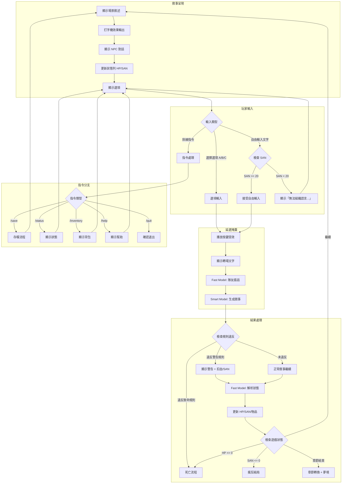

# UX Design Specification - nightmare-assault

**Author:** Pollux
**Date:** 2025-12-11

---

## Executive Summary

### Project Vision

惡夢驚襲 (Nightmare Assault) 是一款 CLI 終端機恐怖文字冒險遊戲，融合「規則怪談」與「海龜湯」推理元素。玩家扮演被惡夢纏身的主角，必須透過觀察、推理、發現潛規則來逃出生天。

**核心體驗：**
- 🎭 夢境預知 → 夢境片段是未來的線索
- 🧩 潛規則生存 → 隱藏規則，違反即死
- 😱 無力感恐懼 → 無法用武力解決，只能智取
- ⚖️ 公平性原則 → 每次死亡都有可追溯的線索

### Target Users

| 用戶類型 | 描述 | UX 需求 |
|----------|------|---------|
| **恐怖遊戲愛好者** | 喜歡規則怪談、恐怖解謎 | 沉浸式恐怖氛圍、文字渲染 |
| **推理遊戲玩家** | 喜歡海龜湯、偵探遊戲 | 清晰的線索呈現、邏輯追蹤 |
| **終端/CLI 愛好者** | 習慣使用終端工具的開發者 | 純文字但有沉浸感 |
| **AI 互動體驗者** | 對 LLM 遊戲有興趣 | 高自由度的互動與回應 |

**技術熟練度：** 中高（習慣 CLI 操作）
**平台：** 桌面終端機（Windows/macOS/Linux）

### Key Design Challenges

1. **終端機限制下的沉浸感**
   - 純文字環境如何營造恐怖氛圍
   - ASCII art、顏色、打字機效果的運用

2. **複雜資訊的清晰呈現**
   - 雙數值系統（HP + SAN）的直觀顯示
   - 線索、規則、物品的有效管理
   - 低理智狀態的視覺混亂 vs 可玩性平衡

3. **LLM 延遲的體驗處理**
   - Smart Model 生成需要時間（~2-5秒）
   - 如何讓等待時間不破壞沉浸感

4. **死亡覆盤的教育性**
   - 死亡時揭露線索而不讓玩家感到「不公平」
   - 鼓勵重玩而非沮喪

5. **首次啟動引導**
   - API Key 設定對非技術用戶的友善度

6. **存檔信任感**
   - 手動存檔機制，玩家需明確知道何時可存檔

7. **18+ 內容切換**
   - 首次年齡驗證 + 設定中隨時可調整

8. **多語言切換**
   - 繁中 ↔ 英文，UI 文字寬度變化處理

### Design Opportunities

1. **理智值視覺化**
   - 低 SAN 時的漸進式 UI 崩壞
   - 文字扭曲、顏色變化、幻覺選項
   - 這是一個獨特的 UX 特色

2. **隊友插話填補延遲**
   - Fast Model 生成隊友反應
   - 讓等待變成敘事的一部分

3. **死亡回顧的遊戲化**
   - 線索追溯圖表
   - 「你錯過了這些」的探索獎勵感

---

## Core UX Mechanisms

### 1. SAN 緩衝區與控制權剝奪

理智值不只是數字，而是**玩家控制權的指標**。

| SAN 範圍 | 輸入方式 | 視覺效果 | 心理效果 |
|----------|----------|----------|----------|
| ≥ 25 | 自由打字 + 選項 | 正常 UI | 完全掌控感 |
| 20-24 | 自由打字 + 選項 | 邊框變黃、輕微提示 | 預警階段 |
| 15-19 | 只能選擇選項 | 邊框變紅、「你的思緒開始模糊...」 | 開始失控 |
| 10-14 | 只能選擇選項 | 邊框符號變化、「恐懼讓你的大腦一片空白...」 | 恐慌 |
| 5-9 | 只能選擇選項 | 輸入框縮小、「你張開嘴，卻只有無聲的尖叫...」 | 崩潰邊緣 |
| 1-4 | 只能選擇選項 | 「▓▓▓ 意識正在崩解 ▓▓▓」 | 完全失控 |

**SAN 緩衝區視覺效果（按可靠度排序）：**

| 效果 | 實現方式 | 可靠度 |
|------|----------|--------|
| 邊框顏色變化 | ANSI 256 色，從白 → 黃 → 紅 | ⭐⭐⭐⭐⭐ |
| 提示文字 | 輸入框上方顯示狀態文字 | ⭐⭐⭐⭐⭐ |
| 邊框符號變化 | `┌──┐` → `╔══╗` → `▓▓▓▓` | ⭐⭐⭐⭐ |
| 輸入框縮小 | 可輸入字數從 100 → 50 → 20 | ⭐⭐⭐⭐ |
| 游標樣式 | `_` → `█` 閃爍加快 | ⭐⭐⭐ |

### 2. 三層延遲防護機制

等待時間不是技術問題，而是**敘事設計機會**。

```
[玩家按下 Enter]
     ↓ (0ms)
Layer 1: 本地轉場文字        ← 絕對不會失敗
     「你屏住呼吸...」
     ↓ (300ms)
Layer 2: Fast Model 隊友插話  ← 可能超時
     「小心！前面有聲音！」
     ↓ (2000ms)
Layer 3: 本地氛圍維持文字     ← 保底機制（如果 Layer 2 超時）
     ↓
[Smart Model 恐怖場景串流顯示]
```

**場景感知氛圍文字庫（按遊戲階段）：**

| 遊戲階段 | 氛圍文字風格 |
|----------|--------------|
| **序章/探索期** | 「你環顧四周...」「空氣中有股奇怪的味道...」 |
| **緊張期** | 「心跳聲在耳邊轟鳴...」「陰影似乎在蠕動...」 |
| **高潮期** | 「它們來了...」「逃不掉的...」 |

### 3. 死亡回溯系統（按難度分級）

死亡不是懲罰，而是**學習機會**。回溯機制依難度調整：

| 難度 | 回溯機制 | 敘事解釋 |
|------|----------|----------|
| **簡單** | 無限回溯 | 強大的預知夢能力 |
| **困難** | 單次回溯 | 微弱的預知能力 |
| **地獄** | 無回溯，只能讀檔 | 你只是普通人 |

**敘事包裝（非打破第四面牆的「讀檔」）：**

```
┌─────────────────────────────────────────────────────────────┐
│                                                             │
│     ▓▓▓ 黑暗吞噬了你的意識... ▓▓▓                          │
│                                                             │
│     ．．．                                                   │
│                                                             │
│     你猛然睜開眼——                                          │
│     剛才的死亡...是夢？還是預知？                           │
│     你發現自己回到了那個選擇的瞬間。                        │
│                                                             │
│     💭 「這一次，我不會再犯同樣的錯誤...」                  │
│                                                             │
│     [Enter] 重新選擇                                        │
│                                                             │
└─────────────────────────────────────────────────────────────┘
```

**設計意圖：**
- 回溯是「夢境預知」的延伸，符合遊戲世界觀
- 玩家感受到的是「角色能力」而非「遊戲作弊」
- 為什麼主角有預知能力？這本身可以是結局揭露的謎團

### 4. 首次體驗三部曲

三個「第一次」決定玩家是否繼續遊戲：

| 階段 | 場景 | 設計目標 |
|------|------|----------|
| **First Launch** | API 設定精靈 | 降低技術門檻 |
| **First Game** | 互動式教學 | 學會核心操作 |
| **First Death** | 溫柔的覆盤 | 建立「死亡是學習」的心態 |

**First Launch 設計：**

```
┌─────────────────────────────────────────────────────────────┐
│                                                             │
│     ▓▓▓ 歡迎來到惡夢驚襲 ▓▓▓                               │
│                                                             │
│     在開始之前，我們需要設定 AI 連線。                      │
│     這只需要一分鐘。                                        │
│                                                             │
│     ┌─────────────────────────────────────────────────┐    │
│     │  請選擇 AI 服務商：                              │    │
│     │                                                  │    │
│     │  [1] OpenAI (GPT-4o)        - 推薦，最穩定       │    │
│     │  [2] Anthropic (Claude)    - 文筆最佳           │    │
│     │  [3] Groq (Llama)          - 免費，速度極快      │    │
│     │  [4] 其他 / 自訂                                 │    │
│     └─────────────────────────────────────────────────┘    │
│                                                             │
│     💡 還沒有 API Key？按 [H] 查看取得教學                  │
│                                                             │
└─────────────────────────────────────────────────────────────┘
```

**First Death 設計：**

```
你倒下了...但這不是終點。

讓我們回顧一下——其實你離真相很近了。
在第 2 章，小明的死亡其實是一個警告...

[查看完整線索分析] [再試一次]
```

**設計意圖：**
- 不是「GAME OVER 你輸了」
- 而是「讓我們一起看看發生了什麼」
- 把死亡從懲罰變成教學時刻

### 5. 死亡覆盤的公平感設計

每次死亡後，展示玩家「本來可以活下來」的線索：

```
┌─────────────────────────────────────────────────────────────┐
│  ⚰️ 死亡原因：違反規則 #1                                   │
│                                                             │
│  📍 線索回顧：                                              │
│                                                             │
│  [第 1 章] ✓ 夢境暗示                                       │
│  [第 2 章] ✓ NPC 死亡示範                                   │
│  [第 2 章] ✓ 牆上文字                                       │
│                                                             │
│  💡 分析：你其實已經獲得了足夠的線索。                      │
│                                                             │
│  ─────────────────────────────────────────────────────────  │
│                                                             │
│  [1] 🔄 回到選擇之前（重試這個決定）                        │
│  [2] 📖 查看完整線索分析                                    │
│  [3] 💾 讀取上次存檔                                        │
│  [4] 🏠 返回主選單                                          │
│                                                             │
└─────────────────────────────────────────────────────────────┘
```

**設計意圖：**
- 讓玩家意識到「我本來可以活下來的」
- 而不是「這遊戲太難了」
- 創造重玩動機：每次死亡都是一堂課

---

## Implementation Priority

| 優先級 | 項目 | 說明 |
|--------|------|------|
| P0 | SAN 緩衝區視覺效果 | 邊框顏色變化、提示文字 |
| P0 | 三層延遲防護機制 | 本地轉場 + Fast Model + 保底文字 |
| P0 | 死亡覆盤畫面 | 線索回顧、公平感設計 |
| P1 | 死亡回溯系統 | 按難度分級、夢境敘事包裝 |
| P1 | First Launch 設定精靈 | API 設定流程 |
| P1 | First Death 溫柔覆盤 | 新手友善的死亡體驗 |
| P2 | SAN 進階視覺效果 | 邊框符號變化、輸入框縮小、游標閃爍 |

---

## Core User Experience

### Defining Experience

**核心循環：**
```
探索 → 發現線索 → 推理 → 行動 → 存活或死亡 → 覆盤學習
```

**玩家最頻繁的行動：**
- 閱讀故事敘述 → 推理線索 → 做出選擇

**絕對必須做好的互動：**
- **選擇/輸入系統** — 這是玩家與遊戲世界互動的唯一方式

**應該完全無障礙的體驗：**
- 閱讀文字、理解狀態、做出反應

### Platform Strategy

| 項目 | 決策 |
|------|------|
| **平台** | 桌面終端機（CLI） |
| **作業系統** | Windows / macOS / Linux |
| **輸入方式** | 鍵盤為主（無滑鼠） |
| **離線功能** | 不支援（需要 LLM API） |
| **特殊需求** | 256 色終端支援、最小 80x24 |

**平台限制轉化為設計機會：**
- CLI 的限制 → 迫使我們專注於**文字敘事的力量**
- 無圖形 → 玩家的**想像力**成為恐怖的載體
- 鍵盤操作 → **打字機效果**增強沉浸感

### Effortless Interactions

| 互動 | 目標 | 實現方式 |
|------|------|----------|
| **閱讀故事** | 不被打斷、沉浸式 | 打字機效果、適當換行 |
| **查看狀態** | 一目瞭然 | 頂部狀態列 HP/SAN |
| **做出選擇** | 快速響應 | 數字鍵/字母鍵選擇 |
| **使用指令** | 記得住、打得出 | 斜線指令 `/status` `/save` |
| **等待 AI** | 不感到等待 | 三層延遲防護機制 |

### Critical Success Moments

| 時刻 | 描述 | 設計目標 |
|------|------|----------|
| **「我懂了」時刻** | 首次啟動成功設定 API | 技術門檻不成為阻礙 |
| **「啊哈！」時刻** | 玩家推理出潛規則 | 線索清晰但不直白 |
| **「好險！」時刻** | 差點違規但躲過 | 警告機制有效 |
| **「原來如此」時刻** | 死亡覆盤揭露線索 | 公平感設計 |
| **「再來一次」時刻** | 玩家想重玩挑戰 | 回溯機制 + 不同難度 |
| **「毛骨悚然」時刻** | 低 SAN 的恐怖體驗 | UI 崩壞 + 幻覺選項 |

**首次用戶成功發生在：**
- 首次成功推理出一條規則並存活
- 這是「這遊戲很難但很公平」的認知建立點

### Experience Principles

| # | 原則 | 說明 |
|---|------|------|
| 1 | **文字即恐懼** | 純文字也能創造極致恐怖，靠的是玩家想像力 |
| 2 | **公平的死亡** | 每次死亡都有可追溯的線索，玩家「本來可以活」 |
| 3 | **控制權即理智** | SAN 值不只是數字，而是玩家對遊戲的掌控程度 |
| 4 | **等待即敘事** | API 延遲不是技術問題，而是緊張感營造的機會 |
| 5 | **死亡即教學** | 覆盤系統讓每次死亡都變成進步的契機 |
| 6 | **聲音即空間** | BGM 與音效定義了看不見的恐怖，填補文字之外的想像 |

---

## Audio System Design

### Audio as Space

CLI 沒有畫面，但有聲音。當玩家在黑暗的終端機中聽到心跳聲加速、遠處傳來腳步聲——這是文字做不到的「空間感」。

**音效層次設計：**

| 層次 | 類型 | 功能 | 範例 |
|------|------|------|------|
| **背景層** | 環境音 | 建立空間感 | 風聲、水滴、遠處雷聲 |
| **氛圍層** | BGM | 情緒引導 | 緊張配樂、安全區音樂 |
| **事件層** | 音效 | 強化關鍵時刻 | 心跳加速、門吱呀聲、尖叫 |
| **UI 層** | 系統音 | 操作回饋 | 選擇確認音、存檔音 |

### Audio Download System

**可選音樂包下載：**
```bash
nightmare --download-audio [pack]

可選包：
  --minimal    # 基礎音效 (~5MB)
  --standard   # 標準體驗 (~20MB) [預設]
  --full       # 完整音效 (~50MB)
```

**音效來源優先級：**
1. 用戶自訂 (`~/.nightmare/bgm/custom/`)
2. 下載的音效包 (`~/.nightmare/bgm/`)
3. 內嵌保底音效（極簡，~500KB）

**開源音樂來源：**

| 來源 | 授權 | 特色 |
|------|------|------|
| Freesound.org | CC0 / CC-BY | 大量音效、氛圍音 |
| OpenGameArt.org | CC0 / CC-BY | 專為遊戲設計 |
| Incompetech | CC-BY 4.0 | Kevin MacLeod 配樂，恐怖類豐富 |
| Pixabay Music | Pixabay License | 免費商用，免標註 |

### Audio Graceful Degradation

**音訊初始化失敗處理：**

```
┌─────────────────────────────────────────────────────────────┐
│  ⚠️ 音訊系統無法啟動                                        │
│                                                             │
│  遊戲將以靜音模式運行。                                     │
│  如需啟用音效，請安裝以下套件：                             │
│                                                             │
│  [根據檢測到的系統顯示對應指令]                             │
│                                                             │
│  ─────────────────────────────────────────────────────────  │
│                                                             │
│  [Enter] 繼續（靜音模式）                                   │
│  [Q] 離開，稍後再試                                         │
│                                                             │
└─────────────────────────────────────────────────────────────┘
```

**各平台安裝指令：**

| 平台 | 發行版 | 安裝指令 |
|------|--------|----------|
| Windows | - | 通常內建，無需安裝 |
| macOS | - | 通常內建，無需安裝 |
| Linux | Debian / Ubuntu | `sudo apt install libasound2-dev pulseaudio` |
| Linux | Fedora / RHEL | `sudo dnf install alsa-lib-devel pulseaudio` |
| Linux | Arch | `sudo pacman -S alsa-lib pulseaudio` |
| WSL2 | Ubuntu | `sudo apt install pulseaudio && pulseaudio --start` |

**診斷指令：**
```bash
nightmare --check-audio
```

**靜音模式提示：**
狀態列右上角顯示 `🔇` 圖示，不打斷遊戲流程。

---

## Display Mode System

### Three Display Modes

| 模式 | 風格 | 適用情境 |
|------|------|----------|
| **Unicode** | 現代、精緻、心理驚悚 | 預設，大多數用戶 |
| **ASCII** | 復古、粗獷、80 年代 B 級恐怖片 | 舊終端、懷舊愛好者 |
| **Accessible** | 簡潔、螢幕閱讀器友善 | 視障用戶 |

**設計理念：ASCII 模式是「風格」，不是「降級」**

| 面向 | 說明 |
|------|------|
| 懷舊感 | 讓人想起 DOS 時代的經典恐怖遊戲 |
| 一致性 | 比「缺字的 Unicode」體驗更完整 |
| 效能 | 某些老舊終端渲染更快 |
| 無障礙 | 螢幕閱讀器對 ASCII 支援更好 |

### Display Mode Comparison

**整體風格：**

```
Unicode 風格：
┌─────────────────────────────────────────────────┐
│  ▓▓▓ 惡夢驚襲 ▓▓▓                               │
│                                                 │
│  HP [████████░░] 80    SAN [██████░░░░] 55      │
└─────────────────────────────────────────────────┘

ASCII 風格（復古終端感）：
+--------------------------------------------------+
|  === NIGHTMARE ASSAULT ===                       |
|                                                  |
|  HP [========..] 80    SAN [======....] 55       |
+--------------------------------------------------+
```

**低 SAN 效果對照：**

| 效果 | Unicode | ASCII |
|------|---------|-------|
| 文字扭曲 | `H̸̭e̵͚l̷̰l̶̳o̸͖` | `H-E-L-L-O` 或 `H34R` (L33t speak) |
| 邊框崩壞 | `╔══╗` → `▓▓▓▓` | `+--+` → `#--#` |
| 幻覺選項 | `[C] 發光的門 ✨` | `[C] THE DOOR OF LIGHT` |
| 死亡畫面 | `▓▓▓ YOU DIED ▓▓▓` | `*** YOU DIED ***` |

### First-Launch Display Detection

```
┌─────────────────────────────────────────────────────────────┐
│                                                             │
│  🔍 終端機顯示能力檢測                                      │
│                                                             │
│  請確認以下字符是否正確顯示：                               │
│                                                             │
│  邊框：┌─────────┐                                          │
│       │  測試    │                                          │
│       └─────────┘                                          │
│                                                             │
│  填充：████░░░░ ▓▓▓▒▒▒                                      │
│                                                             │
│  中文：惡夢驚襲                                              │
│                                                             │
│  ─────────────────────────────────────────────────────────  │
│                                                             │
│  您看到的是：                                               │
│  [1] 全部正常顯示 ✓                                         │
│  [2] 部分是亂碼或方框 □                                     │
│  [3] 完全無法辨識                                           │
│                                                             │
└─────────────────────────────────────────────────────────────┘
```

**切換指令：**
```
/display unicode    # 使用完整 Unicode
/display ascii      # ASCII 相容模式
/display accessible # 無障礙模式
/display auto       # 自動檢測（預設）
```

### Safe Character Set

| 類別 | 安全使用 | 避免使用 |
|------|----------|----------|
| **邊框** | `┌┐└┘│─├┤┬┴┼` | 雙線框 `╔╗╚╝║═` |
| **填充** | `█ ░ ▓` | Braille `⣿⣀` |
| **箭頭** | `> < ^ v` | `→ ← ↑ ↓ ▶ ◀` |
| **圖示** | `[!] [?] [X]` | Emoji `⚠️ ❓ ❌` |
| **強調** | `* ** ===` | Zalgo 文字 |

---

## Connection Test with Narrative

API 連線測試融入遊戲氛圍，從第一秒就建立恐怖體驗：

```
┌─────────────────────────────────────────────────────────────┐
│                                                             │
│  正在連結夢境...                                            │
│                                                             │
│  [████████████████████████] 100%                           │
│                                                             │
│  「...你聽到了嗎？」                                        │
│                                                             │
│  ✅ 連線已建立。Smart Model 回應時間：1.2s                  │
│  ✅ 連線已建立。Fast Model 回應時間：0.3s                   │
│                                                             │
│  它們已經在等你了。                                         │
│                                                             │
│  [Enter] 進入惡夢                                           │
│                                                             │
└─────────────────────────────────────────────────────────────┘
```

---

## Updated Implementation Priority

| 優先級 | 項目 | 說明 |
|--------|------|------|
| P0 | SAN 緩衝區視覺效果 | 邊框顏色變化、提示文字 |
| P0 | 三層延遲防護機制 | 本地轉場 + Fast Model + 保底文字 |
| P0 | 死亡覆盤畫面 | 線索回顧、公平感設計 |
| P0 | 基礎 BGM + SFX 播放 | 音效系統核心功能 |
| P0 | Graceful degradation | 音訊/顯示失敗時的靜音/ASCII 模式 |
| P1 | 死亡回溯系統 | 按難度分級、夢境敘事包裝 |
| P1 | First Launch 設定精靈 | API 設定 + 顯示檢測 + 音訊檢測 |
| P1 | First Death 溫柔覆盤 | 新手友善的死亡體驗 |
| P1 | 平台檢測 + 安裝指引 | Linux 音訊套件提示 |
| P1 | `--check-audio` 診斷指令 | 音訊系統排查 |
| P2 | SAN 進階視覺效果 | 邊框符號變化、輸入框縮小、游標閃爍 |
| P2 | 低 SAN 音效崩壞 | 音效扭曲、幻聽 |
| P2 | 四層音效分層 | 背景/氛圍/事件/UI 分離 |

---

## 4. 情緒反應設計 (Emotional Response Definition)

### 4.1 主要情緒目標

| 情緒 | 描述 | 設計目標 |
|------|------|----------|
| 恐懼 | 對未知的害怕 | 想繼續但不敢 |
| 緊張 | 對規則的警覺 | 時刻保持注意 |
| 好奇 | 對真相的渴望 | 想知道更多 |
| 成就感 | 推理成功的滿足 | 我真聰明 |
| 想再來一次 | 死亡後的動力 | 這次我一定行 |

### 4.2 情緒旅程地圖

```
首次啟動 ──┬── 好奇：「這是什麼遊戲？」
           └── 期待：「看起來很有趣」
     ↓
序章開始 ──┬── 好奇：「這個世界觀是？」
           └── 輕微緊張：「氣氛有點怪」
     ↓
探索期 ────┬── 好奇主導：「這裡有什麼？」
           └── 安全感：「目前還好」
     ↓
發現規則 ──┬── 緊張升高：「原來有這種規則」
           └── 警覺：「我要小心」
     ↓
緊張期 ────┬── 恐懼萌芽：「不對勁...」
           └── 緊張維持：「不能犯錯」
     ↓
做出選擇 ──┬── 壓力：「選哪個？」
           └── 不確定：「這樣對嗎？」
     ↓
差點違規 ──┬── 後怕：「好險！」
           └── 緊張加劇：「差點死掉」
     ↓
低 SAN 期 ─┬── 失控感：「我分不清了」
           └── 恐懼高峰：「什麼是真的？」
     ↓
死亡 ──────┬── 震驚：「發生什麼事？」
           └── 接受：「原來是這樣...」
     ↓
覆盤 ──────┬── 恍然大悟：「線索在這裡！」
           └── 公平感：「我本可以避免」
     ↓
重新開始 ──┬── 決心：「這次我知道了」
           └── 興奮：「再來一次！」
```

### 4.3 微情緒設計

#### 恐懼 vs 沮喪
| 要素 | 恐懼（好） | 沮喪（壞） |
|------|-----------|-----------|
| 來源 | 未知的威脅 | 不公平的死亡 |
| 感受 | 想繼續但不敢 | 不想玩了 |
| 設計 | 留有線索 | 無預警殺人 |
| 結果 | 玩家保持警覺 | 玩家放棄遊戲 |

#### 緊張 vs 焦慮
| 要素 | 緊張（好） | 焦慮（壞） |
|------|-----------|-----------|
| 來源 | 已知的規則壓力 | 資訊過載 |
| 感受 | 專注、警覺 | 煩躁、無從下手 |
| 設計 | 規則清晰，後果嚴重 | 規則太多太複雜 |
| 結果 | 玩家小心謹慎 | 玩家記不住放棄 |

#### 好奇 vs 無聊
| 要素 | 好奇（好） | 無聊（壞） |
|------|-----------|-----------|
| 來源 | 有趣的謎團 | 重複的內容 |
| 感受 | 想知道更多 | 跳過對話 |
| 設計 | 適時揭露新資訊 | 過多無意義文字 |
| 結果 | 玩家主動探索 | 玩家失去興趣 |

#### 成就 vs 僥倖
| 要素 | 成就（好） | 僥倖（壞） |
|------|-----------|-----------|
| 來源 | 推理正確 | 矇對答案 |
| 感受 | 「我真聰明」 | 「還好猜對了」 |
| 設計 | 選擇有邏輯依據 | 選項間無明顯差異 |
| 結果 | 玩家感到被尊重 | 玩家感到是賭運氣 |

#### 失控 vs 被欺負
| 要素 | 失控（好） | 被欺負（壞） |
|------|-----------|-----------|
| 來源 | SAN 降低的自然結果 | 遊戲惡意設計 |
| 感受 | 「我的角色瘋了」 | 「遊戲在整我」 |
| 設計 | 有預警、有邏輯 | 突然改變規則 |
| 結果 | 沉浸在角色中 | 抽離、憤怒 |

### 4.4 幻覺選項設計原則

**❌ 錯誤做法：事先標記幻覺選項**
- 「標記了就不恐怖了」
- 玩家知道是假的就不會選
- 失去對自己感官的懷疑

**✅ 正確做法：事後揭露**

```
【選擇時】
你聽到三個方向的聲音：
[A] 右邊走廊傳來呼救聲
[B] 左邊房間有微弱的光
[C] 身後有腳步聲接近

（沒有任何標記，玩家根據直覺選擇）

【選擇 A 後】
你衝向右邊走廊——
但那裡什麼都沒有。
只有你自己的回音在迴盪。
你意識到，那個聲音從一開始就不存在。

【覆盤時】
💀 選項 A 是幻覺
   原因：你的 SAN 只有 15
   線索：「呼救聲」的描述用了「彷彿」「似乎」等詞
```

**設計哲學轉換**
- ❌ 被欺騙感：「遊戲騙我選假選項」
- ✅ 感官懷疑：「我連自己聽到的都不能相信了」
  → 這才是真正的恐怖體驗

### 4.5 隊友死亡情緒設計

#### 情緒三階段弧線

```
死亡瞬間 ────── 震驚、悲傷
    │           「小明...不！」
    ↓
死亡之後 ────── 愧疚、警惕
    │           「你本可以救他的」
    │           「如果當時我選 A...」
    ↓
後續章節 ────── 孤獨、壓力增加
                隊伍變小，責任變重
                「現在只剩我們兩個了」
```

#### 設計核心原則

**關鍵心理：「這是我的錯」而非「這是劇本殺」**

| 玩家反應 | 判斷標準 |
|----------|----------|
| 「如果我選 A 就好了」 | ✅ 成功設計 |
| 「遊戲不讓我救他」 | ❌ 失敗設計 |
| 「這是我的責任」 | ✅ 玩家產生愧疚 |
| 「反正是 NPC」 | ❌ 玩家沒有投入 |

**大部分隊友死亡應該是可預防的**
- 玩家有機會做出正確選擇
- 正確選擇能改變結果
- 死亡是玩家選擇的後果，不是強制劇情

### 4.6 可預防死亡設計原則

#### ❌ 錯誤範例（劇本殺）

```
走廊盡頭傳來細碎的腳步聲。
小明突然停下來：「你們聽到了嗎？好像有人在叫我的名字...」
在你來得及阻止之前，他已經朝著聲音走去。
「小明！」你大喊，但太遲了。
黑暗吞噬了他。

→ 問題：「在你來得及阻止之前」= 玩家沒有選擇權
```

#### ✅ 正確設計：三階段架構

**第一階段：伏筆（前置章節）**
```
【第一章】
你注意到牆上有人用血寫的字：
「聽到名字，別回應。」

【同章節的另一處】
小美若有所思：「我昨晚好像夢到有人叫我...」
你：「然後呢？」
小美：「我沒理他，然後就醒了。」
她頓了頓：「醒來發現自己站在窗邊。」
```

**第二階段：預警（事件前的選擇）**
```
走廊盡頭傳來細碎的腳步聲。
小明突然停下來：「你們聽到了嗎？好像有人在叫我的名字...」
他的眼神變得有些恍惚。

[A] 「小明！別聽！記得牆上的字嗎？」（嘗試阻止）
[B] 不說話，但準備拉住他（被動觀察）
[C] 「真的嗎？你聽清楚說什麼了嗎？」（無意中鼓勵）
[D] 【自由輸入】
```

**第三階段：後果分歧**
```
選 A（阻止）：
小明愣了一下，眼神逐漸恢復清明。
「對...對，牆上的字。」他深吸一口氣。
「謝謝，我差點...」他沒有說完，但你們都懂。

選 B（被動）：
小明向前踏出一步——你抓住他的手臂。
他掙扎著，嘴裡喃喃自語：「放開我...她在叫我...」
【擲骰/技能檢定】成功：拉回；失敗：他掙脫了

選 C（鼓勵）：
「它說...說讓我過去，說那裡很安全...」
小明的腳步不由自主地向前。
你喊他的名字，但他好像聽不見了。
黑暗吞噬了他。
→ 死亡，且玩家會有愧疚感：「是我問的...」
```

### 4.7 角色介紹設計原則

#### ❌ 避免：RPG 角色卡

```
【小明加入隊伍】
姓名：陳小明
年齡：24 歲
職業：研究生
特長：化學知識、冷靜分析
弱點：體力較差、有點固執
背景：你的大學室友...

→ 問題：像在讀說明書，打破沉浸感
```

#### ✅ 使用：行為展示 (Show, Don't Tell)

**方法一：主角記憶**
```
小明站在廢墟前，臉色有些發白。
你想起大一那年，他連鬼屋都不敢進，最後是你拖著他走完全程的。
```

**方法二：行動展示性格**
```
門鎖住了。
小美走上前，從髮間抽出一根髮夾。
幾秒後，「喀」的一聲。
「走吧。」她若無其事地說。
你從不知道她會這個。
```

**方法三：對話揭示關係**
```
「還記得畢業旅行嗎？」小明突然說。
「那個下雨天，我們困在廟裡。」
「你當時說，『反正出不去，不如探險』。」
他苦笑：「我當時覺得你瘋了，現在也是。」
```

**方法四：物品觸發記憶**
```
小美的手機螢幕亮了一下。
你瞥見一個小女孩的照片。
「我女兒，」小美注意到你的目光，「她四歲了。」
她把手機收起來：「所以我一定要活著出去。」
```

**方法五：他人評價**
```
「小明那傢伙...」阿強壓低聲音。
「我不信任他。」
「為什麼？」
「畢業後的事，你不知道嗎？」
```

#### 角色介紹設計原則

| 原則 | 說明 |
|------|------|
| Show, Don't Tell | 用行動/對話展示，不用說明文字 |
| 逐步揭露 | 分散在多個場景，不要一次全講 |
| 先建立羈絆 | 讓玩家在乎角色，再讓角色面臨危險 |
| 每個人有秘密 | 可被發現的秘密增加探索動機 |
| 關係網絡 | NPC 之間的關係也要設計 |

### 4.8 LLM Characterization Rules

```
CHARACTERIZATION RULES:

1. NEVER use stat blocks or character sheets
   - No "特長：xxx" or "性格：xxx" exposition
   - Reveal traits through observable behavior

2. Show personality through action and dialogue
   - Nervous character: describes fidgeting, hesitation
   - Brave character: acts first, questions later
   - Smart character: notices details others miss

3. Use protagonist's memories for backstory
   - "你想起..." format to reveal shared history
   - Memories triggered by locations, objects, or dialogue
   - Unreliable memories at low SAN

4. Every character has a discoverable secret
   - Secrets create exploration incentive
   - Some secrets affect survival
   - Not all secrets are revealed in one playthrough

5. Make player CARE before character can die
   - Establish emotional connection first
   - Minimum 2-3 positive interactions before death risk
   - Death of stranger ≠ death of friend
```

---

## UX Pattern Analysis & Inspiration

### Inspiring Products Analysis

#### 1. Inscryption（卡牌 + 恐怖 + 元敘事）

| 面向 | 分析 |
|------|------|
| **做得好的地方** | 打破第四面牆但不突兀，遊戲機制本身就是敘事 |
| **印象深刻** | 「遊戲在看著你」的感覺，卡牌會說話、對手會作弊 |
| **想再玩的原因** | 多層敘事，第一輪結束才發現「這不是真正的遊戲」 |
| **可借鏡** | UI 本身是恐怖的一部分，不只是承載內容的框架 |

**具體學習：**
- 存檔系統變成劇情元素（刪除存檔 = 角色死亡）
- 選單畫面有秘密
- 失敗不是結束，是揭露更多

#### 2. Lifeline 系列（即時文字冒險）

| 面向 | 分析 |
|------|------|
| **做得好的地方** | 真實時間等待，角色「真的在做事」 |
| **印象深刻** | 等待 2 小時後收到通知：「我到了...這裡有東西」 |
| **想再玩的原因** | 情感連結，Taylor 感覺像真正的朋友 |
| **可借鏡** | 等待變成敘事張力，而非技術缺陷 |

**具體學習：**
- 「對方正在輸入...」的緊張感
- 選項後角色會反駁你、質疑你
- 死亡是真的死亡，存檔要從頭來

#### 3. lazygit / lazydocker（CLI 工具）

| 面向 | 分析 |
|------|------|
| **做得好的地方** | 複雜功能的簡潔呈現，鍵盤操作直覺 |
| **印象深刻** | 視覺化 git 狀態，不用背指令 |
| **想再用的原因** | 比 GUI 快，比純 CLI 友善 |
| **可借鏡** | 分割視窗資訊架構、快捷鍵提示常駐 |

**具體學習：**
- 底部永遠有快捷鍵提示
- 狀態變化即時反饋
- 複雜操作可預覽結果

#### 4. Doki Doki Literature Club（視覺小說 + 心理恐怖）

| 面向 | 分析 |
|------|------|
| **做得好的地方** | 類型顛覆，用「正常」反襯「不正常」 |
| **印象深刻** | 遊戲檔案被竄改、角色知道她在遊戲裡 |
| **想再玩的原因** | 隱藏內容極多，社群解謎 |
| **可借鏡** | 「錯誤」可以是設計，glitch 即恐怖 |

**具體學習：**
- 文字顯示異常作為恐怖手段
- 系統訊息變成劇情
- 玩家的操作被「看見」

#### 5. SCP 基金會 / The Backrooms（協作式恐怖創作）

| 面向 | 分析 |
|------|------|
| **做得好的地方** | 官僚文體反襯恐怖，留白激發想像 |
| **印象深刻** | 越冷靜的描述越可怕 |
| **可借鏡** | 「收容措施」即規則，讀者自行推理為什麼需要這些規則 |

**具體學習：**
- 不直接描述恐怖，描述「如何避免」
- [資料刪除] 比寫出來更可怕
- 規則的存在暗示了曾經的失敗

### Transferable UX Patterns

#### 導航與資訊架構模式

| 來源 | 模式 | 應用場景 |
|------|------|----------|
| lazygit | 底部常駐快捷鍵提示 | 遊戲中 `/help` 提示、SAN/HP 狀態列 |
| lazygit | 分割視窗資訊層級 | 主敘事 vs 狀態 vs 隊友對話 |
| Inscryption | 選單隱藏層 | 通關後解鎖的選項、主選單的「異常」 |

#### 互動模式

| 來源 | 模式 | 應用場景 |
|------|------|----------|
| Lifeline | 等待 = 敘事張力 | API 延遲 → 「小明正在移動...」 |
| Lifeline | 角色會反駁玩家 | 選項後 NPC 質疑：「你確定嗎？」 |
| DDLC | 玩家操作被「看見」 | 低 SAN 時：「你剛才想存檔？」 |
| Inscryption | 失敗揭露更多 | 死亡覆盤教學、解鎖隱藏資訊 |

#### 視覺與情緒模式

| 來源 | 模式 | 應用場景 |
|------|------|----------|
| DDLC | Glitch 即恐怖 | 低 SAN 文字扭曲、Zalgo text |
| Inscryption | UI 本身是恐怖 | 邊框崩壞、選項「自己移動」 |
| SCP | 冷靜文體反襯 | 官僚式規則描述、[資料刪除] |
| SCP | 留白激發想像 | 不說怪物外觀，說「如何避免」 |

### Anti-Patterns to Avoid

| 反模式 | 問題 | 我們的對策 |
|--------|------|------------|
| Jump scare 依賴 | 廉價、一次性、無法在純文字中實現 | 用張力累積取代突發驚嚇 |
| 過度解釋規則 | 破壞推理樂趣，像在讀說明書 | SCP 風格：暗示 > 明說 |
| 懲罰性死亡 | 玩家覺得被騙、浪費時間 | 死亡覆盤教學、公平線索 |
| 假選擇 | 「選什麼結果都一樣」的幻覺 | 選擇有真實後果、NPC 會記得 |
| 資訊過載 | CLI 變成 wall of text | 打字機效果、分段呈現、視覺分隔 |
| 等待無回饋 | 玩家以為當機 | 「正在思考...」、進度暗示 |
| 真實時間壓力 | 「你有 10 秒選擇」會導致 LLM 延遲問題，且與推理玩法衝突 | 規則怪談的恐怖來自「做錯選擇」，不是「來不及選擇」 |

### Design Inspiration Strategy

#### 採用（直接學習）

| 模式 | 原因 |
|------|------|
| **常駐快捷鍵提示**（lazygit） | CLI 使用者期待的體驗，降低學習曲線 |
| **等待即敘事**（Lifeline） | 完美解決 API 延遲問題，化劣勢為特色 |
| **Glitch 即恐怖**（DDLC） | 純文字實現視覺恐怖的最佳方式 |
| **[資料刪除] 留白**（SCP） | 符合規則怪談類型，激發玩家想像 |

#### 調適（修改後應用）

| 模式 | 調整方向 | 具體實作 |
|------|----------|----------|
| 即時推播等待（Lifeline） | 縮短到 30 秒-2 分鐘 | CLI 不適合太長等待 |
| 多層敘事揭露（Inscryption） | 簡化為兩層 | 「正常結局→真結局」 |
| 存檔描述異常（DDLC 風格） | 不動檔案，改存檔顯示文字 | 低 SAN 時存檔名稱 Zalgo 化 |

**存檔異常範例：**

```
┌─────────────────────────────────────────────────────────────┐
│  💾 存檔列表                                                │
│                                                             │
│  [1] 存檔 1 - 第 3 章「走廊」 - 2024/12/15 14:30           │
│  [2] 存檔 2 - 第 5 章「鏡̷子̸房̵」 - 2024/12/15 16:45       │
│  [3] 存̶檔̷ ̵3̸ ̶-̷ ̵不̸要̷讀̶取̵這̸個̷ - ??:??                    │
│                                                             │
└─────────────────────────────────────────────────────────────┘
```

*存檔 3 是玩家 SAN 歸零時自動創建的「詛咒存檔」，讀取會有特殊劇情。*

#### 避免

| 模式 | 原因 |
|------|------|
| **即時動作操作** | CLI 不適合反應速度挑戰 |
| **視覺 jump scare** | 純文字無法實現，且不符合心理恐怖定位 |
| **複雜卡牌機制** | 我們的核心是敘事推理，不是卡牌策略 |
| **真實時間壓力** | 「你有 10 秒選擇」與 LLM 延遲和推理玩法衝突 |

### Integrated Design Examples

#### 從 Inscryption 學：主選單不只是選單

```
┌─────────────────────────────────────────────────────────────┐
│                                                             │
│     ▓▓▓ 惡夢驚襲 ▓▓▓                                       │
│                                                             │
│     [1] 新遊戲                                              │
│     [2] 繼續                                                │
│     [3] 設定                                                │
│     [4] ????（第一輪看不到，通關後解鎖）                    │
│                                                             │
│                                                             │
│     ░░░ 有什麼在選單背後移動 ░░░                           │
│                                                             │
└─────────────────────────────────────────────────────────────┘
```

#### 從 Lifeline 學：等待創造張力

```
[玩家選擇派小明去探路]

小明：「好...我去看看。」

--- 等待 30 秒（Smart Model 生成中）---
--- 這 30 秒顯示：「小明正在移動...」---

小明：「我到了。這裡...」
小明：「等等，有聲音」
小明：「...」

[玩家的焦慮在等待中累積]
```

#### 從 SCP 學：規則的呈現方式

```
❌ 直接說：
「規則：聽到鐘聲時不能移動」

✅ SCP 風格：
┌─────────────────────────────────────────────────────────────┐
│  📋 倖存者筆記 #7（部分損毀）                               │
│                                                             │
│  ...鐘聲響起時，[無法辨識] 必須立刻 [污損]                  │
│  違反者將在 [數據刪除] 秒內                                 │
│                                                             │
│  已知受害者：12 人                                          │
│  目前倖存者：3 人                                           │
│                                                             │
│  附註：為什麼是鐘聲？誰在敲鐘？                             │
│       ——不要問這個問題                                      │
└─────────────────────────────────────────────────────────────┘

玩家自己推理：「不能動？不能出聲？到底是什麼？」
```

---

## Design System Foundation

### Design System Choice

**選擇：Charm 全家桶 + 自訂恐怖元件層**

```
Charm 全家桶
    └── Bubble Tea (框架)
    └── Lip Gloss (樣式/主題)
    └── Bubbles (基礎元件)
        │
        ▼
自訂恐怖層
    └── horror/ (HorrorStyle 五維度)
    └── events/ (Event Bus 混合模式)
    └── renderer/ (三模式 DisplayRenderer)
    └── components/ (恐怖元件)
```

**核心依賴：**
- `github.com/charmbracelet/bubbletea v1.2.4` - TUI 框架
- `github.com/charmbracelet/lipgloss v1.0.0` - 樣式系統
- `github.com/charmbracelet/bubbles v0.20.0` - 標準元件庫

### Rationale for Selection

| 考量 | 決策 |
|------|------|
| 開發速度 | 用現成元件處理 80% 基礎功能 |
| 獨特性 | 自訂恐怖元件層實現差異化 |
| 三模式支援 | Lip Gloss 主題系統天生適合 |
| 維護性 | 依賴 Charm 官方維護的穩定庫 |
| 生態成熟度 | Go CLI 領域最完整的選擇 |

### Implementation Approach

**Layer 1: 直接使用 Bubbles**
- `viewport` - 文字滾動
- `list` - 基礎選單（包裝後加幻覺）
- `spinner` - 載入動畫
- `textinput` - 自由輸入模式

**Layer 2: 自訂恐怖元件**
- `TypewriterView` - 打字機效果
- `GlitchText` - Zalgo/亂碼文字
- `SanityBar` - SAN 值顯示
- `HallucinationList` - 可注入幻覺選項的選單

**Layer 3: DisplayRenderer 抽象**
- `UnicodeRenderer` - 完整 Unicode（心理驚悚風格）
- `ASCIIRenderer` - 復古 80s 風格（B 級恐怖片）
- `AccessibleRenderer` - 無障礙模式（文字描述恐怖）

### HorrorStyle 五維度系統

恐怖效果根據 SAN 值動態調整，分為五個獨立維度：

| 維度 | 控制什麼 | SAN 影響 |
|------|----------|----------|
| `TextCorruption` | Glitch/Zalgo 強度 | SAN 越低越嚴重 |
| `TypingBehavior` | 打字速度、吞字機率 | 低 SAN 時不穩定 |
| `ColorShift` | 顏色偏移程度 | 低 SAN 時偏紅 |
| `UIStability` | 邊框抖動、閃爍 | 低 SAN 時不穩定 |
| `OptionReliability` | 幻覺選項出現機率 | SAN < 20 時啟用 |

```go
// internal/tui/horror/style.go

type HorrorStyle struct {
    TextCorruption    float64 // 0.0-1.0
    TypingBehavior    TypingConfig
    ColorShift        float64 // 0.0-1.0, 偏紅程度
    UIStability       float64 // 1.0=穩定, 0.0=劇烈抖動
    OptionReliability float64 // 1.0=可信, 0.0=全是幻覺
}

// 根據 SAN 值取得恐怖風格
func StyleFromSAN(san int) HorrorStyle {
    // SAN 越低，效果越強
}
```

### Event Bus 混合模式

恐怖事件系統使用同步+異步混合架構：

```go
// internal/tui/events/bus.go

type EventBus struct {
    // 同步回調：UI 即時反應（閃爍、音效觸發）
    syncHandlers map[EventType][]func(Event)

    // 異步 channel：非即時處理（統計、日誌）
    asyncChan chan Event
}

func (eb *EventBus) Emit(e Event) {
    // 1. 同步處理：UI 必須立即反應
    for _, handler := range eb.syncHandlers[e.Type] {
        handler(e)
    }

    // 2. 異步處理：非關鍵路徑
    select {
    case eb.asyncChan <- e:
    default: // 緩衝滿就丟棄，不阻塞 UI
    }
}
```

**事件流範例：**
```
1. LLM 回傳 <sfx>scream</sfx>
2. 程式解析，發射 HorrorEvent{Type: Scream}
3. 各元件同步反應：
   - 音效：播放尖叫
   - 畫面：瞬間全紅閃爍
   - 文字：加速顯示
   - SAN：下降 15 點
```

### 無障礙模式恐怖設計

**核心原則：恐怖來自「不確定性」，不是「視覺干擾」**

無障礙模式保留完整恐怖體驗，用文字描述取代視覺效果：

| 視覺效果 | 無障礙文字描述 |
|----------|----------------|
| Zalgo 文字 | `[文字開始扭曲]` `[字跡變得難以辨認]` |
| 畫面閃紅 | `[視野被血紅色吞噬]` |
| 邊框抖動 | `[周圍的一切都在顫抖]` |
| 打字機變慢 | `[思緒變得遲緩...]` |
| 選項閃爍 | `[你的判斷開始動搖]` |
| 畫面全黑 | `[黑暗吞噬了一切]` |

**幻覺選項在無障礙模式仍然存在**——玩家同樣會被騙，只是覆盤時會明確標示。

### 目錄結構

```
internal/tui/
├── app.go                    # TUI 主應用
├── model.go                  # Bubble Tea Model
│
├── components/               # 自訂元件
│   ├── typewriter.go         # 打字機效果
│   ├── glitch.go             # Zalgo/亂碼文字
│   ├── sanity_bar.go         # SAN 條
│   ├── health_bar.go         # HP 條
│   ├── option_list.go        # 選項列表（含幻覺）
│   └── transition.go         # 轉場文字
│
├── horror/                   # 恐怖效果系統
│   ├── style.go              # HorrorStyle 五維度定義
│   ├── san_effects.go        # SAN 連動效果
│   └── corruption.go         # 文字污染演算法（硬編碼字符表）
│
├── events/                   # 事件系統
│   ├── bus.go                # 事件總線（混合模式）
│   ├── types.go              # 事件類型定義
│   └── handlers.go           # 事件處理器
│
├── renderer/                 # 顯示模式
│   ├── interface.go          # DisplayRenderer 介面
│   ├── unicode.go            # Unicode 模式
│   ├── ascii.go              # ASCII 模式
│   └── accessible.go         # 無障礙模式（含文字描述庫）
│
├── theme/                    # 主題系統
│   ├── tokens.go             # 設計 token
│   ├── midnight.go           # 預設深色主題
│   ├── blood.go              # 低 SAN 主題
│   └── terminal.go           # 復古終端主題
│
└── views/                    # 畫面
    ├── menu.go               # 主選單
    ├── game.go               # 遊戲主畫面
    ├── death.go              # 死亡畫面
    ├── debrief.go            # 覆盤畫面
    └── settings.go           # 設定畫面
```

### 效能優化策略

| 場景 | 潛在問題 | 解法 |
|------|----------|------|
| Glitch 效果 | 頻繁字串操作 | 預生成 Glitch 字符表（硬編碼） |
| 打字機效果 | 大量 tick 事件 | 批次更新，每 50ms 一次 |
| 主題切換 | 全畫面重繪 | 差異更新，只改變化部分 |

### 測試策略

| 元件 | 測試方法 |
|------|----------|
| GlitchText | Golden file 測試（固定 seed）+ 不同 SAN 等級快照 |
| TypewriterView | 時間模擬測試 + 中斷/跳過測試 |
| DisplayRenderer | Interface mock + 三模式切換測試 |
| HorrorEvent | 事件發射與接收測試 |
| 整合測試 | 完整 SAN 下降流程測試 |

---

## Defining Core Experience

### The One-Line Pitch

**「一款你可以做任何事、但要在發瘋前推理出生存規則的 AI 恐怖遊戲」**

拆解：
- 「可以做任何事」→ AI 臨場反應，自由度
- 「發瘋前」→ SAN 機制，時間壓力
- 「推理出生存規則」→ 核心玩法
- 「AI 恐怖遊戲」→ 類型定位

### Experience Hierarchy

| 層級 | 體驗 | 說明 |
|------|------|------|
| 核心玩法 | 規則推理 | 遊戲的骨架 |
| 獨特賣點 1 | SAN 失控 | 介面本身是恐怖的一部分 |
| 獨特賣點 2 | AI 臨場反應 | 無限可能性，每個人的故事都不同 |
| 體驗增強 | 死亡覆盤 | 讓死亡有意義 |

### The Four Pillars

| 支柱 | 一句話 | 玩家感受 |
|------|--------|----------|
| 規則推理 | 發現隱藏規則才能活 | 「原來如此！」 |
| SAN 失控 | 理智越低越不可信 | 「我不能相信自己的眼睛」 |
| AI 自由度 | 想做什麼就做什麼 | 「這遊戲真的讓我這樣做了」 |
| 公平死亡 | 每次死亡都有跡可循 | 「我本來可以活的」 |

**核心體驗公式：**
```
核心體驗 = 規則推理 × AI 自由度 × SAN 失控
```

### AI Freedom: The Differentiator

傳統規則怪談遊戲做不到的：

| 傳統文字冒險 | Nightmare Assault |
|--------------|-------------------|
| 預設選項 A/B/C | 可以打任何東西 |
| 固定劇情分支 | AI 即時生成回應 |
| 「這個指令無效」 | 「你試圖用火燒門，但門似乎...在笑」 |
| 玩 10 次都一樣 | 每次都是獨特體驗 |

**玩家會這樣形容：**
> 「我輸入『我要唱歌給鬼聽』，AI 真的讓我唱了，然後鬼被我激怒了」
> 「我朋友選了逃跑，我選了躲起來，我們的故事完全不一樣」

### AI Freedom Design Challenges

| 挑戰 | 解法 |
|------|------|
| 玩家輸入超出預期 | 脫軌處理系統（已設計於 PRD） |
| 破壞恐怖氛圍 | 所有「能力」都有代價 |
| 規則被繞過 | 規則是世界法則，無法用創意繞過 |
| 故事失控 | Game Bible 錨定核心劇情 |

**設計原則：**
- 「你可以做任何事，但這個世界有它的規則。」
- 「你的創意會被接納，但後果由世界決定。」

### Player Recommendation Quote

當玩家向朋友推薦時會說：

> 「這是一款你可以輸入任何東西的恐怖遊戲，但你要自己發現規則，不然就會死。而且當你快瘋的時候，連遊戲介面都在騙你。」

### Success Criteria

| 指標 | 成功標準 |
|------|----------|
| 規則推理 | 玩家死後能回想到「那個線索」 |
| AI 自由度 | 玩家嘗試奇怪輸入時獲得有意義回應 |
| SAN 失控 | 玩家開始懷疑選項是否真實 |
| 公平死亡 | 覆盤時玩家認同「這是我的錯」 |

### Four Pillars: Priority Decision (Party Mode Consensus)

**設計決策：四大支柱全部 P0，不接受簡化。**

| 議題 | 團隊建議 | 最終決策 |
|------|----------|----------|
| 四大支柱優先級 | P0/P1/P2 分層 | **全部 P0** |
| AI 自由度 | 分層實作 | **完整實作** |
| SAN 系統 | 簡化為 3 階段 | **完整 6 階段** |
| 開發策略 | 功能分層 | **願意延長開發時間** |

**核心信念：**
> 四大支柱（規則推理 × AI 自由度 × SAN 失控 × 公平死亡）缺一不可，簡化任何一個都會破壞核心體驗。

**待後續解決（Architecture/Tech Spec 階段）：**
- AI 脫軌處理的具體實作細節
- 90 種 SAN 組合（6 階段 × 3 模式 × 5 維度）的測試策略

---

## Visual Design Foundation

### Terminal Layout System

**基礎規格：**

| 項目 | 數值 | 理由 |
|------|------|------|
| 最小寬度 | 80 字元 | 經典標準，SSH 相容 |
| 最小高度 | 24 行 | 標準終端高度 |
| 狀態列位置 | 頂部固定 | 視線自然從上往下 |
| 進度條風格 | `████░░` + 數字 | 視覺直覺 + 精確數值 |
| 預設主題 | Midnight | 深色護眼，符合恐怖氛圍 |

**版面配置：**

```
┌─────────────────────────────────────────────────────────────┐
│ HP [████████░░] 80    SAN [██████░░░░] 55    📍 走廊       │  ← 狀態列 (2 行)
├─────────────────────────────────────────────────────────────┤
│                                                             │
│  你站在走廊盡頭，前方是一扇半開的門。                       │  ← 敘事區 (15 行)
│  門縫中透出微弱的紅光，伴隨著低沉的嗡嗡聲。                 │
│                                                             │
│  小明：「要進去嗎？我有不好的預感...」                      │
│                                                             │
├─────────────────────────────────────────────────────────────┤
│  [A] 推開門進入                                             │  ← 選項區 (5 行)
│  [B] 先觀察門縫                                             │
│  [C] 讓小明先進去                                           │
│  [>] 自由輸入...                                            │
├─────────────────────────────────────────────────────────────┤
│  /save /load /help /quit                     🔊 BGM: 探索  │  ← 快捷鍵 (2 行)
└─────────────────────────────────────────────────────────────┘
```

**區域高度分配：**

| 區域 | 行數 | 用途 |
|------|------|------|
| 狀態列 | 2 | HP/SAN/位置 |
| 敘事區 | 15 | 故事內容（可捲動） |
| 選項區 | 5 | 選項 + 自由輸入 |
| 快捷鍵 | 2 | 指令提示 + BGM 狀態 |

### Responsive Width System

| 寬度 | 模式 | 調整 |
|------|------|------|
| < 80 | 警告 | 提示用戶調整終端大小 |
| 80-99 | 緊湊 | 縮短狀態列，敘事區滿寬 |
| 100-119 | 標準 | 預設版面配置 |
| ≥ 120 | 寬敞 | 可顯示側邊資訊欄 |

### Color Theme System

**五種主題：**

| 主題 | 用途 | 主色調 |
|------|------|--------|
| Midnight | 預設，探索時 | 深藍黑 |
| Blood | 危險/低 HP | 暗紅 |
| Insanity | 低 SAN | 紫黑 |
| Terminal | 復古風格 | 綠黑 |
| High Contrast | 無障礙 | 黑白高對比 |

**主題切換觸發：**

| 條件 | 主題變化 |
|------|----------|
| HP < 30 | 漸變到 Blood |
| SAN < 40 | 漸變到 Insanity |
| 用戶選擇 | 手動切換 |

### Low SAN Visual Effects

**漸進式視覺崩壞：**

| SAN 範圍 | 主題 | 進度條變化 | 邊框變化 |
|----------|------|------------|----------|
| 100-60 | Midnight | 正常 `████░░` | 正常 `┌──┐` |
| 59-40 | Midnight | 開始閃爍 | 偶爾抖動 |
| 39-20 | 漸變 Insanity | `█̷█̸█̵░̶░̷` 輕微 Glitch | `┌̸─̷─̶┐` |
| 19-1 | Insanity | `█̸̧█̷̢?̸̢?̷̧` 嚴重 Glitch | 全面崩壞 |

**SAN 數字欺騙（SAN < 20 時）：**

```
正常狀態：
HP [████████░░] 80    SAN [██████░░░░] 55    📍 走廊

低 SAN 欺騙狀態：
HP [████░░░░░░] 45    SAN [██████████] 9̷5̸    📍 ?̵?̶?̷
                                       ↑
                           顯示 95，實際只有 15
```

**設計原則：** 玩家必須從 UI 崩壞程度（而非數字）判斷真實 SAN 值。

**低 SAN 版面崩壞範例：**

```
┌̸─̷─̶─̵─̸─̷─̶─̵─̸─̷─̶─̵─̸─̷─̶─̵─̸─̷─̶─̵─̸─̷─̶─̵─̸─̷─̶─̵─̸─̷─̶─̵─̸─̷─̶─̵─̸─̷─̶┐
│ HP [████░░░░░░] 45    SAN [██████████] 9̷5̸    📍 ?̵?̶?̷     │
├̶─̵─̸─̷─̶─̵─̸─̷─̶─̵─̸─̷─̶─̵─̸─̷─̶─̵─̸─̷─̶─̵─̸─̷─̶─̵─̸─̷─̶─̵─̸─̷─̶─̵─̸─̷─̶┤
```

### Typography (CLI)

**字體依賴終端設定：**

| 元素 | 處理方式 |
|------|----------|
| 主文字 | 終端預設等寬字體 |
| 強調 | ANSI Bold / Bright colors |
| 標題 | ASCII Art 或 Box Drawing |
| 引言 | `「」` 或 `""` 包裹 |

**文字效果：**

| 效果 | 實作 | 用途 |
|------|------|------|
| 強調 | `\033[1m` Bold | 重要資訊 |
| 暗淡 | `\033[2m` Dim | 次要資訊 |
| 閃爍 | `\033[5m` Blink | 警告（慎用） |
| 反白 | `\033[7m` Reverse | 選中狀態 |

### Spacing System (Character Units)

| 元素 | 間距 |
|------|------|
| 段落間 | 1 空行 |
| 選項間 | 0 空行（緊湊） |
| 區域間 | `─` 分隔線 |
| 左右 Padding | 1-2 字元 |

### Accessibility Considerations

| 考量 | 解法 |
|------|------|
| 色盲 | High Contrast 主題 + 圖形標示（不只靠顏色） |
| 螢幕閱讀器 | Accessible 模式，無視覺效果干擾 |
| 低視力 | 終端字體大小由用戶控制 |
| 閃爍敏感 | 可關閉 Blink 效果 |

---

## Design Direction Decision

### Design Direction Summary

**視覺風格：CLI 恐怖遊戲**

| 面向 | 狀態 |
|------|------|
| 版面配置 | ✅ 已確立（頂部狀態列 + 敘事區 + 選項區 + 快捷鍵） |
| 三種顯示模式 | ✅ 已確立（Unicode / ASCII / Accessible） |
| 主題系統 | ✅ 已確立（Midnight / Blood / Insanity / Terminal / High Contrast） |
| 低 SAN 效果 | ✅ 已確立（漸進式 Glitch + 數字欺騙） |
| 恐怖元件系統 | ✅ 已確立（HorrorStyle 五維度） |

### Three Modes: Equal but Different

核心原則：**三模式等價，不是「有效果 vs 沒效果」的降級關係。**

每種模式都有獨特的恐怖美學：

| 模式 | 視覺恐怖 | 氛圍定位 | 目標用戶 |
|------|----------|----------|----------|
| Unicode | Zalgo 文字扭曲、邊框崩壞 | 現代心理驚悚 | 大多數玩家 |
| ASCII | L33t 替換、字符抖動 | 80s 復古恐怖片 | 復古愛好者、舊終端 |
| Accessible | `[文字開始扭曲]` 描述 | 有聲書式恐怖 | 視障用戶、Screen Reader |

### Design Language

```
┌─────────────────────────────────────────────────────────────┐
│                    惡夢驚襲 設計語言                        │
├─────────────────────────────────────────────────────────────┤
│                                                             │
│  核心特色：                                                 │
│  ├── UI 即恐怖：介面本身會騙你                              │
│  ├── SAN 視覺化：從穩定到崩壞的漸進式效果                   │
│  ├── 三模式等價：每種模式都是完整體驗，不是降級              │
│  └── 終端原生：不依賴外部 GUI，純 CLI 美學                  │
│                                                             │
│  視覺元素：                                                 │
│  ├── 邊框：Box Drawing Characters（Unicode）/ ASCII         │
│  ├── 進度條：████░░ + 數字（雙重資訊）                      │
│  ├── 強調：ANSI Bold/Dim/Reverse                            │
│  └── 恐怖效果：Zalgo / L33t / 文字描述                      │
│                                                             │
└─────────────────────────────────────────────────────────────┘
```

### Implementation Approach

**已確立的實作架構（from Step 6）：**

1. **DisplayRenderer Interface** - 三種模式共用介面
2. **HorrorStyle 五維度** - 統一恐怖效果配置
3. **Event Bus** - 恐怖事件同步觸發
4. **Theme System** - Lip Gloss 主題切換

**不需要 HTML Mockup 的原因：**
- CLI 視覺已用 ASCII/Unicode 版面圖完整定義
- 三種模式的差異在程式碼層級，不在靜態圖像
- 最終呈現依賴終端環境，HTML 無法準確模擬

---

## User Journey Flows

### Journey Priority

| 優先級 | 旅程 |
|--------|------|
| P0 | 首次啟動、核心遊戲循環 |
| P1 | 規則發現、死亡與覆盤 |
| P2 | 夢境體驗、SAN 崩潰 |
| P3 | 隊友互動、存檔管理 |

### Journey 1: 首次啟動

**目標：** 從安裝到第一次遊戲的完整新手引導


**關鍵時刻：**
- 字符測試：決定顯示模式
- API 連線成功：「它們在等你了...」第一個恐怖暗示
- 序章夢境：第一印象

### Journey 2: 核心遊戲循環

**目標：** 遊戲的心跳——閱讀、選擇、等待、結果



**關鍵決策點：**
- SAN < 20 時封鎖自由輸入
- 規則違反判定
- 狀態檢查（HP/SAN/章節）

### Journey 3: 規則發現

**目標：** 核心玩法——觀察、推理、驗證


**難度影響：**
- 簡單：線索 → 規則（直接）
- 困難：線索 + 線索 → 推理 → 規則
- 地獄：線索可能是陷阱

### Journey 4: 死亡與覆盤

**目標：** 公平感——讓玩家說「原來如此」而非「不公平」


**回溯敘事包裝：**
- 不是「讀檔重來」
- 而是「預知夢？還是剛才是幻覺？」
- 保持世界觀一致性

### Journey 5: SAN 崩潰

**目標：** 獨特賣點——UI 即恐怖

```mermaid
flowchart TD
    subgraph SAN下降觸發
        A[恐怖事件] --> B[SAN -10~20]
        C[隊友死亡] --> B
        D[發現真相] --> B
        E[使用/hint] --> F[SAN -10]
        B --> G[更新 SAN 值]
        F --> G
    end

    subgraph 漸進式效果
        G --> H{當前 SAN 範圍}
        H -->|80-100| I[清醒：無效果]
        H -->|60-79| J[不安：輕微顏色變化]
        H -->|40-59| K[焦慮：文字偶爾閃爍]
        H -->|20-39| L[恐慌：Glitch + 紅色關鍵字]
        H -->|1-19| M[崩潰：嚴重 Glitch + 幻覺選項]
        H -->|0| N[瘋狂結局]
    end

    subgraph 緩衝區警告 SAN 25-20
        O[進入緩衝區] --> P[顯示「思緒開始混亂...」]
        P --> Q[輸入框顏色變化]
        Q --> R[字數限制提示]
        R --> S[「你感覺即將失去控制...」]
    end

    subgraph 崩潰狀態 SAN < 20
        M --> T[封鎖自由輸入]
        T --> U[顯示「恐懼吞噬了你的聲音...」]
        U --> V[只能選擇選項]
        V --> W[注入幻覺選項]
        W --> X{玩家選擇}
        X -->|選擇正常選項| Y[正常結果]
        X -->|選擇幻覺選項| Z[陷阱結果]
    end

    subgraph 恢復機制
        AA[使用鎮靜劑] --> AB[SAN +15~25]
        AC[到達安全區] --> AD[SAN 緩慢恢復]
        AE[隊友安慰] --> AF[SAN +5~10]
        AB --> G
        AD --> G
        AF --> G
    end
```

**關鍵機制：**
- 緩衝區警告（SAN 25-20）
- 崩潰時封鎖自由輸入
- 幻覺選項注入

### Journey 6: 夢境體驗

**目標：** 核心敘事機制——夢境是規則的預告


**夢境功能：**
- 預告未來規則（線索）
- 章節過渡的敘事裝置
- 低 SAN 時的閃回碎片

### Journey Flow Summary

| 旅程 | 核心節點數 | 關鍵決策點 |
|------|------------|------------|
| 首次啟動 | 27 | 顯示模式、API 連線 |
| 核心遊戲循環 | 31 | 輸入類型、規則檢查、狀態檢查 |
| 規則發現 | 23 | 玩家注意力、推理正確性 |
| 死亡與覆盤 | 28 | 覆盤選擇、回溯權限 |
| SAN 崩潰 | 26 | SAN 閾值、選項類型 |
| 夢境體驗 | 22 | 線索清晰度、現實連結 |

### Journey Patterns

**跨旅程共用模式：**

| 模式 | 描述 | 應用旅程 |
|------|------|----------|
| 漸進式揭露 | 資訊逐步展開，不一次給完 | 規則發現、夢境 |
| 敘事包裝 | 系統機制用故事包裝 | 回溯=預知、等待=角色行動 |
| 緩衝區警告 | 重要閾值前給予預警 | SAN 崩潰、HP 低 |
| 選擇有後果 | 每個選擇都影響後續 | 核心循環、規則發現 |
| 難度分層 | 同一機制在不同難度有不同表現 | 規則發現、死亡回溯 |

---

## Component Strategy

### Design System Coverage Analysis

**選擇：Charm 全家桶 + 自訂恐怖元件層**（詳見 §Design System Foundation）

#### Bubbles 元件使用策略

| 元件 | 用途 | 使用方式 |
|------|------|----------|
| `viewport` | 文字滾動/敘事區 | ✅ 直接使用 |
| `spinner` | 載入動畫 | ✅ 直接使用 |
| `table` | 表格（覆盤統計） | ✅ 直接使用 |
| `paginator` | 分頁（存檔列表） | ✅ 直接使用 |
| `list` | 選項清單 | ⚠️ 包裝為 HallucinationList |
| `textinput` | 自由輸入 | ⚠️ 包裝為 SANAwareInput |
| `progress` | 進度條 | ⚠️ 包裝為 SanityBar |

#### Gap Analysis

```
需要但 Bubbles 沒有的：
├── 恐怖效果類
│   ├── GlitchText      → Zalgo/L33t/文字描述三模式
│   ├── TypewriterView  → 可中斷、SAN影響速度
│   └── TransitionOverlay → 夢境/死亡/章節轉換
│
├── 狀態呈現類
│   ├── SanityBar       → 數字欺騙、視覺崩壞
│   ├── StatusLine      → 頂部2行、響應式寬度
│   ├── AudioIndicator  → BGM 狀態顯示
│   └── DebriefPanel    → 死亡分析、線索回顧
│
└── 特殊互動類
    ├── HallucinationList → 正常+幻覺選項混合
    ├── SANAwareInput    → SAN<20封鎖自由輸入
    ├── HelpOverlay      → 快捷鍵說明覆蓋層
    └── DreamRenderer    → 夢境專用渲染
```

### Custom Components (14 total)

#### 基礎層元件 (Phase 0)

**1. HorrorStyle**
```
Purpose:  恐怖效果強度配置（五維度）
Content:  TextCorruption, TypingBehavior, ColorShift, UIStability, OptionReliability
Actions:  無互動（配置物件）
States:   根據 SAN 值動態計算
依賴:     無（最底層）
```

**2. DisplayRenderer**
```
Purpose:  三模式渲染介面
Content:  Unicode/ASCII/Accessible 渲染策略
Actions:  無互動
States:   unicode/ascii/accessible
依賴:     HorrorStyle
```

**3. EventBus**
```
Purpose:  事件發射/訂閱系統
Content:  同步回調 + 異步 channel + 優先級佇列
Actions:  Emit, Subscribe, Unsubscribe
States:   running/paused
依賴:     無
```

#### 狀態元件 (Phase 1-2)

**4. StatusLine**
```
Purpose:  頂部常駐狀態資訊
Content:  HP、SAN、位置、時間、關鍵物品、AudioIndicator
Actions:  無互動（資訊顯示）
States:   normal/compact/minimal
Variants: 根據終端寬度響應式調整
A11y:     Screen Reader 可查詢
```

**5. SanityBar**
```
Purpose:  SAN 值視覺化顯示
Content:  當前 SAN、最大 SAN、是否欺騙
Actions:  無互動
States:   normal/warning(25-20)/critical(<20)/deceptive
Variants: 數字+進度條/純進度條
A11y:     數字讀報、狀態變更語音提示
特殊:     SAN<20 時顯示假數字(95)但視覺崩壞
```

**6. AudioIndicator**
```
Purpose:  顯示當前音訊狀態
Content:  BGM 名稱、音量、靜音狀態
Actions:  無互動（資訊顯示）
States:   playing/muted/unavailable
Variants: icon(🔊)/text(BGM: 探索)/minimal(無)
A11y:     Screen Reader 可查詢「目前播放探索音樂」
位置:     整合到 StatusLine 右側
```

#### 互動元件 (Phase 1-2)

**7. TypewriterView**
```
Purpose:  打字機效果輸出敘事文字
Content:  接收字串，逐字/逐詞顯示
Actions:  Space 跳過、任意鍵加速
States:   typing/paused/complete/interrupted
Variants: normal/unstable(低 SAN 時吞字)
A11y:     可關閉動畫、Screen Reader 直接輸出完整文字
```

**8. SANAwareInput**
```
Purpose:  SAN 感知的文字輸入元件
Content:  輸入框 + 狀態提示
Actions:  文字輸入、送出
States:
  - normal     (SAN >= 25)   正常輸入
  - unstable   (SAN 20-24)   輸入但有字數限制 + 視覺提示
  - locked     (SAN < 20)    完全封鎖，顯示「恐懼吞噬了你的聲音...」
  - recovering (SAN 回升中)  逐漸恢復，輸入時震動 +「再等一下」
A11y:     狀態變更語音提示
```

**9. HallucinationList**
```
Purpose:  可注入幻覺選項的選單
Content:  真實選項 + 幻覺選項（標記但不顯示標記）
Actions:  方向鍵選擇、Enter 確認
States:   normal/hallucinating(有幻覺選項)
A11y:     選項朗讀、幻覺選項在覆盤才標記
特殊:     選中幻覺選項 → 陷阱結果
```

#### 效果元件 (Phase 2)

**10. GlitchText**
```
Purpose:  恐怖文字效果（SAN 視覺化）
Content:  接收原始字串 + SAN 值
Actions:  無互動
States:   clean/light/medium/heavy/extreme
Variants: Unicode(Zalgo)/ASCII(L33t)/Accessible([文字描述])
A11y:     Accessible 模式用 [文字扭曲] 等標記
實作:     Strategy Pattern (ZalgoStrategy/LeetStrategy/DescriptiveStrategy)
```

**11. TransitionOverlay**
```
Purpose:  場景轉換視覺效果
Content:  轉換類型（夢境/死亡/章節/SAN崩潰）
Actions:  無互動（自動播放）
States:   entering/active/exiting
Variants: dream(霧化)/death(紅漸變)/chapter(淡出)/san(抖動)
A11y:     Accessible 模式用 [畫面轉換: 進入夢境] 等
```

#### 特殊元件 (Phase 1, 3)

**12. HelpOverlay**
```
Purpose:  快捷鍵與指令說明覆蓋層
Content:  所有可用指令、快捷鍵
Actions:  任意鍵關閉、/help 開啟
States:   hidden/visible
Variants: full(完整說明)/quick(快速參考)
A11y:     結構化清單，可導航
智慧提示: 30 秒無操作 → 底部閃爍「按 ? 查看幫助」，低 SAN 時 Glitch 化
```

**13. DebriefPanel**
```
Purpose:  死亡覆盤面板
Content:  死因、違反規則、線索回顧、正確做法
Actions:  滾動、選擇覆盤選項
States:   rule_view/clue_view/stats_view
A11y:     結構化導航
```

**14. DreamRenderer**
```
Purpose:  夢境專用渲染
Content:  夢境場景、預知畫面、象徵符號
Actions:  無互動（自動播放）
States:   entering/active/exiting
Variants: 清晰度三級（直接暗示/隱喻/純象徵）
A11y:     夢境描述文字
```

### Component Dependency Graph


### Technical Decisions (Party Mode)

| 議題 | 決策 | 說明 |
|------|------|------|
| HorrorStyle 更新 | Push + 100ms 節流 | SAN 變化事件 → 節流器 → EventBus 廣播 |
| 事件優先級 | P0-P3 四級 | P0/P1 同步處理，P2/P3 異步佇列 |
| asyncChan 大小 | 64 緩衝 | 溢出丟棄（P3 可接受丟失） |
| GlitchText 模式 | Strategy Pattern | Zalgo/Leet/Descriptive 三策略 |
| Accessible 文字 | 硬編碼 + 可覆蓋 | 預設硬編碼，支援 ~/.nightmare/accessibility.yaml |
| recovering 輸入 | 震動 +「再等一下」 | acknowledged but not yet |

**事件優先級定義：**

| 優先級 | 事件類型 | 處理方式 |
|--------|----------|----------|
| P0 Critical | 死亡、遊戲結束 | 立即中斷，preempt 所有 |
| P1 High | SAN 崩潰、進入危險 | 快速處理，可中斷動畫 |
| P2 Normal | SAN/HP 變化 | 正常佇列，節流合併 |
| P3 Low | 音效、UI 微調 | 可延遲、可丟棄 |

**EventBus 結構：**

```go
type EventBus struct {
    syncHandlers  map[EventType][]func(Event)  // P0/P1 同步
    asyncChan     chan Event                    // P2/P3 異步, size=64
    priorityQueue *PriorityQueue                // P0 preempt
    throttler     *Throttler                    // 100ms for SAN
}
```

### Directory Structure

```
internal/tui/components/
├── base/           # HorrorComponent interface
├── shared/         # 共用工具
│   ├── throttle.go     # 節流器
│   ├── animation.go    # 動畫時間控制
│   └── accessibility.go # 無障礙輔助函數
├── status/         # StatusLine, SanityBar, AudioIndicator
├── input/          # SANAwareInput, HallucinationList
├── effects/        # GlitchText, TransitionOverlay, TypewriterView
├── panels/         # DebriefPanel, DreamRenderer, HelpOverlay
└── testdata/       # Golden files for snapshot tests
```

### Implementation Roadmap

**Phase 0 - Foundation (基礎架構):**

| 元件 | 說明 | 其他元件依賴它 |
|------|------|----------------|
| HorrorStyle | 五維度恐怖強度 | 所有恐怖元件 |
| DisplayRenderer | Unicode/ASCII/Accessible | 所有顯示元件 |
| EventBus | 同步回調 + 異步 channel | 轉場、狀態變化 |

**Phase 1 - Core (MVP 必需):**

| 元件 | 優先旅程 | 技術依賴 |
|------|----------|----------|
| StatusLine | J1 首次啟動 | Lip Gloss, DisplayRenderer |
| TypewriterView | J2 核心循環 | HorrorStyle |
| SANAwareInput | J2/J5 | SanitySystem |
| HelpOverlay | J1 首次啟動 | DisplayRenderer |
| viewport (直接) | J2 | 無 |

**Phase 2 - Horror Effects:**

| 元件 | 優先旅程 | 技術依賴 |
|------|----------|----------|
| GlitchText | J5 SAN 崩潰 | 字符表、Strategy Pattern |
| SanityBar | J5 | 數字欺騙邏輯, EventBus |
| HallucinationList | J5 | RuleEngine |
| TransitionOverlay | J4/J6 | 動畫時間控制, EventBus |
| AudioIndicator | 全旅程 | AudioManager |

**Phase 3 - Special Systems:**

| 元件 | 優先旅程 | 技術依賴 |
|------|----------|----------|
| DebriefPanel | J4 死亡覆盤 | 線索追蹤系統 |
| DreamRenderer | J6 夢境 | 清晰度系統, GlitchText |

### Test Strategy

| 元件 | 測試重點 | 覆蓋率目標 |
|------|----------|------------|
| HorrorStyle | 五維度計算、SAN 閾值 | 90%+ |
| DisplayRenderer | 三模式切換、輸出一致性 | 90%+ |
| EventBus | 優先級處理、節流、溢出 | 90%+ |
| TypewriterView | 中斷/跳過行為、SAN 影響速度 | 80%+ |
| GlitchText | 三模式輸出一致性、不同 SAN 等級 | 80%+ |
| SanityBar | 數字欺騙邏輯、閾值切換 | 80%+ |
| HallucinationList | 幻覺選項注入、選擇結果 | 80%+ |
| SANAwareInput | 四狀態行為、封鎖時的 UX | 80%+ |
| TransitionOverlay | 動畫時序、類型切換 | 70%+ |

**測試方法：**
- Phase 0 基礎層：單元測試 + 整合測試
- Phase 1-2：Golden file snapshot 測試
- Phase 3：整合測試補足

### Component Summary

| 類別 | 元件 | Phase | 數量 |
|------|------|-------|------|
| 基礎 | HorrorStyle, DisplayRenderer, EventBus | 0 | 3 |
| 狀態 | StatusLine, SanityBar, AudioIndicator | 1-2 | 3 |
| 互動 | TypewriterView, SANAwareInput, HallucinationList | 1-2 | 3 |
| 效果 | GlitchText, TransitionOverlay | 2 | 2 |
| 特殊 | HelpOverlay, DebriefPanel, DreamRenderer | 1, 3 | 3 |

**總計：14 個元件（3 基礎 + 3 狀態 + 3 互動 + 2 效果 + 3 特殊）**

---

## UX Consistency Patterns

### 模式總覽

| 類別 | 模式數 | 優先級 | 說明 |
|------|--------|--------|------|
| 指令層級 | 4 | P0 | 緊急/主要/次要/隱藏 |
| 遊戲回饋 | 6 | P0 | 成功/警告/錯誤/恐怖/死亡/微妙 |
| 輸入模式 | 4 | P0 | 選項/自由輸入/封鎖/確認 |
| 等待轉場 | 8 | P1 | 短/中/長/夢境/死亡/章節/SAN崩潰/SAN恢復 |
| 資訊密度 | 4 | P1 | 完整/標準/精簡/隱藏 |
| 錯誤處理 | 4 | P1 | 輸入/網路/API/致命 |
| 覆蓋層 | 4 | P2 | 幫助/死亡/夢境/設定 |

### 指令層級模式

四層指令層級，從緊急到隱藏：

| 層級 | 動作 | 說明 | 任何狀態可用 |
|------|------|------|--------------|
| **緊急** | `Ctrl+C` / `Esc` | 強制中斷 | ✅ |
| **主要** | `Enter`, `1-9`, `Space` | 遊戲核心操作 | ❌ |
| **次要** | `/save`, `/help` 等 | 系統指令 | 部分 |
| **隱藏** | `/dreams`, `/hints` | 進階功能 | ❌ |

```
┌─ 緊急動作（任何狀態都可用）─────────────┐
│ Ctrl+C / Esc: 強制中斷                 │
│ - API 卡住時可中斷                     │
│ - 恐怖效果中可立即退出                  │
│ - CLI 用戶的本能反應                   │
└────────────────────────────────────────┘

┌─ 主要動作 ─────────────────────────────┐
│ Enter: 確認選擇                        │
│ 數字鍵 1-9: 快速選擇選項               │
│ 空白鍵: 跳過/加速動畫                  │
└────────────────────────────────────────┘

┌─ 次要動作 ─────────────────────────────┐
│ /save, /load, /quit: 系統指令          │
│ /status, /inventory: 查詢指令          │
│ /help, ?: 幫助                         │
└────────────────────────────────────────┘

┌─ 隱藏動作 ─────────────────────────────┐
│ /dreams: 查看夢境記錄                  │
│ /hints: 主動求助（扣 SAN）             │
└────────────────────────────────────────┘
```

### 遊戲回饋模式

六種回饋類型，涵蓋所有遊戲情境：

| 類型 | 視覺效果 | 音效 | 用途 |
|------|----------|------|------|
| **成功** | 敘事融入，不打斷 | 無/輕微 | 正面結果 |
| **警告** | 黃色文字 + 敘事 | 警示音 | 輕微危險 |
| **錯誤** | 紅色文字 + 震動 | 錯誤音 | 操作無效 |
| **恐怖** | Glitch + 延遲 | 心跳/尖叫 | 恐怖事件 |
| **死亡** | 全螢幕紅 | 心跳停止 | 遊戲結束 |
| **微妙** | 輕微顏色變化 | 無 | 隱藏線索 |

**回饋範例：**

```
[成功] 「走廊盡頭的門打開了。」

[警告] 「你感到一陣暈眩。」                    ← 黃色，(SAN -5)

[錯誤] 「指令無效」                            ← 紅色閃爍

[恐怖] 「你̷看̸見̵了̶某̷個̸東̵西̶...」              ← Glitch + 心跳聲

[死亡] ══════ YOU DIED ══════                 ← 全螢幕紅

[微妙] 「走廊盡頭有一扇門。」                  ← 「門」字微微偏紅
       玩家可能注意到，也可能忽略——這就是線索
```

### 輸入模式

四種輸入狀態，根據遊戲情境自動切換：

**1. 選項模式（預設）**
```
┌─────────────────────────────┐
│ 你該怎麼做？                │
│                             │
│ 1. 打開門                   │
│ 2. 查看走廊                 │
│ 3. 返回                     │
│                             │
│ > _                         │
└─────────────────────────────┘
```

**2. 自由輸入模式（SAN ≥ 20）**
```
┌─────────────────────────────┐
│ 你想做什麼？                │
│                             │
│ > 我想唱歌給鬼聽_           │
└─────────────────────────────┘
```

**3. 封鎖模式（SAN < 20）**
```
┌─────────────────────────────┐
│ 恐懼吞噬了你的聲音...       │
│                             │
│ 只能選擇：                  │
│ 1. 逃跑                     │
│ 2. 躲藏                     │
└─────────────────────────────┘
```

**4. 確認模式（高風險動作）**
```
┌─────────────────────────────────────┐
│ ⚠️ 確定要這樣做嗎？                 │
│                                     │
│ 「把火把丟進油池」                  │
│                                     │
│ [Y] 確定    [N] 取消                │
└─────────────────────────────────────┘
```

**確認模式觸發條件：**
- 高風險動作（可能導致死亡）
- 不可逆操作（丟棄關鍵物品）
- 難度「簡單」時更頻繁觸發

### 等待與轉場模式

八種轉場效果，涵蓋所有場景切換：

| 類型 | 時間/觸發 | 視覺效果 | 文字 |
|------|-----------|----------|------|
| **短等待** | 0-300ms | 無 | 無 |
| **中等待** | 300ms-2s | spinner | 「思考中...」 |
| **長等待** | 2s+ | 隊友插話 | Fast Model 生成 |
| **夢境轉場** | 進入夢境 | 霧化效果 | 「意識逐漸模糊...」 |
| **死亡轉場** | HP/SAN 歸零 | 紅色漸變 | 心跳放慢 |
| **章節轉場** | 章節結束 | 淡出 | 「─── 第二章 ───」 |
| **SAN 崩潰** | SAN < 20 | 抖動 + Glitch | 「你̷感̸覺̵自̶己̷正̸在̵...」 |
| **SAN 恢復** | SAN 回升 | 漸變回正常 | 「思緒逐漸清晰...」 |

**轉場時序：**
```
等待分級：
0ms ─────── 300ms ─────── 2000ms ─────── ∞
  │           │             │
  無回饋      spinner       隊友插話
              「思考中...」  Fast Model
```

### 資訊密度模式

四級響應式狀態列，根據終端寬度自動調整：

| 狀態 | 寬度 | 顯示內容 |
|------|------|----------|
| **完整** | ≥100 | HP、SAN、位置、時間、隊友、物品、音訊 |
| **標準** | 80-99 | HP、SAN、位置 |
| **精簡** | <80 | HP、SAN（數字） |
| **隱藏** | 特殊場景 | 無狀態列（夢境、死亡） |

```
完整模式 (≥100 字元):
┌──────────────────────────────────────────────────────────────────────────────────────────────┐
│ HP [████████░░] 80    SAN [██████░░░░] 55    📍 廢棄醫院 3F    🕐 02:35    👥 小明    🔊 探索 │
└──────────────────────────────────────────────────────────────────────────────────────────────┘

標準模式 (80-99 字元):
┌──────────────────────────────────────────────────────────────────────────────┐
│ HP [████████░░] 80    SAN [██████░░░░] 55    📍 廢棄醫院 3F                  │
└──────────────────────────────────────────────────────────────────────────────┘

精簡模式 (<80 字元):
┌─────────────────────────────────────────────────────────────────────────┐
│ HP 80/100    SAN 55/100                                                 │
└─────────────────────────────────────────────────────────────────────────┘

隱藏模式 (夢境/死亡):
（無狀態列，全螢幕敘事）
```

### 錯誤處理模式

四種錯誤類型，全部敘事化包裝：

| 錯誤類型 | 顯示方式 | 恢復動作 |
|----------|----------|----------|
| **輸入錯誤** | 紅色閃爍 +「無效指令」| 自動清空，重新輸入 |
| **網路錯誤** |「連線中斷...」+ 重試 | 自動重試 3 次 |
| **API 錯誤** |「AI 暫時無法回應」| 顯示選項 |
| **致命錯誤** | 保存日誌 + 退出 | 提示回報方式 |

**API 錯誤的敘事化處理：**

```
┌─────────────────────────────────────────────────────────────┐
│                                                             │
│  通訊中斷...                                                │
│                                                             │
│  （某種干擾正在阻止你與外界的聯繫）                         │
│                                                             │
│  [R] 重新嘗試連線                                           │
│  [S] 切換 AI 服務                                           │
│  [Q] 存檔並離開                                             │
│                                                             │
└─────────────────────────────────────────────────────────────┘
```

**設計原則：將技術錯誤包裝成世界觀的一部分**

### 覆蓋層模式

四種覆蓋層，用於特殊場景：

| 類型 | 觸發 | 關閉方式 | 特殊效果 |
|------|------|----------|----------|
| **幫助** | `/help` 或 `?` | 任意鍵 | 低 SAN 時 Glitch 化 |
| **死亡** | HP/SAN 歸零 | 選擇覆盤選項 | 全螢幕紅 |
| **夢境** | 章節轉換/睡眠 | 自動結束 | 霧化效果 |
| **設定** | `/settings` | Esc 或選擇 | 標準選單 |

**幫助覆蓋層：**
```
┌─────────────────────────────────────────────────────────────┐
│                     快捷鍵說明                              │
├─────────────────────────────────────────────────────────────┤
│                                                             │
│  [主要操作]                                                 │
│  Enter      確認選擇                                        │
│  1-9        快速選擇選項                                    │
│  Space      跳過/加速動畫                                   │
│                                                             │
│  [系統指令]                                                 │
│  /save      存檔                                            │
│  /load      讀檔                                            │
│  /status    查看狀態                                        │
│  /inventory 查看背包                                        │
│  /quit      退出遊戲                                        │
│                                                             │
│  [緊急]                                                     │
│  Ctrl+C     強制中斷                                        │
│  Esc        返回/取消                                       │
│                                                             │
│              按任意鍵關閉                                   │
└─────────────────────────────────────────────────────────────┘
```

**低 SAN 時的幫助覆蓋層：**
```
┌─────────────────────────────────────────────────────────────┐
│                     快̷捷̸鍵̵說̶明̷                              │
├─────────────────────────────────────────────────────────────┤
│                                                             │
│  [主̸要̵操̶作̷]                                                 │
│  En̷ter      確̸認̵選̶擇̷                                        │
│  1-̸9        快̵速̶選̷擇̸選̵項̶                                    │
│  ...                                                        │
└─────────────────────────────────────────────────────────────┘
```

### 模式設計原則

**1. 一致性優先**
- 同類操作使用相同快捷鍵
- 同類回饋使用相同視覺語言
- 狀態轉換有可預測的動畫

**2. 敘事融入**
- 技術回饋包裝成遊戲世界的一部分
- 錯誤訊息符合世界觀
- 等待時間用角色行動填充

**3. 恐怖整合**
- 低 SAN 時所有模式都受影響
- UI 崩壞是恐怖體驗的一部分
- 但緊急操作永遠可用

**4. 無障礙保障**
- Accessible 模式保留所有功能
- 關鍵操作不依賴顏色/動畫
- Screen Reader 友好的文字描述

---

## Responsive Design & Accessibility

### CLI 響應式設計概念

CLI 終端機遊戲的「響應式」不同於傳統 Web/GUI：

| 傳統 GUI 概念 | CLI 對應 |
|---------------|----------|
| Mobile/Tablet/Desktop | 終端寬度 <80/80-99/≥100 字元 |
| Breakpoints (px) | Breakpoints (字元數) |
| Touch gestures | 鍵盤操作 |
| CSS Media Queries | 執行時 `termenv` 寬度檢測 |
| Viewport units | 終端行數/列數 |

### 終端寬度響應策略

四級寬度適應，根據終端寬度自動調整：

| 寬度 | 模式 | 狀態列內容 | 版面配置 |
|------|------|------------|----------|
| <80 | 精簡 | HP/SAN 數字 | 警告提示 + 單欄 |
| 80-99 | 標準 | HP/SAN/位置 | 標準單欄 |
| 100-119 | 完整 | HP/SAN/位置/時間/隊友/音訊 | 標準單欄 |
| ≥120 | 寬敞 | 完整資訊 | 可選側邊欄（物品/地圖） |

**寬度檢測實作：**

```go
// internal/tui/layout/responsive.go

type LayoutMode int

const (
    LayoutCompact  LayoutMode = iota // <80
    LayoutStandard                    // 80-99
    LayoutFull                        // 100-119
    LayoutWide                        // ≥120
)

func DetectLayoutMode(width int) LayoutMode {
    switch {
    case width < 80:
        return LayoutCompact
    case width < 100:
        return LayoutStandard
    case width < 120:
        return LayoutFull
    default:
        return LayoutWide
    }
}
```

**寬度變化處理：**

```go
// 監聽終端大小變化
func (m Model) Update(msg tea.Msg) (tea.Model, tea.Cmd) {
    switch msg := msg.(type) {
    case tea.WindowSizeMsg:
        m.width = msg.Width
        m.height = msg.Height
        m.layoutMode = DetectLayoutMode(msg.Width)
        // 重新計算版面配置
        m.recalculateLayout()
    }
    return m, nil
}
```

### 終端高度適應

| 高度 | 敘事區行數 | 選項區行數 | 備註 |
|------|------------|------------|------|
| <20 | 8 | 3 | 極端情況，顯示警告 |
| 20-24 | 12 | 4 | 最小建議 |
| 25-30 | 15-18 | 5 | 標準 |
| >30 | 20+ | 6+ | 寬敞 |

**高度分配公式：**
```
狀態列:     2 行 (固定)
敘事區:     height - 9 行 (動態)
選項區:     5 行 (固定，最多顯示 5 選項，超過可滾動)
快捷鍵提示: 2 行 (固定)
```

### 三模式無障礙系統

**模式定義（已於 Step 3/9 建立）：**

| 模式 | 恐怖表達 | 字符集 | 目標用戶 |
|------|----------|--------|----------|
| **Unicode** | Zalgo 扭曲 + Box Drawing | 完整 Unicode | 大多數現代終端 |
| **ASCII** | L33t 替換 + 字符抖動 | 純 ASCII | 舊終端/SSH/復古愛好者 |
| **Accessible** | [文字描述] 標記 | 純文字 | 視障/Screen Reader |

**模式選擇流程：**

```
首次啟動
    │
    ▼
顯示字符測試畫面
「你看到的是：█ ░ ╔ ═ ╗ 還是亂碼？」
    │
    ├─ 全部正常 → Unicode 模式
    ├─ 部分亂碼 → 詢問選擇
    └─ 無法辨識 → ASCII 模式

設定選單可隨時切換模式
```

### Screen Reader 相容性

**CLI Screen Reader 支援現況：**

| 平台 | Screen Reader | CLI 支援程度 |
|------|---------------|--------------|
| macOS | VoiceOver | ✅ Terminal.app 原生支援 |
| Windows | NVDA | ⚠️ 需 Windows Terminal |
| Windows | JAWS | ⚠️ 需特定終端 |
| Linux | Orca | ⚠️ 依終端實作 |

**Accessible 模式設計原則：**

1. **純文字輸出**：避免 ANSI 控制碼干擾 Screen Reader
2. **結構化描述**：用 `[標記]` 描述視覺效果
3. **狀態公告**：重要狀態變化時輸出文字提示
4. **可導航選項**：選項有編號，可直接輸入

**Accessible 模式輸出範例：**

```
[狀態] HP: 80/100, SAN: 55/100, 位置: 廢棄醫院 3F

[場景描述]
走廊盡頭有一扇門。門上有奇怪的符號。
[文字輕微扭曲] 你感覺有什麼在看著你。

[選項]
1. 打開門
2. 查看符號
3. 返回

輸入選項編號或指令: _
```

**低 SAN 時的 Accessible 模式：**

```
[狀態] HP: 80/100, SAN: 15/100 [警告: 理智值過低], 位置: 廢棄醫院 3F

[場景描述]
[文字嚴重扭曲] 走廊盡頭有一扇門。
[畫面劇烈閃動] 門上的符號似乎在移動。

[警告] 由於理智值過低，自由輸入已被封鎖。

[選項]
1. 逃跑
2. 躲藏
[注意] 部分選項可能是幻覺

輸入選項編號: _
```

### 音訊替代方案

**無音訊時的視覺替代：**

| 音訊事件 | 有音訊 | 無音訊視覺替代 |
|----------|--------|----------------|
| BGM 切換 | 播放音樂 | `🔊 BGM: 探索` → `🔇 BGM: 探索` |
| 恐怖音效 | 心跳聲 | 螢幕紅色閃爍 + `[心跳加速]` |
| 警示音效 | 警報聲 | 黃色閃爍 + `[警報]` |
| 死亡音效 | 心跳停止 | 全螢幕紅 + 漸暗 |

**AudioIndicator 狀態：**

```
有音訊:     🔊 探索
靜音:       🔇 探索
不可用:     🔇 (音訊不可用)
```

### 跨平台測試策略

**終端相容性測試矩陣：**

| 平台 | 終端 | Unicode | ANSI 256色 | 真彩色 | 優先級 |
|------|------|---------|------------|--------|--------|
| macOS | Terminal.app | ✅ | ✅ | ❌ | P0 |
| macOS | iTerm2 | ✅ | ✅ | ✅ | P0 |
| Windows | Windows Terminal | ✅ | ✅ | ✅ | P0 |
| Windows | CMD | ⚠️ | ⚠️ | ❌ | P1 |
| Windows | PowerShell | ✅ | ✅ | ⚠️ | P1 |
| Linux | GNOME Terminal | ✅ | ✅ | ✅ | P0 |
| Linux | Konsole | ✅ | ✅ | ✅ | P1 |
| SSH | 各種 | ⚠️ | ⚠️ | ❌ | P1 |

**測試項目：**

1. **寬度適應測試**
   - 60/80/100/120 字元寬度
   - 動態調整大小

2. **字符集測試**
   - Box Drawing 字符
   - Zalgo 組合字符
   - Emoji（可選）

3. **顏色測試**
   - 5 主題顏色正確顯示
   - 低 SAN 紅色偏移
   - High Contrast 主題

4. **Screen Reader 測試**
   - VoiceOver (macOS)
   - NVDA (Windows)
   - Accessible 模式輸出

### 實作指南

**Go 終端檢測：**

```go
import (
    "github.com/muesli/termenv"
)

func DetectTerminalCapabilities() TerminalCaps {
    profile := termenv.ColorProfile()

    return TerminalCaps{
        ColorProfile: profile,           // Ascii/ANSI/ANSI256/TrueColor
        Width:        termenv.Width(),
        Height:       termenv.Height(),
        Unicode:      detectUnicodeSupport(),
    }
}

func detectUnicodeSupport() bool {
    // 檢查 LANG 環境變數
    // 或執行字符測試
}
```

**無障礙輸出格式：**

```go
// internal/tui/renderer/accessible.go

type AccessibleRenderer struct{}

func (r *AccessibleRenderer) RenderGlitch(text string, intensity float64) string {
    switch {
    case intensity < 0.3:
        return "[文字輕微扭曲] " + text
    case intensity < 0.6:
        return "[文字扭曲] " + text
    case intensity < 0.9:
        return "[文字嚴重扭曲] " + text
    default:
        return "[文字幾乎無法辨識] " + text
    }
}

func (r *AccessibleRenderer) RenderTransition(transType TransitionType) string {
    switch transType {
    case TransitionDream:
        return "[畫面轉換: 進入夢境]"
    case TransitionDeath:
        return "[畫面轉換: 死亡]"
    case TransitionChapter:
        return "[畫面轉換: 章節結束]"
    default:
        return "[畫面轉換]"
    }
}
```

### 無障礙設計檢查清單

**基礎要求：**
- [ ] 三模式可切換（Unicode/ASCII/Accessible）
- [ ] 所有功能在 Accessible 模式可用
- [ ] 選項有數字編號，可直接輸入
- [ ] 狀態變化有文字提示

**視覺效果替代：**
- [ ] Glitch 效果有文字描述
- [ ] 轉場效果有文字描述
- [ ] 顏色資訊不是唯一提示
- [ ] 幻覺選項在覆盤時標記

**Screen Reader 友好：**
- [ ] Accessible 模式無 ANSI 控制碼
- [ ] 輸出結構清晰（狀態/場景/選項）
- [ ] 重要訊息優先輸出

**鍵盤操作：**
- [ ] 所有功能可用鍵盤完成
- [ ] 快捷鍵清單可查詢（/help）
- [ ] 緊急中斷永遠可用（Ctrl+C）

---

<!-- Next step: Complete -->
