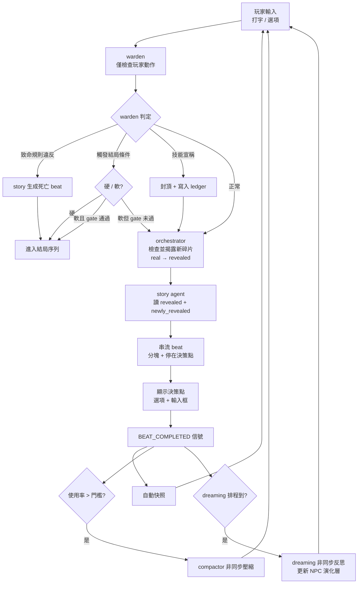
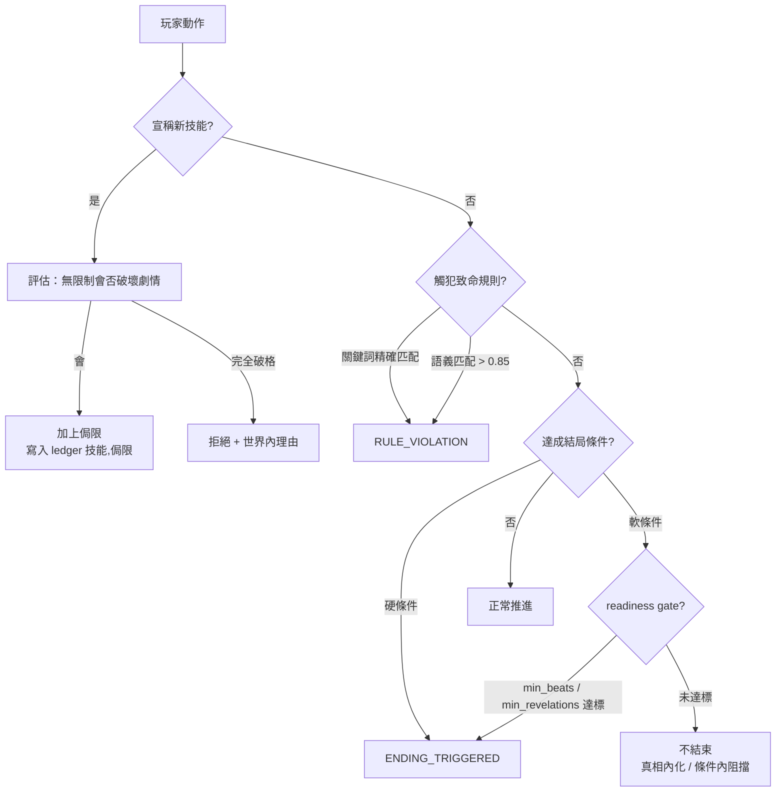

# 02 · 核心演算法

---

## 一、標準 Beat 迴圈



要點：**完整順序 = 玩家輸入 → warden（檢查玩家）→ orchestrator（揭露碎片）→ story（生成）→ 串流 → 快照 → compactor/dreaming 非同步**。warden 只攔玩家動作；orchestrator 每 beat 決定揭露什麼，故 story 永遠拿到最新 newly_revealed；dreaming / compactor 在回合外非同步，不卡玩家閱讀。

---

## 二、Beat 切割機制

**原則：不按長度切，按決策功能切。** 一個 beat = 從劇情自然流動到主角必須抉擇為止。

### Beat 組成

```
一個 beat = [敘述塊, <<<CONTINUE>>>, 敘述塊, ..., <<<DECISION>>>, 決策結構]

  短 beat：  1 塊 + 決策
  長 beat：  N 塊 + 決策（分塊為閱讀節奏，非 context 管理）
  開場序列： 只有塊、無決策，決策只在最後一個 beat
  旁白型：   只有塊、以 CONTINUE 收尾、無決策（純敘事，玩家點繼續往下）
```

**決策型 vs 旁白型**：並非每個 beat 都需要決策。story agent 自行判斷——劇情推進到主角抉擇=決策型（DECISION 收尾）；鋪陳/過場/純揭露=旁白型（CONTINUE 收尾、無決策結構）。旁白型讓節奏有呼吸。

**防呆（程式碼控制，不靠 agent 自律）**：連續旁白型 beat 超過 2-3 個 → 強制下個 beat 給決策點，避免玩家淪為一直點繼續、失去能動性。

### 兩種分隔符

| 分隔符 | 意義 | 後端解析結果 | 前端行為 |
|--------|------|--------------|---------|
| `<<<CONTINUE>>>` | 閱讀節奏暫停 | `StreamParser` 產生 `CONTINUE_PAUSE` | 顯示「繼續」，點擊後呼叫 `continue_narration()` |
| `<<<DECISION>>>` | beat 結束 | `StreamParser` 收集並驗證 DecisionPoint | 渲染後端已驗證的決策 UI |

### 串流狀態機（Python 後端）

```
parser = StreamParser()
for token in stream:
    events = parser.feed(token)                  # 滑動視窗偵測分隔符
    for e in events:
        if e.type == "NARRATIVE_CHUNK":
            push_to_frontend("NA.appendToken", e.text)
        elif e.type == "CONTINUE_PAUSE":
            push_to_frontend("NA.onContinue")
            wait_until_frontend_calls_continue_narration()
        elif e.type == "DECISION_READY":
            decision = parser.finalize()          # JSON repair + Pydantic 驗證
            push_to_frontend("NA.onDecision", decision)

# 安全網：單塊超過 ~400 字仍無分隔符 → 後端在句子邊界產生 CONTINUE_PAUSE
```

分隔符是 agent 的提示，程式碼層的 400 字安全網保底。前端不解析分隔符、不修 JSON，只渲染後端已分類的事件。

---

## 三、雙層 Bible 與揭露閘門（Orchestrator）

story agent 暴雷的根因是「它看得到全部真相，只能靠自律不講」。雙層 bible 把它變成結構保證。

```
real_bible（完整真相）        只有 orchestrator + warden 可讀
revealed_bible（已揭露子集）  story agent 只能讀這個

orchestrator（揭露閘門，每 beat）:
  1. 讀 real_bible 中尚未揭露的碎片 + 各碎片的「進階揭露條件」
  2. 檢查條件是否達標（多數可程式碼判，不必每次 LLM）:
       - beat 數門檻（難度調整）
       - 玩家已觸及的相關碎片（revelations_touched）
       - 特定 NPC 信任/對話達標
       - 玩家進入特定場景
  3. 達標 → 把碎片從 real 搬到 revealed（附「如何揭露」的提示）
  4. 未達標 → 不動（沒有就算了，不強制）
```

揭露條件範例：

```yaml
revelation_pool:
  - id: 地下室名單
    type: item                    # knowledge | item | person
    content: "完整的1987實驗紀錄與受害者名單"
    reveal_condition: { min_beats: 8, requires_touched: [牆上的1987] }
  - id: 張醫生真相
    type: knowledge
    content: "張醫生是當年主治，知情者"
    reveal_condition: { npc_trust: {張醫生: 高}, OR_min_beats: 20 }
  - id: 後門鑰匙
    type: item
    content: "通往後院的鑰匙，逃生前置"
    reveal_condition: { location_reached: 警衛室 }
```

**碎片三型，揭露後流向不同**：

```
knowledge → 進「已知資訊」（玩家腦袋，rolling_summary/ledger 記錄）
item      → 進「共用道具庫」（shared_inventory，見第十三節）
person    → 更新某 NPC 的 presence/位置（找到人）
```

這三型統一了你的結局條件：「找規則離開（knowledge）／找人（person）／找關鍵道具（item）」其實是同一套碎片系統的三種形式。

**story agent 永遠只在 `revealed_bible` 範圍編排**，結構上不可能用到未揭露真相。揭露速度 = 故事節奏 = 難度旋鈕（見第十二節）。

> orchestrator 是窄職務的廉價 agent，多數揭露條件用程式碼判定，僅少數需 Light LLM 判斷「玩家是否實質觸及某碎片」。

---

## 四、Story Agent 生成邏輯

### 三種輸入路徑

玩家的輸入分三條路，平衡護欄與自由：

```
1. 預設選項（story 生成的 2-4 個）       → 直接採用，不檢查
2. 自訂格式輸入（依選項格式自填）         → 過一次 Light LLM 檢查格式與合理性
                                            通過則採用，不合理則提示重填
3. 完全自由打字                          → 不檢查，直接給 story agent
                                            （自由度命根，絕不加 API 護欄）
```

第 2 條是「有護欄的中間路徑」，第 3 條保留完全自由。避免「每次打字都多一次 API call」的成本與延遲。


```
輸入（context 切片）:
  revealed_bible（已揭露子集，**非完整真相**，可快取）
  + 滾動摘要「故事至今」 + fact ledger
  + 最近 5–8 個 beat 原文
  + 玩家上一個決定（verbatim，不先摘要）
  + 在場 NPC 的 evolving 層（含情緒、意圖）  ← dreaming 更新後在此生效
  + 近期聊天摘要（若剛從聊天室返回，3-4 句濃縮）
  + warden 指令（正常推進 / 寫死亡 beat / 結局序列）
  + orchestrator 剛揭露的新碎片（若有）

生成規則:
  寫到「處境成形、主角即將抉擇」就停筆，絕不替主角做決定
  分塊以 <<<CONTINUE>>> 控制閱讀節奏
  以 <<<DECISION>>> 結束，輸出決策結構
  SAN 低時可加入 [?] 標記的可疑內容（可選）

輸出 schema:
  beat_narrative: str（含 <<<CONTINUE>>>）
  decision_point:
    situation_recap: str
    decision_type: enum [action, dialogue]   # 框「你做：」或「你說：」
    suggested_options: [{text, tone}]          # tone 非 risk，只定調
    free_input_allowed: true                   # 永遠允許
    free_input_hint: str
  beat_meta:
    beat_number, revelations_touched, npcs_present
    pacing: enum [calm, rising, peak]
    audio_cue: enum [normal, silence, sting, swell]   # 特殊音訊事件，驅動音軌系統
```

選項用 `tone`（謹慎/大膽/迴避/激進）不用 `risk`，因為無成功率系統。`free_input_allowed` 永遠 true 是自由度命根。

---

## 五、Warden 演算法（僅玩家）

warden 只判玩家動作，三職務共用一塊「這會不會讓故事崩」的推理。



```
warden 輸出 schema:
  rule_violation: bool；violated_rule: str|null
  ending_triggered: null | enum [death_physical, death_mental, truth_revealed, escape, transformation]
  ending_is_soft: bool
  skill_claim: dict|null；skill_verdict: enum [allow, reject]|null；skill_limitation: str|null
  directive_to_story: str
```

> **NPC 不經過 warden。** dreaming 的 NPC 演化變更不送 warden，由 dreaming 自己在 prompt 層自我約束（讀 ledger，被要求不矛盾硬事實）。錨點靠權限邊界保護。

---

## 六、結局系統

**結局 = 終局狀態，不是預寫場景。** 達成 `ending_conditions` 之一 → 觸發**結局序列**（數個純敘述 beat，建構到最終畫面）。

| 類型 | 觸發 | 把關 | 提早發生時 |
|------|------|------|-----------|
| 死亡（肉體/精神） | 立即 | 無 gate | 規則已知，公平直死 |
| 真相揭露 | 達成 | 成熟度 gate（min_beats / min_revelations） | 不結束 → 「你知道了，但還困在這裡」 |
| 逃脫/化解 | 達成 | 前置條件（鑰匙/出口/威脅狀態） | 條件未滿足 → 劇情內合理阻擋 |
| 異變（可選） | 達成 | 累積條件 | — |

**提早結束的處理**：把前置條件編進 world bible，提早結束就在劇情內自然化解（門被鎖鏈纏住、走廊鬼打牆），而非系統生硬擋下。story agent 知道前置，能寫出一致理由。

---

## 七、Dreaming Mode（NPC 反思，無 warden 閘門）

**定位**：compactor 的兄弟，非同步離線 pass。compactor 整合「故事的記憶」，dreaming 整合「角色的心智」。

```
每次 pass，針對「最近有互動或被提及」的 NPC（凍結沒戲份的 NPC 以省成本）:
  1. 讀近期 beat + 該 NPC 的聊天封存片段（從 cold 拉）
  2. 反思 → 更新演化層（只能寫 npc_evolving，碰不到 secret_core）
  3. 自我約束：讀 ledger，不得矛盾於硬事實（prompt 層軟性繫繩，非 warden）
  4. 提交 → NPC_EVOLVED 信號 → story 下個 beat 採用

dreaming 輸出 schema（寫入 npc_evolving）:
  emotional_update: {current:{emotion, intensity}, shift_reason}
  relationship_update: {trust_delta, suspicion_delta, affinity_delta}
  intent_update: enum [observe, befriend, betray, flee, manipulate]
  revealed_layer: str | null        # 決定向玩家揭露秘密的下一層
  emergent_lie: str | null          # 新編的謊（自我約束一致性）
  personal_arc_note: str            # NPC 自己形成的目標/軌跡 ← 「未來發展」
  reflection_log: str               # NPC 內心獨白（debug 觀察情感湧現用）
```

`reflection_log` 是「想看 AI 能否流露情感與未來發展」的觀測窗口——可在 debug 模式檢視 NPC 的內在演化。

**self_aware 的影響**：`emergent_lie` 只對 `self_aware=true` 的 NPC 有意義（知情者才會說謊）。`self_aware=false` 的 NPC 不編謊，而是真誠地相信錯誤的事——dreaming 對這類 NPC 不產生 emergent_lie，反而可能強化其錯誤認知（更毛骨悚然）。

**這就是聊天反向影響主線的路徑**：聊天 → dreaming 更新 NPC → story 反映它。

**時機**：非同步每 K beat 一次，外加「某 NPC 聊天封存跨門檻」時觸發。

---

## 八、壓縮與滾動摘要（Compactor）

無限模式的承重牆。滑動視窗 + 有上限摘要 = 真無限。

```
記憶結構:
  保留最近 N 個 beat 原文（5–8）
  比 N 更舊 → 折進滾動摘要（散文主線，有上限 ~1000 tokens）
  摘要滿上限 → 再濃縮一次

滾動摘要 = 散文主線（氣氛延續） + fact ledger（硬狀態，二元組）

ledger 二元組分類:
  (事實類, 內容)        例：(世界事實, "張醫生證件年份對不上")
  (npc, 對玩家態度)      例：(張醫生, 戒備)
  (技能, 侷限)           例：(鎖匠, 只對機械鎖)
  (碎片id, 揭露狀態)     例：(地下室名單, 已揭露)

觸發等級（使用率）:
  > 70% → L1 輕度（目標 < 70%）
  > 85% → L2 積極（目標 < 60%）
  > 95% → L3 緊急（可能阻塞下一 beat）

保護清單（絕不刪）:
  已埋未揭的伏筆、暗示未來的描述、NPC 可疑行為、anchor、ledger
```

非同步：在玩家讀字時跑，白賺一輪壓縮。

---

## 九、存檔與回溯

**一切都是快照。** 每個 beat 是天然快照邊界。

```
快照 = Blackboard + 視窗原文 + 「當時的」滾動摘要 + NPC 演化層
        （因摘要有上限，快照很小）

存檔點 = 玩家標記的快照
回溯   = 還原快照 + 截斷之後（MVP 線性 undo；分支樹為 v2）

致命陷阱:
  快照必須含「當時的」摘要，不是現在的——
  否則回溯到 beat 10 但摘要是 beat 30 壓縮過的，劇情錯亂

儲存:
  SQLite：每 beat 一列，存檔點是 flag，回溯 = 載入該列 + 截斷後續

LLM 隨機性:
  回溯後選一樣的選項，不會得到一樣的 beat（temperature）
  對恐怖遊戲可能是 feature（夢魘不重複）
  要可重現 → 快取 (快照, 選擇) → beat
```

---

## 十、技能宣稱演算法（瞎掰 → 事實）

```
1. 玩家在自由輸入即興一個能力
     例：「我是鎖匠，能撬開這鎖」
2. warden 評估：無限制地給，會否讓劇情走不下去？
     （威脅失去意義 / 跳過核心障礙 / 結局太廉價）
3. 決定:
     允許 + 侷限 → 認可成 ledger (技能, 侷限)，成為事實
     拒絕       → 給世界內的理由
4. 侷限兼任劇情鉤子:
     「你是鎖匠 → 好，但地下室是電子封印，你的技術用不上」
     （為什麼是電子封印？→ 真相線索）
```

無「每章 2 次」上限（無章節）——**封頂本身即平衡**。

**對稱性**：技能宣稱（玩家認可關於自己的新事實）與 dreaming（NPC 認可關於自己的新事實）是同一機制的兩個方向。差別在玩家經 warden 把關，NPC 只經權限邊界 + 自我約束。

---

## 十一、NPC 離場與分道揚鑣

關鍵區分兩條獨立的軸：**物理在場** ≠ **關係立場**。NPC 可能人走了心還向著你，也可能人在身邊卻已背叛。

```yaml
npc:
  presence: enum [present, absent, missing, dead]   # missing=失蹤(命運結局之一)
  alignment: enum [allied, neutral, departed, hostile, dead]
  offstage_intent: str | null    # 離場時在做什麼（dreaming 寫）
  return_condition: str | null   # 什麼情況下會再出現
  fate_pressure: float           # 0-1，離場累積，達標觸發命運擲骰
  carried_fragment: str | null   # 命運領到、尚未交付玩家的真相碎片 id
```

| 情況 | presence | alignment | dreaming | 處理 |
|------|----------|-----------|----------|------|
| 暫時離開（探路） | absent | allied | 低頻持續 | 帶新發現回來 |
| 分道揚鑣（理念不合） | absent | departed | 低頻持續 | 在別處行動，日後重逢 |
| 背叛離開 | absent | hostile | 持續 | 可能成為對手回來使壞 |
| 死亡 | dead | dead | 停止 | 留下 reflection_log 與線索 |

**核心：離場 NPC 不凍結，而是「離線推進」。** 但離場 dreaming 與在場 dreaming **本質不同**（見下節），不共用邏輯。

### 在場 vs 離場 dreaming 的本質差異

| | 在場 dreaming | 離場 dreaming |
|---|---|---|
| 性質 | **反應式**：讀剛發生的事 + 對話，調整內心 | **生成式**：玩家看不到，自己推進隱形支線 |
| 輸入 | 劇情/聊天（被劇情推著走） | 無共同劇情，自走命運 |
| 產出 | 情緒/信任/意圖微調 | 命運擲骰（機遇/失蹤/屍體/變質） |
| skill | dreaming/SKILL.md | **獨立的 offstage-fate/SKILL.md** |

### 離場命運機制（Fate Roll）

NPC 列出的結局（機遇/失蹤/屍體/敵對）是一張**加權命運表**。原則同 judgment：**程式碼擲骰決定「哪種命運」，LLM 只寫「血肉」**——可調機率、可平衡、可重現。

```
三步:

1. 離線命運 tick（程式碼，每數 beat，比在場低頻）:
     fate_pressure += danger_of_offstage_intent   # 做的事越危險，累積越快
     roll = random()
     if roll < fate_pressure:
         命運觸發 → 依加權表抽一種結局
     else:
         持續離場，offstage_intent 推進一小步

   fate_pressure 是「遲早出事」計量器：離場越久、越危險，出事機率越高
   → 久不歸的盟友自然朝命運收束，不無限漂在背景

2. 加權命運表（程式碼，受 alignment 影響）:
                    allied   departed  hostile
     機遇歸來         高       中        低
     失蹤             中       中        中
     屍體             中       中        低
     敵對歸來         低       中        高
   （這張表可調，用於控制難度與基調）

3. LLM 寫血肉（offstage-fate skill，與在場 dreaming 不同的 prompt）:
     輸入：結局類型 + secret_core + 當前 revealed 進度 + 領到的碎片
     產出：命運的具體樣貌 + 它如何攜帶線索
```

### 關鍵：每種命運掛一個真相碎片，且過揭露閘門

線索不能 LLM 瞎掰（會與 real_bible 打架）。命運**從 `revelation_pool` 領一個未揭露碎片**，包裝成命運形式：

| 命運 | 碎片包裝方式 | 玩家如何取得 |
|------|------------|------------|
| 機遇歸來 | NPC 直接交給你 | 對話即得（「我在三樓找到這個」） |
| 屍體 | 屍體上的隱藏線索 | 搜屍才得（恐怖感） |
| 失蹤 | 懸而未決，最後訊息指向它 | 玩家循線去找 |
| 敵對歸來 | 對峙時的籌碼 | 威脅/交易中揭露 |

碎片從 pool 領、過 orchestrator 揭露閘門 → **絕不暴雷未到時機的真相**。

**副產品一**：離場 NPC 成為真相的**第二條輸送管道**。純靠玩家探索可能有碎片永遠挖不到；命運給了真相第二出口，故事不因玩家沒走對路而卡死。

**副產品二（屍體即場景）**：屍體結局在 `Scene` 種下 `corpse_interactable`，綁定碎片。玩家某次行動撞見曾並肩的盟友屍體——認出的恐怖 + 搜屍線索，是純探索給不了的場景錨點。

**成本上限**：在場 NPC 每 K beat 反思一次，離場 NPC 頻率調低（如 3K）。離場太久又無戲份者才真正降到 dormant 凍結。

**恐怖張力來源**：因理念不合離開的盟友，在最糟時刻重逢——可能已瘋、已知道你不知道的真相、或已被同化。`secret_core` 不變，但 `evolving` 在離場期間自由漂移，重逢的他既熟悉又陌生。**離場 dreaming 對玩家隱藏**（傾向決定），重逢才揭曉，資訊差即恐怖感。

---

## 十二、難度系統 = 揭露閘門鬆緊

新架構無戰鬥數值，難度不再是分散旋鈕，而**統一作用在揭露速度**：

```
難度調整的是 orchestrator 揭露閘門 + dreaming 速度（皆以 beat 為單位）:

  簡單:  碎片揭得快（min_beats 小）、揭得明（直白提示）
         dreaming 揭露 NPC 秘密快、NPC 較主動透露
  困難:  碎片揭得慢（min_beats 大）、揭得隱晦（需玩家拼湊）
         dreaming 揭露慢、NPC 守口如瓶

  真相碎片隱晦程度: 影響「如何揭露」的提示明確度
  dreaming 揭露速度: 影響 NPC revealed_layers 增長速率
```

難度因此是「玩家要花多少 beat 才能拼出真相」的單一連續量，乾淨且易調。

---

## 十三、共用道具庫

道具不是獨立系統，是**物件型真相碎片被持有後的存放處**。道具與真相揭露同一套機制。

```yaml
shared_inventory:
  items:
    - id: str                  # 對應 revelation_pool 碎片 id（若來自碎片）
      name: str                # 「生鏽的鑰匙」
      brief: str               # 簡介（玩家可看）
      acquired_beat: int
      held_by: str | "team"    # 隊伍共用，可標記在某 NPC 身上
      is_key_item: bool        # 是否結局前置（玩家不可見）
      hidden_clue: str | null  # 道具暗示的線索（推理用）
```

**設計要點**：
- 道具描述由 story agent 揭露時生成，但綁定的 id 來自 real_bible → 不會冒出與真相無關的道具。
- 道具可同時是逃生工具與線索（鑰匙既能開門，也暗示「這門很久沒開」）。
- 玩家**看不到** `id` 與 `is_key_item`——不知哪個是結局關鍵，保護推理樂趣。

**共用 × 離場命運的恐怖潛力**：
- `held_by` 可指向某 NPC。該 NPC 失蹤/變屍體 → 道具命運跟著走。
- `/inventory` 顯示「鑰匙（張醫生持有，失蹤）」→ 製造「得找到他才能拿回」的推理壓力。
- 接上離場命運機制（第十一節）：盟友帶走唯一鑰匙失蹤，本身就是劇情事件。

查看方式見 04 UI 章。

---

## 十四、儲存系統 = 世界狀態快照（擴充）

「存故事/聊天/dreaming 狀態/道具庫」全部由快照涵蓋。快照原則：**存完整 Blackboard + 當時記憶層**。

| 要存的 | 對應欄位 | 狀態 |
|--------|---------|------|
| 故事內容 | beat_window + rolling_summary + ColdArchive | 已涵蓋 |
| 聊天紀錄 | ChatLog（cold 層，隨快照保存） | 已涵蓋 |
| dreaming 後狀態 | npc_registry[].{evolving, presence, alignment, fate_pressure} | 已涵蓋 |
| 道具庫狀態 | shared_inventory | 新增 |

### 隱藏命運 × 存檔的衝突（重要）

離場 dreaming 對玩家完全隱藏（已確認），但存檔要存完整世界狀態（含隱藏命運）。若玩家打開存檔檔，會劇透自己的遊戲。

**採用路線 A + 務實折衷**：
- 存檔存完整狀態（否則讀檔後世界斷裂）。
- 遊戲 UI 永遠只顯示 `revealed` 部分。
- 「隱藏命運狀態」存在 SQLite 獨立 table（非明文 JSON），不主動劇透。
- **不做真加密**（過度工程）——會去翻資料庫的玩家本就接受劇透風險。

```
SQLite 結構:
  beats          每 beat 一列（含當時 rolling_summary）
  chat_logs      完整聊天紀錄（cold）
  npc_states     含 evolving + 隱藏的 offstage 命運（獨立 table）
  inventory      shared_inventory 快照
  save_points    flag 標記哪些 beat 是具名存檔
```

---

## 十五、音訊系統（音樂 + 環境音）

恐怖遊戲音訊比畫面更重要。核心原則：**音樂必須預先生成成「音軌庫」，播放時即時挑選，絕不即時生成。**

### 為何不能即時生成

音樂生成 API（Suno/Udio 類）延遲是數十秒至數分鐘級，不是文字 LLM 的數秒級。每 beat 即時生成 → 玩家等 90 秒等音樂 → 摧毀串流沉浸感。

### 解法：分層預生成音軌庫

```
音樂單位不是 beat，是「情緒狀態」。
不需要每 beat 一首歌，只需要每種情緒一條（或數條）循環音軌。
beat 的 pacing（calm/rising/peak）決定切到哪條音軌。
一條「逃跑音樂」服務所有逃跑場景，不必每次重生。

基本音軌（序章生成時一併備好，背景 thread，玩家讀序章時不卡）:
  敘述 ambient（loop）
  高潮 tension
  逃跑 chase
  驚訝 sting（短音效）
  靜默 silence（特殊：高潮中驟然無聲，比音效更嚇人）

進階音軌（特殊 beat 出現前提前生成）:
  觸發器 = 後端早有的「特殊 beat 預兆」:
    orchestrator 即將揭露關鍵碎片
    warden 偵測結局接近
    即將進入特定場景
  → 玩家還在讀前幾個 beat 時，背景就生成那條特殊音樂
  → 走到那裡時音樂已備好

播放時 = 選音軌 + crossfade（零延遲）
```

### 環境音層（比音樂更優先，零生成成本）

比音樂更便宜有效的是**環境音效循環**（素材庫，非生成）：滴水、遠處腳步、電流嗡鳴、心跳。分層疊加。

- 心跳聲隨 pacing 加快 —— 極強的恐怖手段，零生成成本。
- 建議雙層：音樂（生成）+ 環境音（素材庫）。MVP 環境音甚至比音樂更優先。

### audio_cue（story agent 可觸發的特殊音訊）

`beat_meta` 增加 `audio_cue`，讓 story agent 主動觸發特殊音訊事件：

```
audio_cue: normal | silence | sting | swell
  silence → 驟然全靜（高潮中的真空，最被低估的恐怖）
  sting   → 短促驚嚇音
  swell   → 漸強壓迫
```

### 與 MVP 的關係（重要）

音樂生成是全專案技術風險最高、最貴、最慢的部分。**MVP 先用預製素材音軌**（免費恐怖 ambient），把分層播放、crossfade、pacing 切換的**機制**做對；核心迴圈穩了再把預製音軌換成生成音軌。機制與生成是兩件事，先驗證機制。
