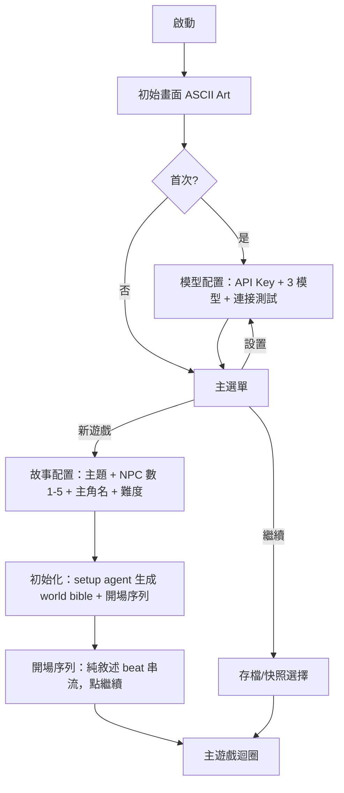

# 04 · UI/UX 編排

> **本檔是 UI/UX 的「設計原則與內容」層**（互動規則、節奏、文案、版面內容），與技術無關。
> **前端實作規劃**（網頁+pywebview、串流渲染、主題、畫面流程）見 `06-frontend.md`。
> ASCII mock 是版面內容示意，實際渲染以 06 的網頁規劃為準。

---

## 一、設計原則

1. **沉浸感優先**：所有 UI 服務於恐怖氣氛，不破壞沉浸。
2. **資訊最小化**：只在必要時顯示系統資訊，避免遊戲感過強。
3. **漸進式揭露**：真相、世界觀、NPC 秘密都由玩家逐步發現。
4. **壓迫感設計**：UI 本身也傳遞恐怖（串流節奏、狀態色彩）。
5. **操作流暢**：最常用操作（決策點選擇/打字）永遠最簡單。
6. **等待即劇情**：LLM 生成的等待時間轉化為氣氛，而非單純 loading。

---

## 二、前端流程



---

## 三、主遊戲畫面

```
╔══════════════════════════════════════════════════════════════╗
║  📍 廢棄醫院走廊  ·  第 12 個分鏡                            ║
╠══════════════════════════════════════════════════════════════╣
║                                                                ║
║   管道中傳來低沉的敲擊聲，一下、兩下…然後是令人窒息的寂靜。    ║
║                                                                ║
║   走廊盡頭那扇門虛掩著，門縫裡透出微弱的光。你身後的腳步      ║
║   聲，停了。你能感覺到有什麼，在等你決定。                    ║
║                                                                ║
║   ────────────────────────────────────                        ║
║   你會：                                                       ║
║    1. 推開那扇虛掩的門                                         ║
║    2. 屏住呼吸，貼著牆退回去                                   ║
║    3. 開口問：「有人嗎？」                                     ║
║                                                                ║
║   > _  （或描述你想做的事…）                                  ║
╚══════════════════════════════════════════════════════════════╝
```

決策點佈局：情境收束句 → 分隔線 → 「你會：」(action) 或「你說：」(dialogue) → 選項 → 永遠存在的自由輸入框。

---

## 四、串流節奏控制

LLM 生成快（~1000 字幾秒生完），但恐怖文字遊戲需要節奏。**把 LLM 的快變成 UX 槓桿**：前端對串流做速度節流。

```
串流速率控制:
  普通敘述:                30–50 字/秒（舒適閱讀速度）
  關鍵詞（死/血/牠在你後面）: 15–20 字/秒
  幻覺片段 [?] 包圍處:      抖動效果 + 慢速
  恐怖句結尾:               1–2 秒停頓再續

<<<CONTINUE>>> 暫停:
  顯示「繼續」提示（呼吸感的脈動）
  玩家點擊才續流——讓長 beat 有節奏，不一次淹沒

決策點浮現:
  敘述結束 → 0.5 秒停頓
  情境收束句出現
  選項一個一個淡入（間隔 0.3 秒）→ 壓迫感，非菜單
```

---

## 五、等待與 Spinner

回合內 warden → story 串聯時有短暫等待。Spinner 用**承接上一個決定**的敘事性文案（story agent 在上一 beat 順帶生成，放在選項 metadata）：

```
玩家選「推開那扇門」→
  spinner: 「你伸出手，指尖距離門把還有一吋…」
玩家選「貼牆退回」→
  spinner: 「你屏住呼吸，數著自己的心跳…」
```

讓等待成為劇情的一部分，而非「LLM 在思考」。

---

## 六、聊天室 UI（獨立模式）

聊天室是玩家**主動發起**的多輪對話，與故事內聊天（被動回答、屬於 beat）不同。需獨立 UI。

```
╔══════════════════════════════════════════════════════════════╗
║  💬 與 張醫生 對話  ·  地下室                    [結束對話]  ║
╠══════════════════════════════════════════════════════════════╣
║  張醫生（分析型）:                                            ║
║    「根據目前的情況，我們不該往三樓去。」                     ║
║                                                                ║
║  你:                                                           ║
║    你來這裡多久了？                                           ║
║                                                                ║
║  張醫生:                                                       ║
║    「……比我想記得的久。」                                    ║
║    （他的視線飄向牆上那張褪色的合照）                          ║
║                                                                ║
╠══════════════════════════════════════════════════════════════╣
║  > _                                          [結束對話]      ║
╚══════════════════════════════════════════════════════════════╝
```

- 進入：故事內某 NPC 在場時，玩家點「找 X 說話」；或 story beat 主動召喚（「張醫生想單獨跟你談」）。
- 退出：明確的「結束對話」按鈕 → 觸發濃縮（完整紀錄入 cold，事實入 ledger，一句入摘要）。
- NPC 的演化層（情緒、意圖）在此即時表現——dreaming 更新後，下次對話語氣會變。

---

## 七、技能宣稱 UX

玩家在自由輸入即興能力，warden 的侷限要**融入劇情**回饋，而非系統彈窗：

```
玩家輸入: 「我是鎖匠，試著撬開這扇門」

❌ 不要: 「系統：技能已認可，侷限：僅機械鎖」

✅ 要（融入敘事）:
  「你的手指記得這套動作——你確實做過鎖匠。但指尖觸到鎖孔時，
   一陣涼意竄上來：這不是傳統的鎖芯，是某種電子封印。你的技術，
   在這扇門上派不上用場。」
```

侷限既是平衡，也是劇情鉤子（為什麼是電子封印？）。

---

## 八、狀態顯示與可選氣氛меter

- 主畫面預設**不顯示數字**，狀態靠敘事與色彩傳遞。
- NPC 信任/態度**不顯示數字**，透過 NPC 行為與語氣表現（dreaming 驅動）。
- 可選的 **SAN 氣氛меter**：由 story agent 在 `beat_meta` 報告、程式碼套用的**敘事驅動軟指標**（非戰鬥數值），僅作氣氛與軟結局訊號。色彩：穩定（白）→ 不安（灰）→ 焦慮（紫）→ 崩潰邊緣（深紫閃爍）。**此為可選項，見待決事項。**

---

## 九、存檔 / 回溯 UI

```
- 每個 beat 自動快照（無感）
- /save：標記為具名存檔點
- /load：列出存檔點與快照
- 回溯：選一個過去的 beat → 還原 + 截斷之後（MVP 線性 undo）
  提示玩家：回溯後相同選擇可能導向不同結果（夢魘不重複）
```

---

## 十、命令系統

| 命令 | 說明 |
|------|------|
| `/save` | 標記存檔點 |
| `/load` | 讀取存檔/快照 |
| `/back` | 回溯到上一個 beat |
| `/inventory` `/bag` | 查看共用道具庫（種類 + 簡介，不顯示是否關鍵道具） |
| `/status` | 角色狀態（主角、已宣稱技能 + 侷限） |
| `/who` | 在場 NPC（不顯示隱藏資訊） |
| `/help` | 說明 |
| `/quit` | 離開（確認） |

命令不消耗 beat、不影響進程。

---

## 十一、道具庫面板

道具按鈕（🎒）或指令開啟，modal 呈現。隊伍共用。

```
╔══════════════════════════════════════════════════════════════╗
║  🎒 共用道具庫                                    [關閉]      ║
╠══════════════════════════════════════════════════════════════╣
║   生鏽的鑰匙                                                  ║
║     在三樓護理站抽屜找到，不知道開哪扇門。                    ║
║                                                                ║
║   褪色的照片                                                  ║
║     一群穿白袍的人，背景是這間醫院。日期被刮掉了。            ║
║                                                                ║
║   後門鑰匙          （張醫生持有 · 失蹤）                     ║
║     ⚠ 持有者目前下落不明                                     ║
╚══════════════════════════════════════════════════════════════╝
```

設計要點：
- 顯示 name + brief，**不顯示** id、is_key_item（保護推理樂趣，不讓玩家知道哪個是結局關鍵）。
- `held_by` 指向 NPC 時顯示持有者與其狀態——道具命運跟著 NPC 走（失蹤/屍體）。
- `hidden_clue` 在玩家「已注意到」後才顯示（由劇情觸發）。

---

## 十二、自訂格式輸入（三輸入路徑的中間路徑）

三輸入路徑（見 02）：預設選項（直接用）／**自訂格式輸入**（過 Light 檢查）／完全自由打字（不檢查）。中間路徑用於玩家想「客製一個角色或具體行動」時，給格式護欄。

### 角色自訂格式（建立 NPC / 描述行動對象時）

```
格式欄位（玩家照填）:
  人物姓名:   （必填）
  人物職業:   （必填，決定他懂什麼、不懂什麼）
  人物個性:   （從預設個性選或自填：領導/緊張/分析/樂觀/神祕…）
  人物外觀:   （一句外觀敘述）
  與主角關係: （可選：陌生/同伴/可疑…）
```

Light LLM 檢查：格式完整性 + 內容合理性（不破壞世界基調、不破格）。通過則建立，不合理則提示重填。個性的細部多軸（說話節奏/情緒底色/怪癖）由程式碼擲骰補齊，玩家不必填。

### 預設角色（遊戲內建範本，供快速起步）

提供數個預設角色範本，玩家可直接選用或當填寫範例：

```yaml
preset_characters:
  - name: 林護士
    profession: 護理師
    personality: nervous
    appearance: 制服皺亂、眼神閃躲，總把病歷夾抱在胸前
    hook: 似乎知道些什麼，但不敢說
  - name: 陳醫師
    profession: 內科醫師
    personality: analytical
    appearance: 金屬框眼鏡、白袍一塵不染，說話像在念報告
    hook: 過度冷靜，對異常毫不意外
  - name: 老警衛
    profession: 保全
    personality: mysterious
    appearance: 佝僂、鑰匙串叮噹作響，眼白渾濁
    hook: 在這裡待了幾十年，認得每一道門
  - name: 失蹤者家屬
    profession: 一般民眾（外來者）
    personality: optimistic
    appearance: 外來者打扮，緊抓一張照片
    hook: 為了找人而來，是少數的「外部視角」
```

setup agent 生成 NPC 時可用這些當範本或靈感；玩家自訂時也可參考格式。預設角色的 `secret_core`、`self_aware` 與個性多軸（說話節奏/情緒底色/怪癖）仍由 setup 依該局 real_bible 即時錨定與擲骰（範本只定外型、職業與核心個性，不定真相）。
